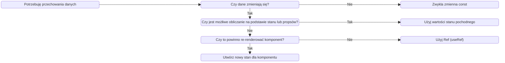
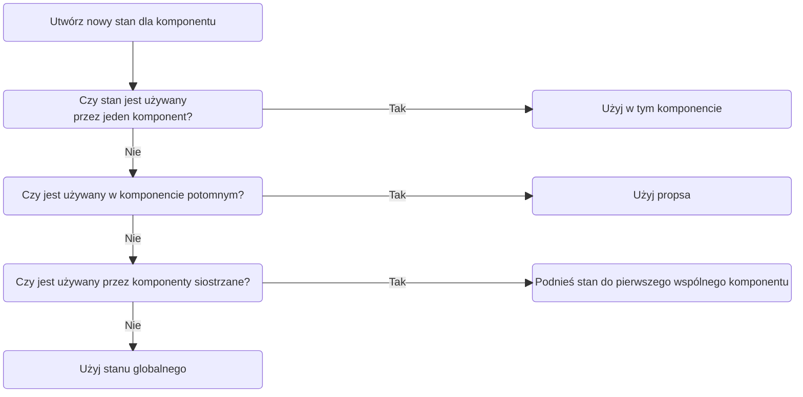
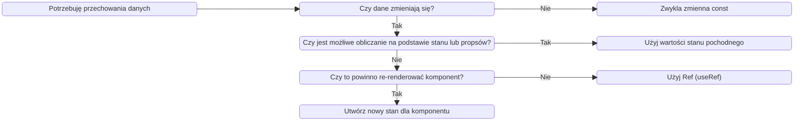

# The Ultimate React Course 2024: React, Redux & More

## 1. Sekcja 1: Welcome, Welcome, Welcome

### 1.1. Wprowadzenie do kursu

### 1.2. Projekt rozpoczęty w codesandbox

Rozpoczęcie projektu po autoryzacji za pomocą konta GH, skrót do utworzenia nowego template w sandboxie pod domeną: react.new
Projekt polegający na utworzeniu prostej apki do pobierania porad z api, wyświetlania ich i zliczania kliknięć. Użyto useState oraz useEffect. Wydzielono komponent z Messages.
Mój kod: https://codesandbox.io/p/sandbox/busy-proskuriakova-mclsv8

### 1.3. Wprowadzenie o czym jest kurs, jak się uczyć i jak działa udemy

### 1.4. Link do repo prowadzącego

https://github.com/jonasschmedtmann/ultimate-react-course

### 1.5. Zapoznanie jak wygląda repo prowadzącego

## 2. Sekcja 2: PART 1: REACT FUNDAMENTALS [4 PROJECTS]

### 2.6. Wstęp

### 2.7. Wylistowanie 4 źródeł pomocnych podczas nauki kursu:

Dokumentacja React - https://react.dev/
Dokumnetacja CRA - Create React App - https://create-react-app.dev/
Dokumentacja buildera Vite - https://vitejs.dev/guide/
Czysty kod HTML z obsługą zagnieżdżenia skryptu z React - https://gist.githubusercontent.com/gaearon/0275b1e1518599bbeafcde4722e79ed1/raw/db72dcbf3384ee1708c4a07d3be79860db04bff0/example.html

## 3. Sekcja 3: A First Look at React

### 3.8. Wstęp

### 3.9. W jakim celu powstały frameworki front-endowe

Omówienie zagadnień SERVER-SIDE RENDERING, CLIENT-SIDE RENDERING (SPA)
Vanilla JS jest imperatywny, trudniejszy do czytania i utrzymania niż deklaratywne frameworki.
Synchronizacja pomiędzy UI i danymi w Vanillii jest bardzo trudna, frameworki zdejmują odpowiedzialnosć z devów.
Frameworki pomagają w narzuceniu struktury kodu i sposobu pisania. Pozwalają devom zachować spójność kodu wewnątrz zespołu.

### 3.10. Prezdstawienie i analiza kodu napisanego w React i Vanilla JS

https://codesandbox.io/p/sandbox/react-first-app-advice-52879f

### 3.11. Czym jest React

React to biblioteka JS, deklaratywna, bazująca na komponentach i stanach.
React nie jest frameworkiem, tylko biblioteką przez to, że reprezentuje tylko warstwę widoku, potrzeba jeszcze innych bibliotek, żeby utworzyć framework (routing, fetching itd.). Frameworki React: Next.Js, Remix.
React renderuje componenty na aplikacji bazując na ich aktualnym stanie. Utrzymuje synchronizację UI dzięki stonom, gdy stan się zmeinia to komponent ponownie renderuje się.

### 3.12 Przygotowanie środowiska developerskiego

Zaleca VSC, NodeJS LTS,
Wtyczki:

- eslint,
- prettier,
- one monokai - zarządzanie kolorami
- material Icon Theme
  Włączenie autosave na onFocusChange co pozwoli na automatyczne zapisanie po zmianie zakładki w VSC, albo po przełączeniu okien. Osobiście widzę sporo problemów i wolę panować na tym kiedy mają pojawiać sie zapisy.
  Ustawienie domyślnego formatera na prettiera i dodanie mu wartości formatOnSave. Fajna opcja, ale nie ma racji bytu podczas pracy nad starszymi projektami lub z projektami które nie mają ustawień dla prettiera, ponieważ przy zapisie zmienia cały plik i później do commita lecą zmiany nie związane z realną zmianą w kodzie.
  Ustawienie Eslint na onSave

### 3.13 Czysty React

Prezentacja w jaki sposób można tworzyć kod w React, React przyjmuje kod w czystym JS. React i babel zaimportowany w pliku html z linków:

```html
<script src="https://unpkg.com/react@18/umd/react.development.js"></script>
<script src="https://unpkg.com/react-dom@18/umd/react-dom.development.js"></script>

<script src="https://unpkg.com/@babel/standalone/babel.min.js"></script>
```

Renderowanie elementów HTML za pomocą funkcji createElement() zamiast składni JSX.
Hooki useState i useEffect przez wywołanie React.useEffect, React.useState zamiast przez wykorzystanie zainstalowanej aplikacji

## 3.14 Prezentacja dokumentacji React

## 3.15 Rozpoczęcie nowego projektu

Przedstawiono dwa buildery używane przy projektach React: CRA i Vite.
CRA jest starterem zawierającym Eslint, Prettier, Jest, webpack itd. Nie zaleca się korzystania z niego na realnych aplikacjach, jedynie do celów edukacyjnych.
Vite jest przedstyawiony jako bardzo szybki builder do budowania "realnych aplikacji". Problemem jest konieczność instalowania dodatkowych paczek jak ESLint, przy którym łatwo o błędy.

## 3.16 Rozpoczęcie projektu przy użyciu CRA

Wstęp do budowy terminala i podstawowych komend:

- ls,
- dir,
- cd

Instalacja projektu za pomocą komendy:

> npx create-react-app@5 pizza-menu

Zapoznanie ze strukturą utworzonego projektu i ruchomienie projektu za pomocą komendy

> npm start

Naniesienie swoich, drobnych zmian

## 4. Sekcja 4: (Optional) Review of Essential JavaScript for React

### 4.17. Wstęp do sekcji

### 4.18. Destrukturyzacja obiektów i tablic

Zainstalowanie dodayku Quokka.js do wywyołania JS w środowisku VSC.
Zaprezentowane sposoby destrukturyzacji obiektów:
Poprzez stworzenie zmiennej obiektu zawierającego elementy do których chcemy sie dostać z obiektu:

> const { title, author, genres } = book;

\*Sposoby destrukturyzacji obiektów niewymienione w kursie:

- Destrukturyzacja w funkcjach
  > function showUser({name, surname}) {
  > console.log(name);
  > console.log(surname);
  > }
  > const user = {
  > name: "Marcin",
  > surname: "Nowak"
  > };
  > showUser(user);

Zaprezentowane sposoby destrukturyzacji tablic:
Poprzez stworzenie zmiennej tablicy zawierającej elementy do których chcemy sie dostać z tablicy (nazwy zostają przypisane do kolejnych elementów):

> const [primaryGenre, secondaryGenre] = genres;

\*Sposoby destrukturyzacji tablic niewymienione w kursie:

- Pominięcie elementów
  > const [name1, name2,, name4] = tab;
- Ustawienie domyślnych wartości
  > const [name1 = "brak", name2 = "brak", name3 = "brak"] = tab;
- Zamiana miejscami wartości
  > [a, b] = [b, a];

### 4.19. Rest/Spread Operator

Rozbicie tablicy na pojedyncze wartości oraz resztę starej tablicy. Wartość reszta starej tablicy musi być wydzielona na końcu:

> const [primaryGenre, secondaryGenre, ...otherGenres] = genres;

Dodanie do tablicy pojedyncze wartości za pomocą operatora spread:

> const newGenres = [...otherGenres, "epic games"];

Dodanie do obiektu pojedyncze wartości za pomocą operatora spread:

> const updatedBook = { ...book, moviePublicationDate: 2000 }

Edycja pojedynczej wartości (price) za pomocą operatora spread:

> const updatedBook = { ...book, moviePublicationDate: 2000, pages: 2000 }

### 4.20. Template Literals

String zapisywany za pomocą ``, w którym można odwołac się do zmiennej przy pomocy ${zmienna}:

```js
> const { moviePublicationDate } = updatedBook;
> const summary = `Data publikacji: ${updatedBook.moviePublicationDate}`;
```

### 4.21 Użycie operatorów warunkowych zamiast if/else

warunek ? true : false

deklaracja zmiennej:

```
> const stop = x > y ? "Stop" : "Move"
```

### 4.22 Funkcje strzałkowe

```js
(parametr) => {blok kodu}
```

Prowadzący zaleca używanie funkcji strzałkowych jako jednolinijkowe:
(parametr) => kod

wyrażenie funkcyjne:

```js
const funkcja = (parametr) => kod;
```

deklaracja funkcji:
(parametr) => kod

Wyrażenia można wywoływać wewnątrz template stringów

### 4.23 Skrócone wyrażenia logiczne: &&, ||, ??

&& jeśli pierwsza wartość jest true, to równanie zwraca drugą wartość. Jeśli pierwsza wartość jest falsy to zwraca pierwszą wartość

|| jeśli pierwsza wartość jest true, to równanie zwraca pierwszą wartość. Jeśli pierwsza wartość jest falsy to zwraca drugą wartość.
Jest tu problem, jeśli chcemy pozyskać info o tym, że czegoś jest 0, co nie jest tożsame z odpowiednikiem "undefined" to otrzymamy zwrotkę jakby wartość była false, a nie 0.

?? jeśli pierwsza wartość jest true, to równanie zwraca drugą wartość. Jeśli pierwsza wartość jest falsy to zwraca pierwszą wartość.
Tu problem z wartościami "nullish" został poprawiony

### 4.24 Operator Optional Chaining

?. Dodawany po wartości która może zwracać undefined lub null
Przydatne gdy nie mamy pewności co do sktuktury danych które otrzymamy

### 4.25 Metoda .map()

Metoda zwraca nową tablicę z tą samą długością, ale z wykonanymi operacjami na każdym z elementów.

```js
> const essentialsData = books.map((book) => ({
> title: book.title,
> author: book.author,
> reviewsCount: getTotalReviewCount(book),
> }));
```

### 4.26 Metoda .filter()

Metoda zwraca nową tablicę z wartościami spełniającymi warunek.
Da sie zastosować dwa filtry:

```js
> const longBooksWithMovie = books
> .filter((book) => book.pages > 500)
> .filter((book) => book.hasMovieAdaptation);
```

Ale lepiej użyć jednego z wyrazeniem logicznym:

```js
> const longBooksWithMovie = books
> .filter((book) => book.pages > 500 && book.hasMovieAdaptation)
```

Metody filter można używać z innymi metodami np.

```js
> const adventureBooks = books.filter((books) =>
> books.genres.includes("adventure")
> ).map(book=>book.title)
```

### 4.27 Metoda .reduce()

W kursie przedstawiono metodę .reduce() jako przykład funkcji akumulującej wyniki

```js
> const pagesAllBooks = books.reduce((sum, book) => sum + book.pages, 0);
```

sum - początkowo wynosi 0, następnie akumuluje wyniki dodawania book.pages, w rezultacie dostajemy sumę stron wszystkich książek

Zamiast ", 0" można podstawić obiekt lub tablicę, co w połączeniu z operatorem spread pozwala na filtrowanie, mapowanie, zliczanie elementów itd.

### 4.28 Metoda .sort()

Metoda mutująca tablicę na której działa, służy sortowaniu

```js
> const sorted = arr.sort((a, b) => a - b);
```

Aby zapobiec zmianom oryginalnej tablicy, sortowanie przeprowadza sie na kopii wykonanej za pomocą metody .slice();

```js
> const sorted = arr.slice().sort((a, b) => b - a);

> const sortedByPages = books.slice().sort((a, b) => b.pages - a.pages);
```

### 4.29 Niemutujące tablice

Wykorzystanie operatora spread (dodanie) i metod filter() (usuwanie) oraz map() (aktualizacja) nie mutuje tablic, tylko zwraca nową

### 4.30 JS asynchroniczny - Promises

Promis składa sie z fetcha() i następujących po nim metod .then() zawierających instrukcje

```js
> fetch("https://jsonplaceholder.typicode.com/todos").then(res=>res.json()).then(data=>console.log(data));
```

Asynchroniczność polega na tym, że kod może wykonać jakąś operację, bez oczekiwania na zakończenie poprzedniej operacji.

### 4.31 JS asynchroniczny - Async/await

Blok async/await pozwala na czytelniejsze i prostsze przypisanie danych pobranych asynchronicznie ze źródła

```js
> async function getTodos() {
> const res = await fetch("https://jsonplaceholder.typicode.com/todos");
> const data = await res.json();
> console.log(data);
>
> return data;
> }
> const todos = getTodos();
>
> console.log(todos); //Promise
```

## 5. Sekcja 5: Working With Components, Props, and JSX

### 5.32 Wprowadzenie do sekcji

### 5.33 Renderowanie komponentu Root i strict mode w JS

Strict Mode jest częścią React.
Komponenty renderuje się poprzez odwołanie do elementu html któy jest rootem i wywołanie metody render():

```js
> const root = ReactDOM.createRoot(document.getElementById('root'));
> root.render(
> <React.StrictMode>
> <App />
> </React.StrictMode>
> );
```

### 5.34. Debugging

Główne przyczyny nie działania aplikacji:

- Brak uruchomionej aplikacji (npm start)
- Potrzeba przeładowania przeglądarki

Błędy mogą pojawiaś się w zakładkach VSCode: termional i problemy, dane wyjściowe oraz w konsoli przeglądarki.

Kolejne przykłady błędów:

- Wiele zwracanych elementów JSX nie owrapowanych rodzicem
- Zmienna do któej nic się nie odwołuje (eslint)

### 5.35 Komponenty jako bloki kodu

Komponent to podstawowe założenie react. W React służą do budowania bloków UI. UI składa się z warstw danych, logiki i wyglądu.
Cały UI składa się z wielu połączonych komponentów.

### 5.36 Tworzenie i reużywalność komponentów

Komponenty w React tworzymy jako funkcje, nazwa funkcji jest zapisywana z wielkiej litery, PascalCase.
Komponentów można używać wielokrotnie.

### 5.37 Czym jest JSX

Pozwala pisać kod deklaratywnie, opisuje jak komponent ma działać i wyglądać. Komponenty uruchamiają blok kodu JSX. JSX jest rozszerzeniem JS pozwalającym na osadzenie JS, CSS i komponentów React w składni HTML
JSX jest konwertowany do funkcji React.createElement()

Kod imperatwny: krok po kroku opisujemy jak utworzyć komponent: querySelectory, addEventListener, classList.add() itd.
Kod deklaratywny: JSX

```js
> <p>{question.text}</p>
> <UpvotBtn
> onClick={upvote}
> upvotes={upvotes}
> />
```

### 5.38 Tworzenie dodatkowych komponentów

Utworzenie komponentów Header, Menu, Footer i osadzenie w Menu komponentu Pizza

### 5.39 JS w komponentach

Użycie zmiennych i funkcji do poierania informacji o godzinie wewnątrz komponentu

```js
> const hour = new Date().getHours();
> const hours = {
> open: 12,
> close: 18
> }
> const isOpen = hour >= hours.open & hour <= hours.close;
```

### 5.40 Separation of Concerns (Modulartność kodu)

W react zastosowano nowe podejście w podziale kodu na logikę i UI. Dotychczasowo za html, css i js odpowiadały osobne pliki, teraz wszystkie informacje są przechowywane w obrębie jednego komponentu, zachowując przy tym podział obowiązków konkretnych bloków kodu.

### 5.41 Stylowanie w aplikacji React

Liniowo za pomocą obiektu

```js
> <h1 style={{ display: "flex", fontSize: "32px" }}> Tekst </h1>
```

Przekazanie obiektu ze zmiennej:

```js
> const styles = { display: "flex", fontSize: "32px" }
>
> <h1 markdown="1" style={styles}> Tekst </h1>
```

Za pomocą klasy ostylowanej w osobnym pliku .css:

```js
> <div> className="container"</div>
```

Nie można użyć słowa class, ponieważ jest zarezerwowane w JS (skłądnie to JSX, a nie HTML) dla deklaracji klas

### 5.42 Obsługa propsów

Props to przekazanie wartości poprzez atrybuty do elementu potomnego.

```js
> <Pizza
>   imgSrc={pizza.photoName}
>   name={pizza.name}
>   ingredients={pizza.ingredients}
>   key={i}
> />
```

Wywołanie właściwości propsa poprzez destrukturyzację obiektu props w elemencie dziecka:

> Pizza(props) {
> const { imgSrc, name, ingredients } = props;
> }

### 5.43 Props, Immutability, and One-Way Data Flow

- Propsy służą do przekazywania danych z komponentu rodzica do komponentu dziecka (w dół drzewa komponentów)
- Niezbędne narzędzie do obsługi komponentów, podobne do parametrów funkcji
- Dzięki propsom komponent rodzica kontroluje jak komponent dziecka wygląda i działa
- Cokolwiek może być ptrzekazane jako props:
  - pojedyncza wartość,
  - tablice,
  - obiekty,
  - funkcje,
  - inne komponenty

Propsy są niemutowalne, a przepływ danych jest w dół drzewa komponentu. Jeśli jest potrzeba zmian propsa, to odbywa się przez stan. Zmiany w propsach prowadzą do zmian w komponencie rodzica, a to tworzy efekty uboczne, co nie jest czystym rozwiązaniem. Komponenty mają być czystymi funkcjami, to pozwalia optymalizować aplikacje, unikać błędów i czynią apkę przewidywalną.

Jednokierunkowy przepływ danych czyni aplikacje łatwiejszymi do zrozumienia oraz do kontroli. Prościej je naprawiać i mamy większą kontrolę nad nią oraz zwiększa wydajność.
Dwukierunkowy przepływ danych jest wykorzystywany np. w angularze.

### 5.44 Zadanie #1 Karta profilu

Kod w repo

### 5.45 Zasady JSX

Specyfika:

- JSX działą i wygląda jak HTML, lecz obsługuje tryb "JavaScript", dzięki zastosowaniu {}
- Można zamieszczać wywołania JS wewnątrz {}. Np.: odwołąnia do zmiennych, tworzenie tablic lub obiektów, funkcje tablicowe np. [].map(), operator warunkowy itd.
- If/else, pętle, switche nie są dopuszczone
- JSX działa dzięki wywołaniu JavaScript
  - Można zamieścić JSX wewnątrz JSX za pomocą {}
  - JSX można pisać wszędzie wewnątrz komponentu (if/else, przypisanie do zmiennycg, dodanie do funkcji)
- JSX ma jeden element root

Różnice w porównaniu do HTMLa:

- className zamiast class
- htmlFro zamiast for
- każdy tag musi być zamknięty np. `, <br />`
- obsługa zdarzeń, atrybuty i inne właściwości są pisane camelCasem: onClick, OnMouseOver
  - wyjątkiem są aria-_ i data-_, one są pisane jak HTML
- liniowe style CSS są wprowadzane jako obiekt: ``
- właściwości CSS są wywoływane jako camelCase
- komentarze muszą być wewnątrz {} jak w JS

### 5.46 Wywołanie listy

Za pomocą funkcji .map() wywołanej na tablicy. Chodzi o to, żeby było można podstawić tyle komponentów dziecka ile mamy danych do podziału przekazanuych do rodzica.

```js
> <main className="menu">
>   <h2>Our Menu</h2>
>   {
>     pizzaData.map((pizza, i) => {
>       return (
>         <Pizza
>           imgSrc={pizza.photoName}
>           name={pizza.name}
>           ingredients={pizza.ingredients}
>           key={i}
>           price={pizza.price}
>         />
>       );
>     })
>   }
> </main>

```

### 5.47 Warunkowe renderowanie z &&

Jeśli sprawdza czy jakaś wartość istnieje, to jeśli jej nie ma zwróci 0, a jeśli sprawdzi jakieś porównanie to zwróci false. Jeśli się da, to lepiej użyć operatora warunkowego.

```js
> const pizzas = pizzaData;
> const pizzasNums = pizzaData.length;
> return
>
>   <main className="menu">
>     <h2>Our Menu</h2>
>     pizzasNums > 0 &&
>       <ul className="pizzas">
>         {pizzas.map(pizza, i) =>
>           return
>             <Pizza
>               imgSrc={pizza.photoName}
>               name={pizza.name}
>               ingredients={pizza.ingredients}
>               key={i}
>               price={pizza.price}
>             />
>           ;
>         }
>       </ul>
>   </main>
> ;
```

### 5.48 Warunkowe renderowanie z operatorami

```js
> {pizzasNums > 0 ? (
>
>   <ul className="pizzas">
>     {pizzas.map((pizza, i) => {
>       return (
>         <Pizza
>           imgSrc={pizza.photoName}
>           name={pizza.name}
>           ingredients={pizza.ingredients}
>           key={i}
>           price={pizza.price}
>         />
>       );
>     })}
>   </ul>
> ) : (
>   <p>Pracujemy nad menu, odwiedź nas później</p>
> )}
```

### 5.49 Warunkowe renderowanie z wieloma deklaracjami return

Przydatne np. gdy jakieś dane nie wymagają wyświetlenia w komponencie

```js
> function Pizza(props) {
> const { photoName, name, ingredients, price, soldOut } = props;
> if (soldOut) return null;
> return (
>
> <div className="pizza">
> 
> <div>
> <h3>{name}</h3>
> <p>{ingredients}</p>
> <span>{price}</span>
> </div>
> </div>
> );
> }
```

### 5.50 Wyodrębnianie JSX w nowym komponencie

Utworzenie komponentu Order w stopce

### 5.51 Destrukturyzacja propsów

Podstawowym sposobem jest destrukturyzacja bezpośrednio w deklaracji komponentu:

```js
> function Pizza({ photoName, name, ingredients, price, soldOut }) {
> }
```

Kolejnym sposobem jest zadeklarowanie jako zmienne:

```js
> function Pizza(props) {
> const { photoName, name, ingredients, price, soldOut } = props;
> }
```

### 5.52 React Fragments

Pozwala grupować elementy bez dodawania dodatkowych elementów w drzewie HTML

```js
> <></>
```

Użycie React Fragment gdy potrzebujemy przekazać atrybut key:

```js
> <React.Fragment key={i}></React.Fragment>
```

### 5.53 Warunkowe dodawanie klas i tekstu

Dodanie klasy:

```js
> <div className={`pizza ${soldOut && "sold-out"}`}></div>
```

Wpływanie na tekst:

```
> <span>{soldOut ? "Sold out" : price}</span>
```

### 5.54 Sekcja podsumowująca

Każdy komponent jest samodzielnym elementem UI. Zawiera własne: dane, logikę JS oraz własny wygląd.
Komponenty są napisane za pomocą deklaratywnej składni JSX. Każdy fragment JSX może zawierać znaczniki, zasadniczo w formie HTML.
Do komponentów potomnych przekazuje się konfiguracje za pomocą propsów.
Za pomocą metod tablicowych .map(), renderujemy wiele komponentów.
Renderowanie warunkowe służy do wprowadzania zależności w konfigurowanych komponentach.

### 5.55 Zadanie #2 Karta profilu v2

Kod w repo pod katalogiem 5.44

## Sekcja 6: State, Events, and Forms: Interactive Components

### 6.56 Przegląd sekcji

Sekcja o tym jak stworzyć interaktywne komponenty

### 6.57 Tworzenie komponentu z krokami

Sekcja inicjująca projekt

### 6.58 Obsługa zdarzeń w React

Obsługujemy deklaratywnie, eventy obsługujemy liniowo np. onClick={}, zamiast addEventListener.

### 6.59 Czym jest stan w React

Stan to dane które może przechowywać podczas cyklu życia aplikacji. To coś na kształt pamięci komponentu.
Zmianna stanu to zmienna w komponencie. Aktualizacja stanu powoduje re-renderowanie komponentu.
Stan pozwala programistom na utrzymanie wartości zmiennych pomiędzy renderowaniami.

### 6.60 Tworzenie zmiennej stanu przy pomocy hooka useState

Poprzez destrukturyzację tablicy zawierającej się w useState()

```js
> const [step, setStep] = useState(1)
```

### 6.61 Nie obsługuj stanu ręcznie!

Nie można edytować stanu za pomocą let

```js
> let [zmienna, setZmienna] = useState(1)
> zmienna = zmienna ++ // nie zadziała!
```

**Nie wolno** mutować zmiennych:

```js
> const [test] = useState({name: "John"})
> test.name = "Paul"
```

### 6.62 Mechanika stanu

Każda zmiana stanu wywołuje ponowne wyrenderowanie komponentu z podstawionymi już danymi.

React nosi swoją nazwę ponieważ reaguje na zmiany stanu poprzez re-render UI.

### 6.63 Dodanie kolejnego stanu

Dodano useState z isOpen, żeby przełączać widoczność dzięki operatorowi warunkowemu &&

### 6.64 React developer tools

Zapoznanie z zakładką Components w React dev tools

### 6.65 Aktualizacja stanu na podstawie aktualnego stanu

Najlepiej aktualizować stan na podstawie aktualnego stany z wykorzystaniem callbacka

```js
> function handleAddStep() {
> step > 1 && setStep((s)=>s - 1)
> }
```

### 6.66 Praktyczne wskazówki dotyczące stanów

Każdy komponent ma własny stan. UI to reprezentacja danych zmieniających się w czasie, a nie jawna manipulacja DOMem.
Opisujemy UI danymi zmieniającymi stan, obsługą zdarzeń i JSxem.

**Wskazówki**

- Używaj stanu dla zmiennych które muszą pozostać zapamiętane (w JS to let, [] lub {}).
- Jeżeli coś w komponencie ma być dynamiczne, trzeba utworzyć stan powiązany z tym elementem i trzeba aktualizować stan gdy ten element powinien się zmienić.
- Jeśli chce zmienić wygląd komponentu lub wyświetlane dane to powinienem aktualizować stan. To dzieje sie za pomocą obsługi zdarzeń.
- Komponent jest odbiciem stanu zmieniającego sie nieustannie
- Dla danych nie potrzebujących re-renderowania, nie używaj useState, użyj zwykłej zmiennej.

### 6.67 Użycie Vanilla JS

Przykład wykonanej aplikacji w Vanilla JS oraz zaprezentowanie, że komponenty są osobnymi bytami.

### 6.68 Wyzwanie 1: Licznik daty

Licznik wskazuje datę +/- od dnia zero. W dodatku ma być opcja "step" dzięki której ustalamy jak duży ma być przeskok czasu.

W repo katalog 6.68.

### 6.69 Rozpoczęcie nowego projektu "Far Away" Lista do podróży

W repo katalog 6.69

### 6.70 Tworzenie Layoutu

Utworzenie komponentów:

```js
> <Logo />
> <Form />
> <PackingList />
> <Stats />
```

### 6.71 Renderowanie list elementów

Renderowanie za pomocą metody JS .map()

### 6.72 Tworzenie formularza i obsługa podzadań

Utworzenie opition za pomocą Array.from()

```js
> {Array.from({ length: 20 }, (\_, i) => i + 1).map((num) => (
>
>   <option value={num} key={num}>
>     {num}
>   </option>
> ))}
```

### 6.73 Kontrolowanie elementów

Manipulacja inputem oraz selectem za pomocą stanu i metod onChange

### 6.74 State vs. Props

**Stan**

- Dane wewnątgrzne
- Pamięć komponentu, może być aktualizowany przez komponent
- Aktualizacja stanu powodoje ponowne renderowanie komponentu
- Czyni komponent interaktywnym

**Props**

- Zewnętrzne dane, przetrezymywane przez komponent rodzica
- Podobny do argumentu funkcji
- Tylko do odczytu
- Otrzymanie nowych propsów powoduje ponowne wyrenderowanie komponentu. Często gdy rodzić jest aktualizowany.
- Używane przez rodzica do konfugurowania komponentu dziecka

### 6.75 Zadanie #1: Flashcards

Zrobienie aplikacji do wyświetlania pytania i odpowiedzi. Odpowiedź ma się pojawić po kliknięciu, gdy użytkownik kliknie na inną kartę stara zostaje ponownie zasłonięta. Do użycia powinien być wykorzystany jeden stan.

repo katalog 6.75

### 6.76 Wyzwanie 2: Licznik daty v2

repo katalog 6.76

## 7. Sekcja 7: Thinking In React: State Management

### 7.77 Przegląd sekcji

Poruszone askpekty:

- Myślenie "Reactowe"
- Zarządzanie stanem
- Kiedy i gdzie tworzyć stan
- Kominukacja pomiędzy komponentami podrzędnymi oraz nadrzędnymi

### 7.78 Czym jest myślenie "Reactowe"

- Dobry model mentalny jak tworzyć:
  - komponenty,
  - stan
  - propsy
  - data flow
  - effects
  - etc.
- Myślenie o zmianie stanu, a nie zmianie komponentu
- Proces:
  - Podzielenie kodu na komponenty i tworzenie drzewa komponentów
  - Zbudowanie statycznej wersji kodu, bez stanu
  - Myślenie o stanie:
    - Kiedy użyć stanu
    - Rodzaj stanu: lokalny vs. globalny
    - Gdzie powinien znajdować się stan
  - Ustalenie data flow
    - Jednokeirunkowy przepływ danych
    - komunikacja dziecko-rodzic
    - Dostęp do globalnego stanu

Pytania na które powinienem znać odpowiedź:

- Jak podzielić UI na komponenty?
- Jak sprawić, żeby komponenty były wielokrotnego użytku?
- Jak utworzyć UI z reużywalnych komponentów?
- Jakich składowych stanu potrzebuję do interaktywności?
- Gdzie powinien znajdować się stan? Który komponent powinien zarządzać konkretnym stanem?
- Jakiego rodzaju stanu powinienem lub mogę użyć?
- Jak utworzyć przepływ danych przez aplikację

### 7.79 Podstawy zarządzania stanem w React

Zarządzanie stanem jako decyzja kiedy tworzyć nowe elementy stanu, jakie typy stanu są konieczne, gdzie powinny znajdować się wywołania stanu oraz jak powinny przepływać dane przez aplikację.

**Różnice pomiędzy stanem globalnym i stanem lokalnym**

Stan lokalny:

- stan potrzebny jednemu lub kilku componentom
- stan zdefiniowany w komponencie, dostępny tylko dla tego komponentu i komponentów potomnych
- zawsze powinno się zaczyna od stanu lokalnego

Stan globalny:

- stan potrzebny w wielu komponentach
- udostępniony dla każdego komponentu w aplikacji

**Gdzie i kiedy użyć stanu**

Kiedy: <br/> <br/>



Gdzie: <br/> <br/>



Stan globalny możemy wykorzystać gdy jest potrzbny w wielu komponentach rozsianych w rónych miejscdach aplikacji

### 7.80 Jak myśleć o stanie i wynoszeniu stanu do komponentu nadrzędnego

repo katalog 6.69

### 7.81 Wyjaśnienie "Wyniesienie stanu do komponentu rodzica"

Przepływ od rodzica do dziecka. Aktualizacja stanu za pomocą funkcji zadeklarowanej w rodzicu i przekazanej do dziecka.

### 7.82 Usunięcie elementu: Wieksza komunikacja rodzic-dziecko

repo katalog 6.69

Usuwanie za pomocą funkcji handleDelete() w App.js

```js
> function handleDelete(id) {
>   setItems((prevItems) => prevItems.filter((item) => item.id !== id));
> }
```

### 7.83 Edycja elementu: Złożona operacja na danych ze stanu

Dodanie inputa do zmiany stanu rzeczy z listy potrzebnych do podróży:

```js
> <input
>   type="checkbox"
>   checked={packed !== undefined ? packed : false}
>   onChange={() => changePacked(id)}
> />
```

### 7.84 Stan pochodny

repo katalog 6.69

Stan pochodny jest wyliczany z istniejącego stanu lub propsa
Np.

```js
> const [cart, setCard] = useState([
  { name: "book1", price: "15,99" },
  { name: "book2", price: "12,99" }
])
const numItems = cart.length;
const totalPrice = cart.reduce((acc, cur) => acc + cur.price, 0)
```

### 7.85 Obliczanie statystyk - Stan pochodny

repo katalog 6.69

```js
> const { items } = props;
>
> if (!items.length) // zabezpiczenie przed wykonywaniem obliczeń, gdy nie ma elementów
>   return (
>     <p className="stats">
>       <em>Dodaj coś do listy pakowania</em>
>     </p>
>   )
>
> const itemsNumbers = items.length;
> const intemsPackedNumbers = items.filter((item) => item.packed && item).length;
> const itemsPackedPercentage = Math.round((intemsPackedNumbers / itemsNumbers) * 100);
```

### 7.86 Sortowanie elementów

repo katalog 6.69

Sortowanie z użyciem stanu do ustalenia wartości selecta. Sortowanie przy pomocy zmiennej let bez użycia stanu do przetrzymywania informacji o kolejności elementów w liście:

```js
>  const [sortBy, setSortBy] = useState("default");
>
>  let sortedItems;
>
>  if (sortBy === "description") {
>    sortedItems = newItems
>      .slice()
>      .sort((a, b) => a.description.localeCompare(b.description));
>  } else if (sortBy === "package-status") {
>    sortedItems = newItems
>      .slice()
>      .sort((a, b) => Number(a.packed) - Number(b.packed));
>  } else {
>    sortedItems = newItems
>      .slice()
>      .sort((a, b) => a.id - b.id);
>  }
>
>  function handleSort(value) {
>    setSortBy(value);
>  }
```

### 7.87 Czyszczenie listy

repo katalog 6.69

Przekazanie pustej tablicy do stanu z listą elementów, wywołanie confirm:

```
> const confirmed = window.confirm("Czy jesteś pewny, że chcesz wyczyścić listę?");
> confirmed && setItems([]);
```

### 7.88 Przenoszenie komponentów do osobnych plików

repo katalog 6.69

### 7.89 Zadanie #1: Komponent akordeonu

repo katalog 7.89

### 7.90 Props {children}: reużywalny przycisk

repo katalog 6.56

Props {children} jest czymś w rodzaju dziury, któą można napełnić dowolnym kodem JSX. Podstawowe narzędzie do tworzenia reużywalnych i łatwych w konfiguracji komponentów. Użyteczny podczas tworzenia komponentów które nie muszą znać swojego kontentu przed użyciem, np. modal.

### 7.91 Więcej przykładów reużywalności z propsem {children}

Przekazanie komponentu Button jako children:

repo katalog 6.56

```
> <StepMessage step={step}>
>   {messages[step - 1]}
>   <div className="buttons">
>     <Button
>       onClick={() => alert(`Learn how ${messages[step - 1]}`)}
>       bgColor="#e7e7e7e7"
>       color="#333"
>     >
>       Learn how
>     </Button>
>   </div>
> </StepMessage>
```

### 7.92 Zadanie #2: Komponent akordeonu v2

Zmiana w elementach akordeonu, teraz żaden z komponentów nie będzie zarządzał informacją o stane samodzielnie, a będzie dziedziczył informację czy ma być otwarty od rodzica (na podstawie swojego id). Zmieni się funkcjonalność, od teraz moze być tylko jeden element otwarty.

### 7.93 Wyzwanie #1: Kalkulator napiwków

repo katalog 7.93

## 8 Sekcja 8: [Optional] Practice Project: Eat-'N-Split

### 8.94 Przegląd sekcji

Podsumowanie podstaw z React podczas tworzenia aplikacji "Eat-N-Split"

### 8.95 Wstęp do projektu

Aplikacja do pomocy podczas podziału wydatków. Ma podsumować wydatki, dodać przyjaciela.

repo katalog 8.95

### 8.96 Wersja statyczna aplikacji: Lista przyjaciół

repo katalog 8.95

### 8.97 Wersja statyczna aplikacji: Formularze

repo katalog 8.95

### 8.98 Pojawianie się formularza dodającego przyjaciół

repo katalog 8.95

### 8.99 Dodanie przyjaciela

repo katalog 8.95

### 8.100 Wybranie przyjaciela

repo katalog 8.95

### 8.101 Tworzenie elementu kontrolującego

repo katalog 8.95

### 8.102 Rozdszielenie rachunku

repo katalog 8.95

## 9 Sekcja 9: Średniozaawansowany React: [2 Projekty]

### 9.103 Wstęp do części 2

Prezentacja aplikacji usePopcorn

### 9.104 Przydatne źródła

Pisanie odpornych komponentów
https://overreacted.io/writing-resilient-components

Nie rozpraszaj się wyimaginowanymi problemami:

- Ludzie postrzegają lintera jako nadgorliwego, hałaśliwego strażnika, a nie pomocnego narzędzia
- Ludzie odróżniają prawidłowego i nieprawidłowego użycia określonego wzorca. Na przykład istnieje popularna reguła zabraniająca wywoływania setState wewnątrz komponentu ComponentDidMount, ale jeśli zawsze byłby to bład to React blokowałby ją.
- Ludzie nadgorliwie walczą o semantykę i egzekwowanie zasad, które nie wnoszą znaczącej różnicy. „Użyłeś deklaracji funkcji, ale w naszym projekcie zastosowano funkcje strzałkowe.”

**“Has this rule ever helped us catch a bug?” If not, turn it off.**
**Use the linter to find bugs, not enforcing the a e s t h e t i c s.**

Zasady odpornych komponentów:

- Nie zatrzymuj przepływu danych
- Zawsze bądź gotowy do renderowania
- Żaden komponent nie jest singletonem
- Trzymaj stan lokalny w izolacji

#### Principle 1: Don’t Stop the Data Flow

##### Don’t Stop the Data Flow in Rendering

##### Don’t Stop the Data Flow in Side Effects

##### Don’t Stop the Data Flow in Optimizations

#### Principle 2: Always Be Ready to Render

#### Principle 3: No Component Is a Singleton

#### Principle 4: Keep the Local State Isolated

Filozofia react
https://github.com/mithi/react-philosophies

Przewodnik po renderowaniu w React
https://blog.isquaredsoftware.com/2020/05/blogged-answers-a-mostly-complete-guide-to-react-rendering-behavior/

Wizaualny przewodnik po rendorowaniu w React
https://alexsidorenko.com/blog/react-render-always-rerenders/

React Fiber - konferencja
https://www.youtube.com/watch?v=ZCuYPiUIONs

React Fiber - czym jest
https://www.youtube.com/watch?v=0ympFIwQFJw

React i React Native
https://levelup.gitconnected.com/how-exactly-does-react-handles-events-71e8b5e359f2

React Events Listener
https://gist.github.com/romain-trotard/76313af8170809970daa7ff9d87b0dd5

Przewodnik jak zrobić samodzielnie aplikację React
https://github.com/pomber/didact

useSync­External­Store
https://julesblom.com/writing/usesyncexternalstore

Zagłębienie się jak działają hooki w React
https://the-guild.dev/blog/react-hooks-system

Dlaczego hooki React opierają się na kolejności wywołań?
https://overreacted.io/why-do-hooks-rely-on-call-order

React refs
https://thoughtspile.github.io/2021/05/17/everything-about-react-refs/

react use
https://github.com/streamich/react-use

reacthookz/web
https://github.com/react-hookz/web

## 10 Sekcja 10: Myślenie w React: Komponenty, Kompozycja i Reużywalność

### 10.105 Przegląd sekcji

W sekcji zapowiedziano:

- Jak traktować komponenty
- Czym jest kompozycja
- Czy jest reużywalność
- Jak podzielić komponent
- Jak budować layout

### 10.106 Rozpoczęcie projektu usePopcorn

Wersja do testowania na usepopcorn.netlify.app

repo katalog 10.106

### 10.107 Jak dzielić komponenty w UI

Jeśli komponent przyjmuje 10-15 propsów to powinien zostać podzielony.

4 kryteria podziału komponentu:

- Logiczny podział kontentu/layoutu
- Reużywalność
- Podział odpowiedzialności
- Osobiste preferencje co do wielkości komponentu

Logiczny podział kontentu/layoutu - jeśli komponent zawiera niespójne ze sobą fragmenty to należy go podzielić

Reużywalność - jeśli da się ponownie użyć komponent i zajdzie taka potrzeba lub chęć

Podział odpowiedzialności - Jeśli komponent robi zbyt wiele rzeczy lub zależy od zbyt wielu propsów. Jeśli posiada zbyt wiele stanów lub efektów. Jeśli kod (w tym JSX) są zbyt skomplikowane/mylące

Osobiste preferencje co do wielkości komponentu - Dostosuj wielkość kodu do własnych wymagań/wymagań zespołu

**Wskazówki ogólne**:

- Tworząc nowy komponent **tworzę nową warstwę abstrakcji**. Abstrakcja kosztuje dodatkowy wysiłek umysłowy podczas tworzenia aplikacji. Ważne, żeby nie tworzyć zbyt wielu komponentów zbyt wcześnie.
- Nazywanie komponentów na podstawie tego co robią i co wyświetlają. Można używać długich nazw.
- Nie deklaruje się komponentu wewnątrz innego komponentu
- Zamieszczanie komponentów wewnątrz tego samego pliku. Nie rozbijaj komponentów na osobne pliki zbyt wcześnie
- Normą jest to, że projekty mają różnej wielkości komponenty: małe i ogromne.

### 10.108 Podział komponentów w praktyce

repo katalog 10.106

### 10.109 Kategorie komponentów

- komponenty bezstanowe lub prezentacyjne,
- komponenty stanowe,
- komponenty strukturalne

**Komponenty bezstanowe**

Bez stanu, przyjmują props i prezentują dane, zwykle małe i reużywalne

**Komponenty stanowe**

Posiadają stan, mogą być reużywalne

**Komponenty strukturalne**

Komponenty layoutu jak Pages, Layout, Screen. Skłądają się z mniejszych komponentów, mogą być małe, jednak zwykle są duże i raczej nie reużywalne.

### 10.110 Przekazywanie komponentu w propsie przez wiele warstw

repo katalog 10.106

### 10.111 Kompozycja komponentu

repo katalog 10.106

### 10.112 Poprawienie przekazywania komponentu z kompozycją

repo katalog 10.106

### 10.113 Użycie kompozycji do stwoprzenia reużywalnego boxa

repo katalog 10.106

### 10.114 Wprowadzanie elementu jako propsa, alternatywa dla children

```js
> <Box element={<MovieList movies={movies} />} />
```

Z tego rozwiązania korzysta np. React Router.

### 10.115 Tworzenie reużywalnego komponentu oceny filmu

repo katalog 10.106

### 10.116 Tworzenie gwiazdek oceny filmu

repo katalog 10.106

### 10.117 Obsługa zdarzenia: najechanie kursorem

repo katalog 10.106

Użycie metod onMouseEnter i onMouseLeave jako nasłuchujących na wydarzenia związane z najadem kursora.

### 10.118 Props jako komponent API

repo katalog 10.106

### 10.119 Zwiększenie reużywalności przez API

Przykład rozpisanych właściwości komponentu:

```js
>  const { maxRating = 5, color = "#fcc419", size = 48, className = "", messages = [], defaultRating = 0, onSetRating = () => {return true} } = props;
```

### 10.120 PropTypes

Już się nie używa, jeśli chcemy panować na typami to pisze się kod w TypeScript.

```js
> import PropTypes from 'prop-types' - zainstalowana wraz z CRA

> StarRating.propTypes = {
>   maxRating: PropTypes.number,
>   messages: PropTypes.array,
>   onSetRating: PropTypes.func,
> }
```

### 10.121 Wyzwanie #1: Komponent skracający tekst

repo katalog 10.121

## 11 Sekcja 11: Jak React działa "pod spodem"

### 11.122 Wstęp do sekcji

### 11.123 Wstęp do projektu i prezentacja na czym polega

Projekt ma symulować kod innego programisty, mam się wcielić w osobę dołączającą do nowego zespołu

### 11.124 Komponenty, instancje i elementy

Komponent to funkcja która zwraca element React, szablon z któego React tworzy instancje komponentu.
Instancja komponentu to osobne wywołania szablonu, które przechowują swój stan i props oraz posiadają własny cykl życia.
Element React to wynik wywołania funkcji React.createElement(). Element React jest konwertowany w elemenet DOM.

### 11.125 Instancje i elementy w praktyce

repo katalog 10.121

Zabezpieczenie React przed atakiem xss:

```js
> $$typeof: Symbol(react.element)
```

Wywołanie komponentu jak funkcji przez Komponent(), nie zadziała poprawnie. Element nie zostanie prawidłowo zinterpretowany jako instancja komponentu z type: DifferentContent(), a jako funkcja renderująca element html

### 11.126 Jak działa renderowanie: Przegląd

Renderowanie elementów w React składa się z dwóch faz: renderowanie i commit. Faza renderowania polega na wewnętrznej aktualizacji react, nie ma zmian graficznych na UI użytkownika. Faza commit polega na przekazaniu informacji o zmianie elementów, usunięciu elementów itd.
Za wyświetlenie elementów odpowiada przeglądarka.

Wywołąnie renderowania:

- Początkowe renderowanie (initial render),
- Rerender przez aktualizację stanu w jednym lub wielu instancjach komponentu

Rednderowanie oświeża całą aplikację, ale nie aktualizuje całego dom. Render w react polega na wywołaniu funkcji komponentów i ustalaniu co należy zmienić w DOM później.
Renderowanie nie jest wywołane od razu, a zostaje zaplanowane przez silnik obsługujący JS na "czas wolny". Wiele wywołań aktualizacji stanu jest obsługiwanych grupowo.

### 11.127 Jak działa renderowanie: Faza renderowania

Nie jest prawdą że:

- Render w React polega na odświeżeniu widoku ekranu / DOM
- React kasuje stary widok podczas rerenderowania

Virtual DOM jest drzewem elementów React, stworzonym ze wszystkich instancji w drzewie komponentów. Nie ma nic wspólnego z "shadow DOM" który jest wbudowany w przegloarkę i obsługuje "web components".

Jeśli element rodzica zostanie ponownie wyrenderowany, to wszystkie elementy potomne, aż do samego dołu drzewa również zostaną rerenderowane. Nie ma znaczenia czy na 15 piętrze potomków zmienił się props, czy nie.

Nowy DOM zostanie uzgodniony z tak zwanym **drzewem Fiber**, istniejącym przed aktualizacją. Uzgadnianie jest dokonywane w Reconcilerze - Fiber (uzgadniaczu). Następnie dochodzi do aktualizacji drzewa Fiber.

Dlaczego Reconciler jest potrzebny i zamiast niego nie aktualizować całego DOM?
Zapis DOM jest stosunkowo powolny, nie ma sensu odświeżać gdy zmienia się tylko mała część DOM.
React reużywa z istniejącego DOM, ile tylko może, dzięki reconciliation (uzgadnianiu).

Reconciler odbiera Virtualny DOM i przebudowuje na Fiber Tree.

Fibers nie są odtwarzane przy każdym renderowaniu ale jest mutowana.
Fibers służą do porównywania aktualnego stanu, propsów, effectsów, hooków ze stanem początkowym
Fibers są jednostką pracy. Praca jest wykonywana asynchronicznie: renderowanie jest podzielone na kawałki, zadania są prioretyzowane, a praca jest zastrzymana, reużyta lub odrzucona. Umożliwia użycie współbieżnych funkcji (concurrent features) jak Suspense i transitions. Długie renderowania nie blokują silnika JS.

Diffing - analiza wykonana przez Fiber, wskazujaca na różnice pomiędzy aktualnym drzewem Fiber, a zaktualizowanym drzewem Fiber opartym na nowym wirtualnym DOM.

Na końcu tworzy listę aktualizacji w DOM, jako wynik "listy efektów".

### 11.128 Jak działa renderowanie: Faza commitu

React zapisuje do DOM: wstawia, usuwa i aktualizuje elementu DOM. Zmiany zostają "przelane" z listy DOM do właściwego DOM. Wykonując zmiany jedna po drugiej.
Faza commitu jest synchroniczna, jest to konieczne, żeby DOM nie pokazywał częściowego rezultatu co zapewnia spójny UI. W tym celu podzielono proces renderowania na fazę renderowania i fazę zatwierdzania (commitu).

Po fazie commitu drzewo Fiber workInFrogress zostaje drzewen aktualnym do następnego cyklu renderowania. Za fazę commitu nie odpowiada ani React, ani przeglądarka, tylko biblioteka React DOM.
Na końcu rendorowany jest obraz w przeglądarce.

React używa biblioteki React DOM, ponieważ został tak zaprojektowany, żeby nie korzystać z jednej platformy, a działać zarównow React DOM, ReactNative lub Remotion.
Te biblioteki do fazy commitowania określono jako renderers, co jest błędem, bo nie obsługują rendorowania, tylko zatwierdzanie różnic w Fiber.

BTW. wyniki fazy renderowania nie są listą aktualizacji DOM, a listą aktualizacji dowolnych elementów. Dlatego React woli nazywać wirtualny dom Elementami React.

### 11.129 Jak działa Diffing

Diffing jest oparty o dwa założenia:

- Dwa elementy różnych typów tworzą różne drzewa.
- elementy ze stabilnym kluczem nie zmieniają się podczas renderów

### 11.130 Jak działa Diffing w praktyce

repo katalog 11.123

Przedstawienie zasady mówiącej, ze jeśli nie zmienia się klucz to nie jest zmieniana wartość stanu elementu.

### 11.131 Props key

- Specjalny props który musi być unikalny (ale tylko w obrębie listy)
- pozwala React na rozróżnienie pomiędzy wieloma instancjami tego samego komponentu (np podczas generowania list otrzymujemy warning)
- jeśli key będzie ten sam podczas renderowania, to zostanie przechowany w DOM.
- jeśli key zmieni sie pomiędzy renderowaniami, to zostanie zniszczony i zostanie utworzony nowy element

### 11.132 Resetowanie stanu za pomocą atrybutu key

repo katalog 11.123

### 11.133 Resetowanie stanu za pomocą atrybutu key w aplikacji eat-n-split

repo katalog 8.95

### 11.134 Zasady logiki renderowania: czeste komponenty

Dwa typy logiki w komponentach React:

- Logika renderowania,
- Obsługa wydarzeń (Event Handler Functions)

Logika renderowania - kod w górnej części komponentu (np useState), udział w opisie jak komponent ma wyglądać (JSX). Wykonywany za kazdym razem gdy komponent jest renderowany.

Obsługa wydarzeń - funkcje wykonywane jako obsługa wydarzeń np. handlery. Kod odpowiada za: aktualizację stanu, obsługę zapytań HTTP, odczytywanie inputów, nawigacje do innego linku itd.

**Refresher** - zasady programowania funkcyjnego

Skutki uboczne (side effects) - modyfikacja danych poza zakresem funcji np. zmienianie zewnętrznych zmiennych, zapytania HTTP, zapisywanie do DOM.

```js
> function circleArea(r) {
> const data = Date.now();
> const area = 3.14 * r * r;
> return `${date}: ${area}`
> }
```

Pure functions - funkcje bez skutków ubocznych.

```js
> function circleArea(r) {
>  areas.circle = 3.14 * r * r;
> }
```

Side effects nie są złe, służą do porozumiewania się ze światem zewnętrznym.

Zasady logiki renderowania:

- Komponenty muszą być czyste jeśli chodzi o logikę renderowania. Te same propsy powinny być zwracane w jsx.
- Nie może produkować efektór ubocznych
  - Nie dopuszcza się wykonywać połączeń z siecią (Api calls)
  - Nie dopuszcza się tworzyć liczników (timers)
  - Nie dopuszcza się bezpośrednio pracować z API DOM
  - Nie dopuszcza się mutować obiektór lub zmiennych znajdujących się na zewnątrz zakresu funkcji - **dlatego nei mutuje się propsów**
  - Nie dopuszcza się aktualizować stanu lub referencji: to spowoduje nieskończoną pętlę
- skutki uboczne są dozwolone, lub nawet wskazane w funkcjach obsługujących zdarzenia (np. useEffect).

### 11.135 Grupowanie aktualizacji stanu

Jak aktualizacje stanu są grupowane?

- renderowania nie są wywoływane natychmiastowo, ale trafiają do planu silnika JS. Wiele setState jest grupowanych w obsłudze zdarzeń.

```js
> const reset = function() {
>  setAnswer('');
>  console.log(answer);
>  setBest(false);
>  setSolved(false);
> }
```

Z powyższego kodu, wywołania setState nie są wykonywane jedno po drugim, a złączone w jedno wywołanie. Dzięki temu wywoływany jest jeden render i commit, zamiast trzech osobnych.
Console.log wskaże stary stan dla answer, ponieważ zostaje odczytanyz drzewa Fiber, a rerenderowanie jeszcze nie nastąpiło. Jest to związane z asynchronicznością (gdyby kod był synchroniczny, zmiana byłaby widoczna, ale rozjechałaby sie mechanika React).

Jeśli potrzebujemy aktualizoweać stan na bazie poprzedniego stanu, to powinniśmy używać setState z callbackiem: (setAnswer(answer => ...))

### 11.136 Grupowanie aktualizacji stanu w praktyce

Obsługa wszystkich rodzajów funkcji przez batchowanie (grupowanie) jest dostępna od React 18, React 17 miał tę funkcję tylko podczas handlerów. Teraz obsługuje wszystkie rodzaje wydarzeń - np. timeouty

### 11.137 Jak działa obsługa zdarzeń w React

Propagacja zdarzeń następuje przez capturing(przesył informacji o evencie w dół drzewa DOM do elementu docelowego).
Po osiągnięciu docelowego elementu przez event, wraca po całym drzewie DOM w górę zgodnie z bubblingiem.
Bubliong i capturing są zasadami JS przemieszczania się eventów po DOM.
Metodą zapobiegającą bubblingowi jest e.stopPropagation().

Delegacja zdarzeń (event delegation) - obsługa zdarzeń dla wielu elementów. Lepsza wydajność i oszczędność pamięci, bo wymaga jednej funkcji obsługującej.
Delegacja polega na:

- dodaniu obsługi do elementu rodzica
- sprawdzeniu który element rodzica odpowiada za wywołanie eventu
- obsługa zdarzenia, jeśli event pochodzi od jednego z dzieci

Sami w React nie mamy często styczności z delegacją zdarzeń, ponieważ React wykorzystuje ten proces automatycznie.
W React wszystkie zdarzenia są obsługinawe w #root. Zdarzenie dociera do przycisku, a później bąbelkuje i zostaje rozwiązane w #root.

Zdarzenia syntetyczne w React:

- Wrapper dla natywnych zdarzeń DOM,
- taki sam interface jak natywne obiekty zdarzeń (stopPropagation(), preventDefault())
- Naprawia pewne niedoskonałości przeglądarek, dzięki czemu zdarzenia działają tak samo we wszystkich przeglądarkach (pewnie chodzi o obsługę silników JS np. mozilli i safari)
- Najważniesze zdarzenia syntetyczne będą bąbelkowały (focus, blur, change), lecz bez scroll
- Nazwy zdarzeń są tworzone za pomocą camelCase (onClick, onChange itd.)
- Domyślne zachowanie zdarzeń są zablokowane przez React np. wysłanie formularza ma e.preventDefault();
- Jeśli potrzebujesz obsługi podczas fazy capture, wystarczy dodać słowo capture (onClickCapture)

### 11.138 Biblioteki vs. Frameworki i ekosystem React

React jest libką, a nie freameworkiem.
Framework to zlepek najpotrzebniejszych bibliotek do osiągnięcia jakiegoś celu podczas tworzenia aplikacji. Libki są po to, żeby uprościć proces wzorca tworzenia kodu.
Vue, Svelte, Angular to frameworki, zawierają całe zesatwy bibliotek.

Framework:

- kompletna struktura projektu, wszystko jest załączone (baterie są w zestawie)
- zamyka w konkretnym stacku technologicznym i cieżko z niego wyjść

Biblioteka:

- React jest biblioteką "widoku". React rysuje komponenty w widoku użytkownika.
- Baterie trzeba dopasować samemu

Biblioteki w ekosystemie React:

- Routing (dla SPA) - React Router,
- Https request - fetch(),
- Zdalne zarządzanie stanem - React Query,
- Globalne zarządzanie stanem - Context API, Redux,
- Sylowanie - CSS Modules, styled components, tailwindcss,
- Zarządzanie formularzem - React Hook Form,
- Animacje/przejścia,
- UI componenty

### 11.139 Podsumowanie sekcji: Praktyczne informacje

- Komponent to szablon dla kawałka UI, React tworzy instancję komponentu. Instancja komponentu gdy jest renderowana zwraca element React.
- Renderowanie oznacza wywołanie funkcji komponentu i obliczanie któe elementu DOM potrzebują zmiany. Nie nadpisuje niczego w DOM. Zaq każdym razem gdy instancja komponentu jest inicjowana i rerendorowana, funkcja jest wywołąna ponownie.
- Jedynie początkowe renderowanie i aktualizacja stanu moga wywołąć render, któe wykonuje się dla całej aplikacji, a nie dla pojedynczego komponentu.
- Podczas rerenderowania instancji komponentu, wszystkie dzieci mogą być rerenderowane. To nie znaczy, ze wszystkie dzieci zostaną aktualizowane w DOM, dzięki uzgadnianiu (reconciliation), które sprawdza czy elementy zmieniają się pomiędzy renderowaniami. Wszystkie rerenderowania mogą wpłynać na wydajność aplikacji.
- Diffing jest sposobem na podjęcie decyzji przez React jaki element DOM ma zostać dodany lub zmodyfikowany. Jeśli element pomiędzy renderami nie zmieni pozycji w drzewie elementów, to odpowedni element DOM i stan komponentu nie ulegną zmianom. Jeśli element zmieni pozycję lub jeśli to inny typ elemenetu, to element i stan elementu zostanią zniszczone i zresetowane.
- Nadając atrybut key elementom, możemy je rozróżnić. Jeśli key nie zmienił się podczas renderowania, to element jest zatrzymany w DOM. Jeśli key zmieni się, to element zostanie przebudowany.
- Nie wolno deklarować komponentu wewnątrz komponentu.
- React nie aktualizuje DOM, dzieje się to przez ReactDOM (odpowiednikiem jest ReactNative).
- Wiele wywołań aktualizacji stanu jest grupowanych i wykonywanych wspólnie. Aktualizacje są wykonywane asynchronicznie. Od React 18 grupowanie działa podczas timeoutów, promisów i natywnych obsług zdarzeń.
- Gdy używamy zdarzeń otrzymujemy dostęp do syntetycznych obiektów zdarzeń, a nie do obiektów natywnych przeglądarki. Większosć zdarzeń bąbelkuje, prócz scrolla.
- React to biblioteka, a nie framework. Potrzebuje innych libek do utworzenia bardziej skomplikowanych aplikacji.

## 12 Sekcja 12: Effects and Data Fetching

### 12.140 Przegląd sekcji

- pobieranie danych to podstawowa czynność
- Efekty tworzy sie z hookiem useEffects
- Efekty muszą być czyszczone
- Będzie realna aplikacja

### 12.141 Cykl życia komponentu

**To instancja komponentu ma swój cykl życia** ale dla uproszczenia mówi się o cyklu życia komponentu.

Cykle:

#### Zamontowanie/inicjalny render

- pierwszy render
- tworzone są świeże stany i propsy

#### Re-reder

wydarza się gdy:

- zmienia się stan
- zmienia się props
- re-renderuje się rodzic
- zmienia się kontekst

#### Odmontowanie komponentu

- instancja komponentu jest zniszczona i usunięta
- stan i props są zniszczone

### 12.142 Jak nie pobierać danych w React

**Nie pobiera się** bezpośrednio w metodzie fetch wraz z zapisaniem do stanu, to wywoła nieskończoną pętlę aktualizacji komponentu i przypisywania do stanu. Podobnie nie powinno się wywoływać przypisania stanu bezpośrednio w komponencie, bo zapętra się render komponentu. Z tego powodu powinno się izolować pobieranie dancyh i aktualizację stanu. Dane zostaną pobrane wraz z renderowaniem komponentu, zamiast po renderowaniu.

### 12.143 useEffect - na ratunek

Dane są pobierane po renderowaniu komponentu.

useEffect składa się z częsci deklaracji funkcji oraz tablicy zależności.

### 12.144 Zapoznanie z useEffect

Czym jest efekt i czym różni sie od obsługi zdarzeń?
Efekt uboczny to interakcjie pomiędzy komponentem i światem poza komponentem np. fetch danych z API. Efekty uboczne nie powinny występować w trakcie renderowania komponentu.

Efekty uboczne mogą być tworzone w:

- obsłudze zdarzeń - uruchamiane za każdym razem gdy wystąpi event na któy nasłuchują (onClick, onSubmit itd.)
- useEffect - występuje za kazdym razem gdy nastąpi renderowanie (zamontowanie, odmontowanie, re-render komponentu)

### 12.145 Użycie async Function

Skutkiem asynchroniczności jest to, że w trakcie trwania funkcji w ogórej jest update stanu na podstawie fetcha, nie widać zmian stanu. Zmiany będą widoczne dopiero po zakończeniu fetcha.

### 12.146 Dodanie stanu ładowania

repo 10.106

### 12.147 obsługa błedów

repo 10.106

Podstawowym sposobem obsłużenia błędów było:

- utworzenie komponentu wyświetlanego podczas błędów
- obsłużenie bloku try-catch i finally
- dodanie w bloku try warunków do wytwołania błędów

### 12.148 Tablica zależności w useEffect

Domyślnie efekty są uruchamiane po kazdym renderze, zapobiega się temu przez dodanie tablicy zależności.
Bez tablicy React nie wie kiedy uruchomić efekt.
Za każdym razem gdy zmieni się któreś z zależności, efekt zostanie ponownie wywołany.
Każda zmienna stanu i props użyte w efekcie muszą być w tablicy zależności.

useEffect działa na zasadzie nasłuchiwania na zdarzenie aktualizacji śledzonej zmiennej.

Efekty są reaktywne, reagują na zmiany stanu i propsów używanych wewnątrz efektu.

Jeśli komponent re-renderuje się, ale nie aktualizuje sie żadna z zależności w tablicy, to useEffect nie wykona się.

Efekty wykonują się po wyświetleniu aplikacji przez przeglądarkę i działają asynchronicznie.

### 12.149 Synchronizacja zapytania z informacjami o filmie

repo 10.106

### 12.150 Wybranie filmu

repo 10.106

### 12.151 Załadowanie szczegółów filmu

repo 10.106

### 12.152 Dodanie/usuwanie do listy obejrzanych filmów

repo 10.106

### 12.153 Dodanie nowego efektu: Zmiana tytułu strony

repo 10.106

### 12.154 Sprzątanie po useEffect

Funkcja sprzątająca (cleanup function) ma za zadanie przywrócenie stanu sprzed użycia efektu. Uruchamia się ją w dwóch momentach:

- przed wykonaniem efektu
- podczas odmontowania komponentu

Czyszczenie efektu może być potrzebne gdy jeden efekt nadpisuje następny np. podczas requestów HTTP. Może dojść do "wyścigu warunków":

- HTTP request
- API subscription
- Start timer
- Add event listener

Każdy efekt powinien pełnić jedną funkcję.

### 12.155 Czyszczenie tytułu

repo 10.106

W JS występuje zjawisko domknięć (closure), polega na tym, że funkcje przechowują w pamięci wartości, które pojawiały się w nich. Widać to w useEffect, gdy podczas czyszczenia efektu za pomocą return, odwołujemy się do ostatniej wartości np. title.

### 12.156 Czyszczenie danych po fetch

repo 10.106

Korzyści z rozwiązania tego problemu:

- zmniejszenie liczby zapytań gdy użytkownik wypełnia samodzielnie input
- brak ryzyka, że wcześniejsze zapytanie dotrze po późniejszym (race condition)
- zmniejszenie liczby pobranych danych

Nie ma potrzeby czyszczenia gdy użytkownik nie wywołuje wielu pobrań w krótkim czasie np. pobirając informacje o jednym obiekcie, lub ładując listę obiektów podczas montowania komponentu.

### 12.157 Jeszcze jeden efekt: nasłuchiwanie na wciśnięcie klawisza

repo 10.106

Użyto tutaj klasycznego nasłuchiwania z JSa przez addEventListener()
add.EventListeren nazwywany jest "włazem ewekuacyjnym"

### 12.158 Wyzwanie #1: Przelicznik walut

repo 12.158

## 13 Sekcja 13: Własne hooki, useRef itd

### 13.159 Przegląd sekcji

- Hooki są proste do nauki, trudne do opanowania
- Zasady hooków
- Pełniejsze poznanie useState
- useRef
- własne hooki

### 13.160 Hooki react i ich zasady

- Hooki to wbudowane w React funkcje (interfejs API):
  - mogą tworzyć stan i mieć do niego dostęp w drzewie Fiber
  - rejestrują efekty uboczne w drzewie Fiber
  - wybór w elementach DOM
  - wiele więcej
- zawsze zaczynają się od use
- pozwalają na proste reużywanie logiki, możemy wiele hooków spiąć w jeden
- komponenty funkcyjne mogą posiadać swój własny stan i uruchamiać efekty uboczne w różnych momentach życia komponentu (przed React 16.8 obsługa była obiektowa)

Hooki React:

- useState
- useEffect
- useReducer
- useContext
- useRef
- useCallback
- useMemo
- useTransition
- useDefferredValue
- useLayoutEffect
- useDebugValue
- useImperativeHandle
- useId
- useSyncExternalStore
- useInsertionEffect

Zasady hooków:

- wywołujemy tylko na najwyższym poziomie komponentu - nie da się wewnątrz pętli, warunków, czy zagnieżdżonych funkcji
- hooki mogą być wywoływane tylko z poziomu komponentu lub własnego hooka
- nie mogą wyć wywołane po zwrócerniu wartości przez return

### 13.161 Zasady hooków w praktyce

Na przykładzie aplikacji usePopcorn repo 10.106

### 13.162 Szczegóły useState

Czasem, gdy komponent jest renderowany nie ma potrzeby używania useState, tylko można użyć stanu pochodnego poprzed przypisanie jakiejś właściwości do zmiennej.

Przypisanie stanu jest asynchroniczne, przez co nie można odczytać zmienionego stanu zaraz po wykonaniu przypisania. Podczas aktualizacji stanu na podstawie poprzedniej wartości trzeba skorzystać z wywołania zwrotnego

> setAvg((avg)=>(avg + newValue)/2)

### 13.163 Tworzenie stanu z Callbackiem (Lazy Initial State)

Zapisywanie danych o wybranych filmach w pamięci lokalnej przeglądarki

Wykorzystano useState i useEffect. Do inicjalizacji useState wprowadzono odczytanie z pamięci lokalnej.

> function getValueFromLocalStorage(key) {
> const storedValue = localStorage.getItem(key);
> return JSON.parse(storedValue);
> }
> function setValueFromLocalStorage(value, key) {
> localStorage.setItem(key, JSON.stringify(value));
> }

repo 10.106

### 13.164 Podsumowanie useState

Stan można utworzyć poprzed nadanie początkowej wartości lub null, oraz przez dodanie callbacka (lazy evaluation). Funkcja musi być czysta i nie może przyjmować argumentów.

Aktualizacja stanu może być poprzed dodanie do settera pojedynczej wartości, lub funcji wykorzystującej jako argument poprzedni stan: (c) => c+1

### 13.165 Jak nie wybierać elementów DOM w React

Nie powinno się używać imperatywnego JS w React, chodzi o to, żeby kod był deklaratywny

### 13.166 Wstęp do innych hooków: useRef

useRef to obiekt z mutowalną właściwości _.current_ którego wartość przetrwa pomiędzy renderami
Przypadki w których używa sie useRef:

- tworzenie zmiennej która ma być taka sama pomiędzy renderami
- wybieranie i przechowywanie lementów DOM

Refs są dla danych które nie są renderowane (obsługa eventów lub efekty). W JSX trzeba użyć stanu.
Nie można edytować i odczytywać _.current_ wewnątrz logiki renderowania (można tylko w useEffect). Służy do zmierania danych

State vs. Refs

- Oba zapamiętują warości pomiędzy renderami
- Aktualizacja stanu wywołuje ponowny render komponentu, aktualizacja refs nie wywołuje ponownego renderowania
- stan jest mutowalny, refs nie
- stan jest aktualizowany asynchornicznie, refs nie



### 13.167 Użycie useRef do obsługi elementu DOM

repo 10.106

### 13.168 Użycie useRef do zachowania nadych pomiędzy renderami

repo 10.106

### 13.169 Czym są własne hooki i kiedy je tworzyć

- Pozwalają nam re-używać logikę nie UI-ową.
- Jeden hook powinien robić jedną rzecz
- zasady hooków dotyczą również hooków customowych

### 13.170 Pierwszy custom hook: useMovies

repo 10.106

### 13.171 Utworzenie hooka useLocalStorageState

repo 10.106

### 13.172 Utworzenie hooka useKey

repo 10.106

### 13.172 Wyzwanie #1: utworzenie włąsnego hooka useGeolocate

repo 13.173

## 14 Sekcja 14: React przed hookami: React klasowy

### 14.174 Przegląd sekcji

Historia pisania w React klasowym

### 14.175 Pierwszy klasowy komponent

repo 14.175

Dodano state do klasy

### 14.176 Praca z obsługą zdarzeń

repo 14.175

Manipulacja danymi w stanie (setState)

### 14.177 Komponenty klasowe vs. komponenty funkcyjne

**Konponenty funkcyjne**
Komponenty funkcyjne są od 2019 roku (react 16.8)
Tworzy się je za pomocą funkcji JS
Propsy odczytujemy destruktyryzując props lub dostając się do właściwości props przez props.x
Wprowadzono hooki
Lokalny stan przechowujemy w useState
Efekty uboczne obsługuje useEffect
Zdarzenia obsługujemy funkcjami
JSX jest zwracany przez funkcję
Dodatkowe korzyści:

- mniej kodu
- czystszy kod: useEffect ma wbudowaną obsługgę cyklu życia komponentu
- prościej dzielić logikę stanu
- nie potrzeba używać "this"

**Komponenty klasowe**
React był o nie oparty od początku istnienia
Tworzy się je za pomoca ES6, dziedzicząc React.Component
Propsy odczytuje się przez this -> this.props.x
Lokalny stan jest obsługiwany przez this.setState()
Efekty uboczne są obsługiwane przez metody cyklu życia
Obsługa zdarzeń przez metody klasy
JSX jest zwracany przez metodę render()

Dodatkowe korzyści:

- Cykl życia jest czytelniejszy dla początkujących, bo jest opisany w kodzie przez componentDidMount componentWillUnmount i componentDidUpdate

### 14.178 Start z aplikacją Classy Weather

repo 14.175

### 14.179 Pobranie danych o pogodzie

repo 14.175

### 14.180 Wyświetlanie informacji o pogodzie

repo 14.175

### 14.181 Refaktoryzacja kodu za pomocą klas

repo 14.175

### 14.182 Komunikacja dziecko - rodzic

repo 14.175

### 14.183 Cykl życia komponentu

repo 14.175

## 15 Sekcja 15: Wprowadzenie do 3ciej części kursu

### 15.184 Wstęp do części 3ciej

4 projekty
Hooki useReducer, useMemo, useCallback

### 15.185 Przydatne źródła

👉 [Tao of React - Software Design, Architecture & Best Practices](https://alexkondov.com/tao-of-react/)

👉 [The new wave of React state management (Excellent read!)](https://frontendmastery.com/posts/the-new-wave-of-react-state-management/)

👉 [A Visual Guide to React Rendering - useMemo](https://alexsidorenko.com/blog/react-render-usememo/)

👉 [React as a UI Runtime (By Dan Abramov from the React team)](https://overreacted.io/react-as-a-ui-runtime/)

👉 [You Might Not Need an Effect (Official React docs)](https://react.dev/learn/you-might-not-need-an-effect)

👉 [A Complete Guide to useEffect (By Dan Abramov)](https://overreacted.io/a-complete-guide-to-useeffect/)

👉 [useEffect sometimes fires before paint](https://thoughtspile.github.io/2021/11/15/unintentional-layout-effect/)

👉 [Making setInterval Declarative with React Hooks (By Dan Abramov)](https://overreacted.io/making-setinterval-declarative-with-react-hooks/)

👉 [Redux - Not Dead Yet! (By Mark Erikson from the Redux team)](https://blog.isquaredsoftware.com/2018/03/redux-not-dead-yet/)

👉 [Why React Context is Not a "State Management" Tool (By Mark Erikson)](https://blog.isquaredsoftware.com/2021/01/context-redux-differences/)

Library documentation:

👉 [Vite (Why Vite is so fast)](https://vitejs.dev/guide/why.html)

👉 [CSS Modules](https://github.com/css-modules/css-modules)

👉 [React Router](https://reactrouter.com/en/main)

👉 [React Leaflet: Installation](https://react-leaflet.js.org/docs/start-installation/)

👉 [Redux: Style Guide (A must-read for Redux users!)](https://redux.js.org/style-guide/)

👉 [Redux Toolkit](https://redux-toolkit.js.org/tutorials/overview)

👉 [React Redux](https://react-redux.js.org/api/hooks)

## 16 Sekcja 16: Zaawansowany hook useReducer

### 16.186 Przegląd sekcji

- useReducer to potężne narzędzie do zarządzania stanem.
- Jest ważny w zrozumieniu **Redux**
- Połowa sekcji to będą projekty

### 16.187 Jeszcze jeden hook: useReducer

repo 16.187

Deklaracja reducera:

> const [count, dispatch] = useReducer(reducer, 0);

Funkcja redukująca:

> function reducer(state, action) {
> if (action.type === 'inc') return state + 1;
> else if (action.type === "dec") return state - 1;
> else return action.payload;
> }

Wywołanie reducera:

> const reset = function () {
> dispatch({ type: "reset", payload: 0 });
> };

Definiowanie type i payload są dobrą praktyką podczas tworzenia reducerów, ale payload nie zawsze jest potrzebny.

### 16.188 Zarządzanie powiązanymi częściami stanu

Funkcja reducer została przetworzona na:

> function reducer(state, action) {
> console.log(state, action);
> switch (action.type) {
> case "dec":
> return { ...state, count: state.count - state.step };
> case "inc":
> return { ...state, count: state.count + state.step };
> case "setCount":
> return { ...state, count: action.payload };
> case "setStep":
> return { ...state, step: action.payload };
> case "reset":
> return initialState;
> default:
> throw new Error("Unknown action");
> }
> }

### 16.189 Zarządzanie stanem z useReducer

Zarządznie stanem za pomocą useState czasem jest niewystarczające np.:

- komponent ma wiele zmiennych stanu i ich aktualizacji rozproszonych w wielu programach obsługi zdarzeń w całym komponencie lub wielu komponentach.
- Wiele aktualizacji stanów musi zadziać sie w tym samym czasie, w reakcji na to zamo zdarzenie np. uruchamianie gry
- Gdy aktualizacja jednego stanu zależy od wielu elementów stanu

Stan z useReducer:

- idealny do złożonych i powiązanych ze sobą stanów
- powiązane stany są przechowywane w zmiennej state
- useReducer potrzebuje funkcji reducer do aktualizacji stanów. Oddziela logikę stanu od componentu
- reducer: prosta funkcja (**bez efektów ubocznych**) która odbiera state i action, a zwraca już aktualizowany stan
- action: objekt opisujący jak aktualizować stan (type i payload)
- dispatch: funkcja wywołująca aktualizację stanu przez wysyłanie akcjii z programu obsługi zdarzeń do reducer. dispatch zastępuje setState

### 16.190 Aplikacja React Quiz

repo 16.187

Skorzystanie z fragmentów kodu, które są customowym emmetem i dodanie rozszerzenia Auto Rename Tag, które pomaga podczas zmiany elementów html.

### 16.191 Załądowanie pytań ze sztucznego API

repo 16.187

Instalacja npm i json-server

### 16.192 Obsługa ładowania, błędów i statusów

repo 16.187

Destrukturyzacja state w useReducer:

> const [{ questions, status }, dispatch] = useReducer(reducer, initialState);

Obsługa stanów ładowania:

```
<Main>
  {status === "loading" && <Loader />}
  {status === "error" && <Error />}
  {status === "ready" && <StartScreen numQuestions={numQuestions} />}
</Main>
```

### 16.193 Rozpoczęcie quizu

repo 16.187

### 16.194 Wyswietlanie pytań

repo 16.187

### 16.195 Obsługa nowych odpowiedzi

repo 16.187

### 16.196 Przeniesienie do następnego pytania

repo 16.187

### 16.197 Wyświetlanie paska progressu

repo 16.187

### 16.198 Kończenie quizu

repo 16.187

### 16.197 Restart quizu

repo 16.187

### 16.200 Dodanie timera do quizu za pomocą useEffect

repo 16.187

### 16.201 Podsumowanie sekcji: useState vs. useReducer

useState:

- idealny dla pojedynczych, samidzielnych stanów (numery, stringi, tablice itd.)
- logika aktualizująca stan jest w obsłudze zdarzeń lub w efekcie, położona w jednym komponencie lub rozsiana po wielu komponentach
- aktualizacja przez setState
- imperatywna aktualizacja aktualizacja
- prostszy do zrozumienia

useReducer:

- idealne dla wielu powiązanych stanów
- logika aktualizacji stanu żyje w jednym miejscu, oddzielona od komponentu
- stan jest aktualizowany przez wysyłanie akcji do reducera
- deklaratywna aktualizacja stanu: złożone zmiany stanu są mapowane na akcje
- wyższy poziom abstrakcji

### 16.202 Wyzwanie 1: Tworzenie konta bankowego z useReducer

repo 16.202

## 17 Sekcja 17: React Router: tworzenie SPA

### 17.203 Wstęp do sekcji

- najważniejsza 3rd-part liblary
- budowanie SPA
- style przy użyciu CSS Modules

### 17.204 Tworzenie pierwszej aplikacji z Vite: "WorldWise"

> npm create vite@4

lub

> npm create vite@latest

Instalacja eslint:

> npm i eslint vite-plugin-eslint eslint-config-react-app --save-dev

Dodanie eslint.json, w pliku eslint.json:

> {
> "extends": "react-app"
> }

Edycja vite.config.js:

> import eslint from "vite-plugin-eslint"
> export default defineConfig({
> plugins: [react(), eslint()],
> })

### 17.205 Routing i SPA

Routing

- Połączenie ścieżki z różnymi UI
- pozwala użytkownikom przełaczać się pomiędzy widokami używając URL
- Utrzymuje synchronizację z URL
- pozwala na budowanie SPA

SPA

- Aplikacja która całkowicie wykonuje się po stronie użytkownika
- Różne URLe to różne widoki
- JS aktualizuje DOM
- Strona nigdy nie jest przeładowana
- Odczucie jest jak w przypadku apikacji mobilnych/desktopowych
- Dodatkowe dane mogą być ładowane z web API

### 17.206 Implementacja Strony Głównej i Routingu

repo 17.204

### 17.207 Linkowanie pomiędzy dwoma Routami <Link /> i <NavLink />

Użycie Link powoduje brak przeładowania, dzięki czemu mamy SPA. Navlink oddatkowo dodaje klasę "active" do linku

repo 17.204

### 17.208 Stylwoanie w React

Opcje stylowania:

| STYLING OPTION               | WHERE                           | HOW?                  | SCOPE       | BASED ON   |
| ---------------------------- | ------------------------------- | --------------------- | ----------- | ---------- |
| liniowy css                  | JSX elements                    | style props           | JSX element | CSS        |
| plik css lub sass            | External file                   | className prop        | Entire app  | CSS        |
| moduły css                   | One external file per component | className prop        | Component   | CSS        |
| css-in-js                    | External file or component file | Creates new component | Component   | JavaScript |
| Utility-first-css - tailwind | JSX element                     | className prop        | JSX element | CSS        |

Jako alternatywę można użyć gotowej biblioteki UI np. MUI, Chakra UI, Mantine, Ant Designe

### 17.209 CSS Modules

repo 17.204

Wbudowane w CRA i Vite.

Selektory elementów DOM nie działają poprawnie jesli nie są rozwinięciem klasy

### 17.210 Tworzenie pages

repo 17.204

### 17.211 Tworzenie Layoutu części z mapą

repo 17.204

### 17.212 Zagnieżdżone roouty

repo 17.204

index kieruje do strony właściwej dla zakresu routy

> Route index element={HomePage }

### 17.213 Implementacja listy miast

repo 17.204

### 17.214 Implementacja listy państw

repo 17.204

### 17.215 Przechowywanie stanu w URL

URL jest doskonałym miejscem na przechowywanie informacji o UI użytkownika i alternatywą dla useState w niektórych sytuacjach.

Przykłady:

- otwarte/zamknięte panele
- wybrane elementy listy
- kolejność sortowania listy
- dodane filtry list

Korzyści:

- Prosty sposób na przechowanie komponentów
- dobry sposób na przenosienie danych z jednego komponentu do innego
- można zapisać stan aplikacji jako link i udostępnić lub dodać do zakłądek w przeglądarce

### 17.216 Dynamiczne routy z parametrami URL

repo 17.204

Dodanie do routy :id:

```
<Route path="cities/:id" element={<City city={cities} isLoading={isLoading} />} />
```

### 17.217 Odczytywanie i dodawanie zapytań

repo 17.204

zarządzanie parametrami za pomocą hooka

```
const [searchParams, setSearchParams] = useSearchParams();
```

### 17.218 Programowalna nawigacja z useNavigate

repo 17.204

### 17.219 Programowalna navigacja z <Navigate />

repo 17.204

Przypadkiem w którym ten komponent przydaje sie, jest kierowanie Routy indexu do docelowej np.

```
<Route
  index
  element={<Navigate replace to="cities" />}
/>
<Route
  path="cities"
  element={<CityList cities={cities} isLoading={isLoading} />}
/>
```

Atrybut **replace** pozwala na powrót w przeglądarce do poprzedniej strony

## 18 Sekcja 18: Contrext API

### 18.220 Przegląd sekcji

- Wzorce Context API
- Głębokie poznanie zarządzania stanem
- Dołączenie interaktywnej mapy

### 18.221 Wyzwanie #1: Zrozumienie aplikacji "The Atomic Blog"

repo 18.221

### 18.222 Czy jest Context API

Zapobiega prop drilling - polega na przekazywaniu propsów przez wiele poziomów komponentów

- system do przekazywania danych przez aplikację bez koniecznosci przekazywania ręcznego propsów pomiędzy komponentami
- pozwala używać globalnych stanów w aplikacji

Context API używa:

- Provider: nadaje dzieciom dostęp do wartości
- value: dane któe udostępniamy
- Consumers: wszystkie komponenty które odczytują wprowadzony kontekst

Provider renderuje komponenty które używają go, ale istnieje możliość, gdy nie chcemy części dzieci re-renderować. W takim wypadki komponent, który używa kontekstu można owinąć w osobny komponent i przekazać pozostałe komp[onenty jako dzieci:

```
const counterContext = React.createContext();
const CounterContextProvider = ({ children }) => {
  const [count, setCount] = React.useState(0);
  return (
    <counterContext.Provider value={{ count, setCount }}>
      <button onClick={() => setCount((prev) => prev + 1)}>Change state</button>
      {children}
    </counterContext.Provider>
  );
};

const ComponentOne = () => {
  const { count } = React.useContext(counterContext);
  console.log("ComponentOne renders");
  return <div></div>;
};

const ComponentTwo = () => {
  console.log("ComponentTwo renders ");
  return <div></div>;
};
function App() {
  return (
    <CounterContextProvider>
      <ComponentOne />
      <ComponentTwo />
    </CounterContextProvider>
  );
}
ReactDOM.render(
  <App />,
  document.getElementById("root")
);
```

### 18.223 Torzenie i wprowadzanie kontekstu

repo 18.221

```
<PostContext.Provider value={{
  posts: searchedPosts,
  onAddPost: handleAddPost,
  onClearPosts: handleClearPosts,
  searchQuery,
  setSearchQuery
}}>
```

### 18.224 Stosowanie kontekstu

repo 18.221

> const { onClearPosts } = useContext(PostContext)

### 18.225 Zaawansowany wzorzec: własny Provider i hook

repo 18.221

### 18.226 Myślenie Reactowe: Zaawansowane zarządzanie stanem

Dostępność stanu:

- Local state
  - jeden lub pare komponentów
  - Postępny w komponencie i komponentach potomnych
- Global state
  - wiele rozproszonych komponentów
  - dostępny z poziomu całej aplikacji

Miejsce stanu:

- Remote state
  - Zdalne dane z np. API
  - zazwyczaj asynchroniczny
  - potrzebuje ponownego fetchowania i aktualizacji
- UI State
  - pozostałe rzeczy
  - tematy, filtry, dane z formularza itd.
  - synchroniczny i przechowywany w aplikacji

| Where to place?       | Tools                            | When to use?                                  |
| --------------------- | -------------------------------- | --------------------------------------------- |
| Local component       | state, reducer, ref              | Local state                                   |
| Perent component      | state, reducer, ref              | Odziedziczony                                 |
| Context               | context, state, reducer          | globalny stan (UI)                            |
| Zewnętrzne biblioteki | redux, react query, swr, zustand | globalny stan (zdalny)                        |
| URL                   | React Router                     | globalny stan (przenoszony pomiędzy stronami) |
| Przeglądarka          | Local storage, session storage   | Dane przechowywane w przeglądarce             |

### 18.227 Powrót do WorldWise: tworzenie kontekstu CitiesContext

repo 17.204

### 18.228 Użycie CitiesContext

repo 17.204

### 18.229 Dokończenie widoku miasta

repo 17.204

### 18.230 Dodanie bibliotek leaflet i leaflet-react

repo 17.204

### 18.231 Wyśweitlanie znaczników miast na mapie

repo 17.204

### 18.232 Interacting with the map

repo 17.204

### 18.233 Ustawienia pozycji z geolokalizacją

repo 17.204

W narzędziach dev przeglądarki, w zakładce Components można użyć sensors - Location i dzięki temu użyć podrobionej lokalizacji urządzenia.

### 18.234 Pobranie danych o mieście któe wybrał użytkownik na mapie

repo 17.204

### 18.235 Dodawanie nowego miasta

repo 17.204

### 18.236 Usuwanie miasta

repo 17.204

### 18.237 Zaawansowane zarządzanie stanem: Context + Reducer

repo 17.204

### 18.238 Dodanie sztycznej autoryzacji: Dodanie kontekstu

repo 17.204

### 18.239 Dodanie sztycznej autoryzacji: Implementacja Logowania

repo 17.204

### 18.240 Dodanie sztycznej autoryzacji: Zabezpieczanie Routy

repo 17.204

### 18.241 Wyzwanie 2#: Refaktoryzacja React Quiz przy użyciu Context API

repo 16.187

## 19 Sekcja 19: Optymalizacje i zaawansowany useEffect

### 19.242 Przegląd skecji

- Analiza nadmiarowych renderów
- optymalizacja wydajności
- zagłębienie sie w useEffect

### 19.243 Optymalizacja wydajności i nadmiarowe rendery

Zapobieganie nadmiarowej liczbie renderów przez użycie:

- memo
- useMemo
- useCallback
- przekazywanie elementów jako dzieci albo propsów

Wzrost prędkości aplikacji i jej responsywności:

- useMemo
- useCallback
- useTransition

Redukcja rozmiaru bundle:

- 3rd-party packages
- lazy loading i podział kodu

Re-renderowanie komponentó następuje gdy:

- zmienia się stan
- zmienia się kontekst
- re-renderuje się rodzic

Zmarnowane rendery to te, które nie wpływają na dom, ale funkcje są wykonywane.

### 19.244 Profiler

Użycie narzędzia Profiler do śledzenia czasu renderu komponentów.

### 19.245 Trick optymalizacjny z children

```
function Counter({children}) {
  const [count, setCount] = useState(0);
  return (
    <div>
      <button onClick={() => setCount((c) => c + 1)}>Increase: {count}</button>
      {children}
    </div>
  );
}

export function Test() {
  return (
    <Counter>
      <h1>Slow counter?!?</h1>
      <SlowComponent />
    </Counter>
  );
}
```

Komponent który jest przekazany jako props {children} nie ma szans na zmianę stanu więc nie jest aktualizowany.

### 19.246 Zrozumieć memo

**Memoizacja** technika optymalizacyjna zwracająca funkcję raz i zapisująca wynik w pamięci. Jeśli spróbujemy wykonać jeszcze raz funkcję z tymi samymi argumentami to zostanie zwrócony wynik bez wykonania funkcji.

- używana do tworzenia komponentu który nie re-renderuje się gdy rodzić jest re-renderowany, tak długo jak props jest ten sam pomiędzy renderami
- Wpływa tylko na propsy, zapamiętany komponent re-renderuje się gdy jego własny stan ulegnie zmianie lub gdy zmieni się kontekst
- ma sens tylko gdy komponent renderuje się powoli i re-renderuje się często

### 19.247 memo w praktyce

Użycie memo powoduje zapamiętanie wartości podczas re-rendderowania aplikacji. Ponowne wywołanie komponentu/fetcha caschuje wartości.

repo 18.221

### 19.248 Zrozumieć useMemo i useCallback

W react wszystko jest tworzone od nowa w każdym renderze (wliczając obiekty i funkcje)
W JS dwa obiekty lub funkcje które wyglądają tak samo, są inne ({} != {})
Jeśli obiekty lub funkcje są przekazywane jako props, dzieci komponentów zawsze widzą je jako nowe propsy przy ponownym renderze.
Jeśli props jest inny pomiędzy ponownymi renderami, memo nie zadziała (dla obiektów, funkcji i zmieniających sie wartości w typach prostych).

Do ustabilizowania sytuacji trzeba użyć hooków useMemo lub useCallback.

Zastosowanie useMemo i useCallback:

- zapamiętywanie wartości (useMemo) i funkcji (useCallback) pomiędzy renderami.
- Wartości przekazywane do useMemo i useCallback są prze chowywane w cache i zwracane w przyszłych renderach, tak długo jak zależności pozostają takie same.
- useMemo i useCallback mają tablicę zależności (jak useEffect): gdy jedna z zależności się zmienia, wartość jest przebudowana.
- to trzy przypadki w których useMemo, useCallback i memo mają sens:
  - Zapamiętywanie propsa, żeby nie marnować renderów
  - Zapamiętywanie wartości, żeby uniknąć kosztownych obliczeń przy każdym renderze
  - Zapamiętywanie wartości któe są używane w tablicy zalezności w innym hooku np. useEffect

### 19.249 useMemo w praktyce

Dobrze przechowywać w tablicy zależności wartości będące prymitywami

repo 18.221

### 19.250 useCallback w praktyce

Nie ma potrzeby owijania każdej funkcji/wartości w useCallback/useMemo.
Settery z useState nie są potrzebne w tablicach zależności. Kompilator react domyślnie uważa je za stabilne.

repo 18.221

### 19.251 Optymalizacja ponownego renderowania kontekstu

Aktualizacja jednej wartości z kontekstu powoduje odświeżenie każdego komponentu który korzysta z tego kontekstu.

### 19.252 Powrót do aplikacji "WorldWise"

Optymalizacja za pomocą useCallback w funkcji która po dodaniu do tablicy zależności useEffect wywoływała pętlę.

### 19.253 Optymalizacja rozmiaru wygenerowanego pakietu z użyciem podziału kodu

**Bundle**: Paczka z kodem aplikacji, przesyłana przez serwer.
**Bundle size**: Wielkość bundla
**Code splitting**: Podział kodu na wiele części, które będzi emożna pobrać dzięki mechanizmowi - lazy loading

Do podziału została użyta wbudowana w react metoda lazy(), jednak do użycia jej musi być export default.
Dodatkowo użyto komponentu Suspense do którego przekazano w propsie fallback komponent ładowania.

### 19.254 Nie optymalizuj przedwcześnie

Nie należy optymalizować przedwcześnie, jeśli nie ma takiej potrzeby.

Optymalizacja ma sens tylko w przypadku realnych wąskich gardeł.

### 19.255 Zasady useEffect i dobre praktyki

W tablicy zależności useEffect powinny znaleźć się:

- Wszystkie zmienne state, propsy i konteksty, które są używane w useEffect
- Wszystkie reaktywne wartości powinny być zawarte w tablicy. Zmienne Reaktywne, to te, które zmieniają się np. odwołujące się do stanu.
- Nie ignorujemy ostrzeżeń eslinta
- Nie używamy obiektów lub tablic jako zależności

Usuwanie funkcji z zależności:

- przeniesienie funkcji do useEffect
- jeśli funkcja nie jest używana tylko przez efekt to można ją zapamietać (useCallback)
- Jeśli funkcja nie korzysta z wartości reaktywnych to przenieś ją po za komponent

Usuwanie obiektu z zależności:

- zamiast zamieszczania całego obiektu można zamieścić jedną wartość (primitive value)
- jeśli nie da się wyodrębnić to trzeba uźyć memoizacji lub przenieść po za komponent

Inne strategie:

- jeśli jest zbyt dużo zależności reaqktywnych trzeba użyć reducera
- setState i dispatch są domyślnie stabilne pomiędzy renderami

useEffect powinien być używany jako ostatecznosć.
Trzy przypadki nadużycia useEffect:

- Odpowiedź na event użytkownika - zamiast tego powinna być użyta funkcja obsługi zdarzeń.
- Pobieranie danych podczas montowania komponentu - powinno być zastąpione przez react query
- synchronizacja stanów - zastąpi użycie event handlera i derived state

### 19.256 Wyzwanie #1: Poprawa wydajności w Workout Timer

repo 19.256

### 19.257 Ustawienie stanu bazując na innym stanie

Użycie useEffect do synchronizacji zmiennej

```
const [duration, setDuration] = useState(0);

useEffect(() => {
  setDuration((number * sets * speed) / 60 + (sets - 1) * durationBreak);
}, [number, sets, speed, durationBreak]);
```

repo 19.256

### 19.258 Użycie funkcji wspomagającej w useEffect

Rozdzielenie odpowiedzialności pomiędzy dwa useEffect i przeniesienie ciała funcji do useEffect

repo 19.256

### 19.259 Domknięcia w useEffect

Przykładowym wystąpieniem domknięć i nieaktualnych domknięć są useEffect. W tablicy zależności każda wartość która aktualizuje się ma wpływ na domknięcie (aktualizację danych do których odwołuje sie funkcja). Jeśli jakiejś zależności zabraknie w tablicy to dojdzie do pracy na nieaktualnym zbiorze danych i przechowywaniu informacji o nich w "migawce" (snapshot)

## 20 Sekcja 20: Redux i nowoczesny zestaw narzędzi Redux (Modern Redux Toolkit)

### 20.260 Przegląd sekcji

- Nauka Redux na bazie useReducer
- Nowoczesny zestaw narzędzi Redux
- Zapytania API z Thunks

### 20.261 Wstęp do Redux

Opis Redux:

- Zewnętrzna biblioteka do zarządzania stanem globalnym
- samodzielna biblioteka, ale prosta do integracji z react
- Wszystkie globalne stany są przechowywane w jednym globalnie dostępnym miejscu, które aktualizuje się przez "actions", jak w useReducer
- Koncepcja jest podobna jak przy użyciu Context API + useReducer
- Wszystkie komponenty korzystające z globalnego stanu są re-renderowane
- Dwie wersje Redux: Classic Redux i Modern Redux Toolkit

Kiedyś Redux był używany w większości aplikacji React do zarządzania globalnym stanem. Aktualnie to zmieniło się, bo jest wiele alternatyw. Wiele aplikacji już nie potrzebuje Reduxa, chyba, ze potrzebują zarządzania wieloma globalnymi stanami UI.

Mechanizm Redux:

- Obsługa zdarzeń
- funcja tworzenia akcji - do automatycznego pisania akcji, pomocna w trzymaniu każdej akcji w jednym miejscu (to konwencja)
- dispatch
- Store - action: {dispatch, payload} - przechowuje wiele reducerów i informację o aktualnym stanie
- nowy stan
- re-render

### 20.262 Tworzenie Reducera: konto banklowe

W reducerze Redux nie tworzy się nowego błędu jako default, a zwraca się stan reduktora bez nowych akcji.

### 20.263 Tworzenie Redux Store

> npm i redux

Korzystanie z createStore:

```
const store = createStore(reducer);

store.dispatch({ type: "account/deposit", payload: 500 })

console.log(store.getState())
```

repo 20.262

### 20.264 Praca z Action Creator

Tworzenie funkcji wykonujących określone akcje.
Typ akcji opisuje się przez tworzenie "routy": type: "account/deposit", kiedyś używało się wielkich liter z podkreślnikiem: ACCOUNT_DEPOSIT

repo 20.262

### 20.265 Dodanie większej liczby stanów: Klient

Połączono dwa reducery w jeden za pomocą wbudowanej w react metody combineReducers

repo 20.262

### 20.266 Praktyczna struktura plików Redux: State Slices

repo 20.262

### 20.267 Powrót do React, połączenie redux i aplikacji

instalacja react-redux:

npm i react-redux

Dodanie providera z react-redux:

```
  <Provider store={store}>
    <App />
  </Provider>
```

react-redux udostępnia hook **useSelector** dzięki któremu można pobrać informacje z reduxa:

```
  const customer = useSelector((store) => store.customer.fullName);
```

### 20.268 Dodanie akcji do aplikacji

W handlerze komponentu używamy metody react-redux:

```
import { useDispatch } from "react-redux";

const dispatch = useDispatch();

function handleClick() {
  if (!fullName || !nationalId) return;
  dispatch(createCustomer(fullName, nationalId));
}
```

repo 20.262

### 20.269 Starsza metoda podpinania komponentów do Redux

Przez użycie Connect API

```
import { connect } from "react-redux";

function BalanceDisplay({balance}) {
  return <div className="balance">{formatCurrency(balance)}</div>;
}

function mapStateToProps(state) {
  return {
    balance: state.account.balance
  }
}
export default connect(mapStateToProps)(BalanceDisplay);
```

repo 20.262

### 20.270 Redux Middleware i Thunks

W Redux nie można wykonywać funkcji asynchronicznych, reducery muszą być "pure functions", bez efektów ubocznych.
Fetchowanie danych bezpośrednio w komponencie nie jest najlepszym rozwiązaniem, zdecydowanie lepiej korzystać z middleware (Thunk).

Middleware są:

- idealne dla kodu asynchronicznego
- Wywołania API, timery, logi
- Miejsce do efektów ubocznych

### 20.271 Making an API Call With Redux Thunks

Modyfikacja deposit, tak aby w nim była funkcja asynchroniczna i jej wynik został wysłany dispatchem do reducera:

```
export function deposit(amount, currency) {
  if (currency === "USD") return { type: "account/deposit", payload: amount };
  return async function (dispatch, getState) {
    dispatch({type: "account/convertingCurrency"});
    const res = await fetch(
      `https://api.frankfurter.app/latest?amount=${amount}&from=${currency}&to=USD`
    );
    const data = await res.json();
    const converted = data.rates.USD;

    dispatch({
      type: "account/deposit",
      payload: converted,
    });
  };
}
```

Dodanie obsługi deposit() do handlera w komponencie:

```
function handleDeposit() {
  if (!depositAmount) return;
  dispatch(deposit(depositAmount, currency));
}
```

repo 20.262

### 20.272 Redux DevTools

repo 20.262

### 20.273 Czy jest Redux Toolkit (RTK)?

- Nowoczesny i zalecany sposób pisania Redux
- Zmusza do korzystania z najlepszych praktyk podczas pisania kodu
- kompatybiny z klasycznym Redux
- Można napisać mniej kodu
- Posiada 3 główne korzyści:
  - Można pisać kod który zmienia stan wewnątrz reducera za pomocą libki Immer, która przetworzy kod znowu na niemutowalny
  - Akcje są automatycznie tworzone
  - Automatycznie skonfiguruje thunk middleware i DevTools

### 20.274 Tworzenie i przechowywanie z RTK

repo 20.262

> npm i @reduxjs/toolkit

Zmieniono createStore() na configureStore() z biblioteki reduxjs/toolkit

### 20.275 Utworzenie stanu konta przy użuciu RTK

repo 20.262

### 20.276 Powrót do thunks

W RTK da sie ręcznie ustawić middleware

### 20.277 Utworzenie stanu użytkownika przy użuciu RTK

repo 20.262

### 20.278 Redux vs. Context API

Charakterystyka context api + useReducer

- wbudiwane w react
- łatwe do zaimplementowania jako pojedynczy kontekst
- ryzyko provider hell, gdy będzie wiele kontekstów
- nie ma mechanizmów do operecji async
- optymalizacja jest bolesna
- tylko react devtools

Charakterystyka redux

- wymaga dodatkowych bibliotek
- trudniejsza inicjalizacja w projekcie
- jeśli już raz został dodany to łatwiej dodawać konteksty do projektu
- wspiera middleware
- optymalizacja na starcie
- wsparcie dedykowanych devtoolsów

W przybliżeniu context api + useReducer są używane w mniejszych aplikacjach, a redux w większych.

## 21 Sekcja 21: Część 4: PROFESSIONAL REACT DEVELOPMENT [2 PROJECTS]

### 21.279 Wstęp do części 4

### 21.280 Użyteczne źródła do części 4

- https://www.robinwieruch.de/react-libraries/?ref=jonas.io
- https://www.joshwcomeau.com/css/styled-components/?ref=jonas.io
- https://css-tricks.com/a-thorough-analysis-of-css-in-js/?ref=jonas.io <3
- https://tkdodo.eu/blog/practical-react-query?ref=jonas.io
- https://tkdodo.eu/blog/react-query-meets-react-router?ref=jonas.io
- https://www.benmvp.com/blog/picking-right-react-component-pattern/?ref=jonas.io
- https://github.com/alan2207/bulletproof-react?ref=jonas.io

Biblioteki:

- https://tailwindcss.com/docs/guides/vite?ref=jonas.io
- https://styled-components.com/docs?ref=jonas.io
- https://supabase.com/docs/reference/javascript/installing
- https://tanstack.com/query/v4/docs/framework/react/overview?ref=jonas.io
- https://recharts.org/en-US/examples?ref=jonas.io
- https://date-fns.org/docs/Getting-Started/?ref=jonas.io

## 22 Sekcja 22: React Router With Data Loading (v6.4+)

### 22.281 Przegląd sekcji

### 22.282 Rozpoczęcie projektu: "Fast React Pizza Co."

repo 22.262

### 22.283 Planowanie aplikacji

"Fast React Pizza Co."

- Restauracja chce umożliwić klientom zamawianie pizzy z dowozem
- mam ogarnąć frontend do istniejącego backendu

- Zebranie wymagań i funkcji aplikacji
- Podział aplikacji na strony
  - zaplanowanie ogólnego wyglądu i UI pojedynczych stron
  - Podział UI na komponenty
  - Zaprojektowanie i budowa wersji statycznej
- Podział na kategorie
  - Myślenie o zarządzaniu stanem + przepływie danych
- Decyzja o technologii

Potrzeby biznesowe

- prosta aplikacja gdzie użytkownik może zamówić jedną lub więcej pizz z menu
- Brak logowania, użytkownik podaje tylko imię gdy zamawia
- Menu powinno być pobierane z API, będzie mogło zostać zmienione
- Użytkownicy będą potrzebowali karty zamówienia
- Zamówienia wymagają imienia, numery tel i adresu
- Jeśli jest możliwosć to lokalizacja GPS powinna być wprowadzaona, bo ułatwić dostawę
- Użytkownik moze użyć priorytetyzacji zamówienia, za 20% wartości koszyka
- Zamówienia powinny byc wysłane POSTem wraz z pozostałymi danymi (dane użytkownika i dane o pizzach) do API
- Płatności tylko podczas dostawy, więc nie ma potrzeby obsługi płatności
- każde zamówienie uzyska unikalny ID, któy będzie wyświetlony, więc użytkownik będzie mógł przeglądać zamówienia na podstawie ID
- użytkownik może oznaczyć zamówienia jako priorytetowe nawet po jego złozeniu

Kategorie feature:

- User
- Menu
- Card
- Order

Potrzebne strony:

- Homepage (/)
- Pizza menu (/menu)
- Card (/card)
- New order (/order/new)
- Podejrzenie zamówienia (/order/:orderId)

Zarządzanie stanem

- User -> Globalny stan UI (brak kont, nie musi być propagowane w aplikacji)
- Menu -> Zdalny, globalny stan (menu jest fetchowany z API)
- Card -> Globalny stan UI (nie potrzewba API, jest przechowywane w aplikacji)
- Order -> Zdalny, globalny stan (wysyłany i odbierany przez API)

Decyzje technoilogiczne:

- Routing - React ROuter
- Styling tailwindcss
- Zdalne zarządzanie stanem - React Router - Użycie strategii "render podczas pobierania" zamiast "pobieranie podczas renderu"
- Zarządzanie stanem UI - Redux - stan jest skomplikowany, a redux ma sporo udogodnień dla UI

### 22.284 Dodanie presjonalnej struktury do projektu

Feature based structure

repo 22.262

### 22.285 Nowy sposób na wdrażanie Routes

tworzenie listy rout przez metodę createBrowserRouter()

repo 22.262

### 22.286 Tworzenie Lauoytu aplikacji

Wykorzystuję komponent react-router: Outlet do pobierania informacji o tym jaki komponent ma być zagnieżdżony

AppLayout:

```
<main>
  <Outlet />
</main>
```

App:

```
const router = createBrowserRouter([
  {
    element: <AppLayout />,
    children: [
      {
        path: "/",
        element: <Home />,
      },
    ],
  },
]);
```

repo 22.262

### 22.287 Pobieranie danych za pomocą React Router

Pobieranie danych za pomocą Loadera

W komponencie definiuję loader łączący się z api:

```
export async function loader() {
  const menu = await getMenu();
  return menu;
}
```

W App, w createBrowserRouter używam loadera przy komponencie:

```
{
  path: "/menu",
  element: <Menu />,
  loader: menuLoader,
},
```

repo 22.262

### 22.288 Wyświetlanie wskaźnika ładowania

Użycie useNavigation:

```
  const navigation = useNavigation();
  const isLoading = navigation.state === "loading";
```

repo 22.262

### 22.289 Obsługa błędów z elementem Error

Pobranie błędów z react-router:

```
import { useNavigate, useRouteError } from 'react-router-dom';

export function Error() {
  const error = useRouteError();
  return (
    <p>{error.data || error.message}</p>
  )
}
```

repo 22.262

### 22.290 Zaciąganie zamówień

repo 22.262

### 22.291 Wysyłanie danych z React Router "Actions"

Zamiast loader() używamy action()

repo 22.262

### 22.292 Error Handling in Form Actions

Obsługa błędów za pomocą hooka react-router: useActionData

```
  const formErrors = useActionData();
```

Dodanie w actions sprawdzenia czy zajerestrowano jakiś bład, jeśli nie to złożono zamówienie:

```
export async function action({ request }) {
  const formData = await request.formData();
  const data = Object.fromEntries(formData)
  const errors = {}
  const order = {
    ...data,
    cart: JSON.parse(data.cart),
    priority: data.priority === 'on'
  };

  if (!isValidPhone(order.phone)) errors.phone = "Please give us your correct contact number. We might need it to contact you."

  if (Object.keys(errors).length > 0) return errors;

  const newOrder = await createOrder(order);

  return redirect(`/order/${newOrder.id}`);
}
```

Jeśli wystąpił błąd to dodano walidację do pola formularza:

```
<div>
  <label>Phone number</label>
  <div>
    <input type="tel" name="phone" required />
  </div>
  {formErrors?.phone && <p>{formErrors.phone}</p>}
</div>
```

repo 22.262

## 23 Sekcja 23: Szybki kurs Tailwindcss

### 23.293 Przegląd sekcji

### 23.294 Czym jest Tailwind CSS

Tailwind CSS to framework CSS polegajacy na tworzeniu małych klas, które mają zawężone zastosowanie. Klasy są już gotowe do użycia.

Zalety:

- klasy już istnieją
- stylowanie w jednym miejscu
- w kazdym projekcie są te same klasy
- system projektowania, dzięki czemu UI jest spójniejszy
- oszczędza czas
- świetna dokumentacja

Wady:

- Kod staje się trudniejszy do czytania
- potrzeba nauki klas tailwinda
- instalacja i konfiguracja w każdym projekcie osobno
- rezygnacja z czystego CSSa

### 23.295 Dodanie Tailwind CSS do projektu

Przydatne narzędzie:

prettier-plugin-tailwindcss

> npm install -D prettier prettier-plugin-tailwindcss

.prettierrc - plik do konfigurowania ustawień projektu np. użycie singlequotes('') zamiast doublequotes("")

```
{
  "plugins": ["prettier-plugin-tailwindcss"]
}
```

repo 22.262

### 23.296 Praca z kolorami

repo 22.262

### 23.297 Stylowanie tesktu

repo 22.262

### 23.298 Modelowanie ramek: Spacing, Borders, Display

repo 22.262

### 23.299 Widok responsywny

repo 22.262

### 23.300 Flexbox

repo 22.262

### 23.301 CSS Grid

repo 22.262

### 23.302 Styloanie przycisków: Stan elementu i przejścia (transitions)

repo 22.262

### 23.303 Stylowanie formularzy

repo 22.262

### 23.304 Ponowne użycie styli z @apply

W index.css można zadeklarować style na bazie klas tailwind dla własnej klasy:

```
@layer components {
  .input {
    @apply w-full rounded-full border border-stone-200 px-4 py-2 text-sm transition-all duration-300 placeholder:text-stone-400 focus:outline-none focus:ring focus:ring-yellow-400 md:px-6 md:py-3;
  }
}
```

repo 22.262

### 23.305 Reużywanie styli z React Components

Przydatne tricki podczas tworzenia komponentów linków:

Link korzystający z nawigacji do cofania:

```
export function LinkButton({ children, to }) {
  const navigate = useNavigate();
  const className = 'text-sm text-blue-500 hover:text-blue-600';

  if (to === '-1')
    return (
      <button className={className} onClick={() => navigate(-1)}>
        {children}
      </button>
    );
  return (
    <Link to={to} className={className}>
      {children}
    </Link>
  );
}
```

Współdzielenie klas pomiędzy przyciskiem i linkiem:

```
export function Button({ children, disabled, to }) {
  const className =
    'inline-block rounded-full bg-yellow-400 px-4 py-3 font-semibold uppercase tracking-wide text-stone-800 transition-colors duration-300 hover:bg-yellow-300 focus:bg-yellow-300 focus:outline-none focus:ring focus:ring-yellow-300 focus:ring-offset-2 disabled:cursor-not-allowed sm:px-6 sm:py-4';
  if (to)
    return (
      <Link to={to} className={className}>
        {children}
      </Link>
    );
  return (
    <button disabled={disabled} className={className}>
      {children}
    </button>
  );
}
```

repo 22.262

### 23.306 Pozycjonowanie absolute, z-index itd

Tailwindcss umożliwia korzystanie z theme tailwind w wartościach czystego cssa:

> linear-gradient(theme(colors.stone.800) 0 0);

repo 22.262

### 23.307 Konfiguracja Tailwinda: Własne fonty

repo 22.262

### 23.308 Stylowanie Menu

repo 22.262

### 23.309 Stylowanie Karty

repo 22.262

### 23.310 Stylowanie formularza zamówień

Zamieszczanie emoji jako favicony:

```
> <link rel="icon" href="data:image/svg+xml,<svg xmlns=%22http://www.w3.org/2000/svg%22 viewBox=%220 0 100 100%22><text y=%22.9em%22 font-size=%2290%22>🍕</text></svg>">
```

repo 22.262

### 23.311 Stylowanie podglądu zamówienia

repo 22.262

## 24 Sekcja 24: Dodanie Redux i zaawansowanego React Router

### 24.312 Przegląd sekcji

- Dodanie karty zamówienia
- Zaawansowany React Router
- Realne przypadki użycia Redux

### 24.313 Projektowanie stanu Użytkownika z Redux Toolkit

repo 22.262

### 24.314 Odczytywanie i aktualizacja stanu użytkownika

Aktualizacja nazwy użytkownika za pomocą dispatch

```
>  const dispatch = useDispatch();
>  dispatch(updateName(username));
```

Odczytywanie nazwy użytkownika za pomocą useSelector

```
>  const username = useSelector((state) => state.user.username);
```

repo 22.262

### 24.315 Modelowanie stanu karty

repo 22.262

### 24.316 Dodawanie elementó menu do karty zamówienia

repo 22.262

### 24.317 Budowanie podglądu karty za pomocą Redux Selectors

selektory powinny być umieszczone w slice danego obiektu, a w celu poprawienia wydajności powinno się rozważyć użycie biblioteki "reselect".

repo 22.262

### 24.318 Budowanie strony z kartą

repo 22.262

### 24.319 Usuwanie elementów z karty

repo 22.262

### 24.320 Aktualizacja liczby produktów w karcie

Wykonanie metody z redoktora wewnątrz innej metody odbywa sie za pomocą właściwości caseReductor:

```
>  decreaseItemQuantity(state, action) {
>    const item = state.cart.find((item) => item.pizzaId === action.payload);
>    item.quantity--;
>    item.totalPrice = item.quantity * item.unitPrice;
>    if (item.quantity === 0) cartSlice.caseReducers.deleteItem(state, action);
>  },
```

repo 22.262

### 24.321 Używanie karty do tworzenia nowego zamówienia

repo 22.262

### 24.322 Redux Thunks z createAsyncThunk

Thunks to middleware, tworzy sie za pomocą metody createAsyncThunk():

```
>  export const fetchAddress = createAsyncThunk("user/fetchAddress", async function () {
>    const positionObj = await getPosition();
>    const position = {
>      latitude: positionObj.coords.latitude,
>      longitude: positionObj.coords.longitude,
>    };
>
>    const addressObj = await getAddress(position);
>    const address = `${addressObj?.locality}, ${addressObj?.city} ${addressObj?.postcode}, ${addressObj?.countryName}`;
>
>    return { position, address };
>  });
```

Nazwa funkcji thunk nie może zaczynać się od get, stąd fetch.
Thunk tworzy trzy typy akcji:

- dla stanu zależnego od obietnicy
- dla stanu spełnionego
- dla stanu odrzuconego

Dodanie thunk do reducera:

```
>  const userSlice = createSlice({
>    name: 'user',
>    initialState,
>    reducers: {
>      updateName(state, action) {
>        state.username = action.payload;
>      },
>    },
>    extraReducers: (builder) =>
>     builder
>       .addCase(fetchAddress.pending, (state, action) => {
>         state.status = 'loading';
>       })
>       .addCase(fetchAddress.fulfilled, (state, action) => {
>         state.position = action.payload.position;
>         state.address = action.payload.address;
>         state.status = 'idle';
>       })
>       .addCase(fetchAddress.rejected, (state, action) => {
>         state.status = 'error';
>         state.error = action.error.message;
>       }),
>  });
```

repo 22.262

### 24.323 Integracja geolokalizacji

repo 22.262

### 24.324 Pobieranie danych bez Navigation: useFetcher

Zaciąganie danych zadeklarowanych w innej trasie:

```
>  const fetcher = useFetcher();
>
>  useEffect(() => {
>    if (!fetcher.data && fetcher.state === 'idle') fetcher.load('/menu');
>  }, [fetcher]);
```

repo 22.262

### 24.325 Aktualizacja danych bez Navigation

Dodanie komponentu przycisku do zamówienia:

```
>  export function UpdateOrder({ order }) {
>    const fetcher = useFetcher();
>
>    return (
>      <fetcher.Form method="PATCH" className="text-right">
>        <Button type="primary">Make priority</Button>
>      </fetcher.Form>
>    );
>  }
>
>  export async function action({ request, params }) {
>    const data = { priority: true };
>    await updateOrder(params.orderId, data);
>    return null;
>  }
```

action() odpowiada za aktualizację danych, w tym wypadku właściwosci priority.
Konieczne było winięcie przycisku w formularz bedący komponentem fetchera z odpowiednią metodą.

Na końcu akcja musiałą zostać połaczona z routą w app.jsx:

```
> import { action as updateOrderAction } from './features/order/UpdateOrder';

> {
>   path: '/order/:orderId',
>   element: <Order />,
>   loader: orderLoader,
>   errorElement: <Error />,
>   action: updateOrderAction,
> },
```

repo 22.262

## 25 Sekcja 25: Rozpoczęcie największego projektu + użycie Styled Components

### 25.326 Przegląd sekcji

- Planowanie i tworzenie aplikacji
- Stylowanie przy użyciu styled components

### 25.327 Planowanie aplikacji

The Wild Oasis

- Aplikacja hotelu,
- Zarządzanie rezerwacjami, lokalami i gośćmi
- Możliwość potwierdzenia, czy gość już przybył
- Potrzebują API
- w późniejszym etapie właściciele będą chcieli stronę na której będzi emożna zamawiać za pomocą api

Jak planować aplikacje:

- Zebranie wymagań i funkcji
- podział na strony
- podział na kategorie funkcji

Wymagania projektu:

Autentykacja:

- Użytkownikami są pracownicy hotelu, potrzebują logowania w celu wykonywania obowiązków
- Nowi użytkownicy mogą być dodawani przez innych użytkowników
- Użytkownicy powinni mieć możliwość uploadu avatara i zmiany nazwy oraz hasła

Lokale:

- Aplikacja potrzebuje tabeli z lokalami, zdjęciami lokali, nazwą, wielkością, ceną i aktualną dostępnością
- Użytkownik może dodawać, usuwać i edytoać lokal - włączając aktualizację zdjęć

Rezerwacje:

- Aplikacja będzie potrzebowała widoku tabeli z rezerwacjami, datami zakwaterowania i wykwaterowania, statusem, kwota, dane o lokalu i gościach
- Status rezerwacji może być "unconfirmed", "checked in", "checked out". Tabela powinna być filtrowalna wg. statusu ważności
- pozostałe dane o rezerwacji: liczba gości, liczba nocy, uwagi gości, czy zamówili śniadania, cena śniadania

Potwierdzenia, wykwaterowania:

- użytkownik moze usunąć, zatwierdzić, anulować rezerwację gdy gość przybędzie
- Rezerwacje nie są płatne, do czasu przyjazdu gości. Jednakże podczas zatwierdzania, użytkownicy muszą opłacić (poza aplikacją) i otrzymać potwierdzenie płatności
- Podczas zatwierdzania gość może domówić śniadania na okres całego pobytu

Goście:

- Dane gościa to: imię, nazwisko, email, dowód, narodowość, flaga kraju

Dashboard:

- Początkowy widok aplikacji to dashboard z informacjami z ostatnich 7, 30 i 90 dni
  - Lista gości potwierdzonych na dany dzień i wykwaterowujących się
  - Statystyki obecnych rezerwacji, sprzedaży, potwierdzeń i stopnia zapełnienia hotelu
  - wykres pokazujący dzienne sprzedaże, pokazujący całościowe i dodatkowe sprzedaże (śniadania)
  - wykres pokazujący statystyki długości okresu wynajmu, ważna metryka

Ustawienia:

- Użytkownik powinien móc określić kilka ustawień: cena śniadania, niminalne i maksylane długości okresu rezerwacji, maksymalną liczbę gości
- Aplikacja z dark mode

Strony:

- dashboard
- bookings
- cabins
- checkin/:bookingID
- settings
- users
- login
- account

Client-site render CSR czy server side render SSR

CSR

- Do SPA - single page apps
- cały html jest renderowany w przeglądarce
- cały js musi zostać pobrany, a następnie wyrenderowany (słaba wydajność)
- Jeden idealny usecase: aplikacja na potrzeby wewnętrzne, bez potrzeby optymalizacji

SSR

- MPA - multi page apps
- html renderowany po stronie serwera
- lepsza wydajność, mniej jsa musi być pobrane
- zalecane przez react

Stack technologiczny:

- ReactRouter
- styled components
- React Query
- Context API
- React Hook Form
- React icons, react hot toast, recharts, date-fns, Supabase

### 25.328 Rozpoczęcie projektu "The wild Oasis"

repo 25.328

### 25.329 Wstęp do styled components

> npm i styled-components

Tworzenie komponentu do stylowania:

```
const H1 = styled.h1`
  font-size: 30px;
  font-weight: 600;
`;
```

Każdy komponent będzie miał osobne stylowanie co zapobiegnie kolizji nazw

repo 25.328

### 25.330 Globalne style przy użyciu Styled Components

Globalne style wtorzy się przy pomocy metody createGlobalStyle

```
import { createGlobalStyle } from "styled-components";
```

Dla styli można tworzyć osobne pliki. Hover obsługuje się jak w sass/scss:

```
export const Button = styled.button`
  font-size: 1.4rem;
  padding: 1.2rem 1.6rem;
  font-weight: 500;
  border: none;
  border-radius: var(--border-radius-sm);
  background-color: var(--color-brand-600);
  color: var(--color-brand-50);
  box-shadow: var(--shadow-sm);
  cursor: pointer;

  &:hover {
    background-color: var(--color-brand-700);
  }
`;
```

repo 25.328

### 25.331 Propsy w Styled Component oraz funkcje css

Użycie funkcji css:

```
const test = css`
  text-align: center;
  ${10 > 5 && "background-color: yellow;"}
`
```

Propsy odczutuje

export const Heading = styled.h1`
  ${(props) =>
    props.as === "h1" &&
    css`
      font-size: 3rem;
      font-weight: 600;
    `
  }
  ${(props) =>
    props.as === "h2" &&
    css`
      font-size: 2rem;
      font-weight: 600;
    `
  }
  line-height: 1.4;
`;

repo 25.328

### 25.332 Budowanie reużywalnego komponentu Styled Components

Ustawienia defaultProps, nie trzeba nic więcej ustawiać:

```
Row.defaultProps = {
  type: "vertical",
}
```

Style można dzielić na zmienne które będą podawane z propsów np.:

```
const variations = {
  primary: css`
    color: var(--color-brand-50);
    background-color: var(--color-brand-600);

    &:hover {
      background-color: var(--color-brand-700);
    }
  `,
  secondary: css`
    color: var(--color-grey-600);
    background: var(--color-grey-0);
    border: 1px solid var(--color-grey-200);

    &:hover {
      background-color: var(--color-grey-50);
    }
  `,
  danger: css`
    color: var(--color-red-100);
    background-color: var(--color-red-700);

    &:hover {
      background-color: var(--color-red-800);
    }
  `,
};

export const Button = styled.button`
  border: none;
  border-radius: var(--border-radius-sm);
  box-shadow: var(--shadow-sm);

  ${props=>sizes[props.size]}
  ${props=>variations[props.variation]}
`;
```

repo 25.328

### 25.333 Dodawanie ścieżek i stron

> npm i react-router-dom@6

Deklaratywne budowanie tras przez

```
<BrowserRouter>
  <Routes>  
  </Routes>
</BrowserRouter>
```

repo 25.328

### 25.334 Budowanie Layoutu aplikacji

repo 25.328

### 25.335 Tworzenie Sidebar i nawigacji w Main

Instalacja ikon:

>npm i react-icons

Stylowanie komponenty pochodzącego z jakiejś biblioteki np. reactRouter:

```

const StyledNavLink = styled(NavLink)`
  &:link,
  &:visited {
    display: flex;
    align-items: center;
    gap: 1.2rem;

    color: var(--color-grey-600);
    font-size: 1.6rem;
    font-weight: 500;
    padding: 1.2rem 2.4rem;
    transition: all 0.3s;
  }
`
```

repo 25.328

## 26 Sekcja 26: Szybki kurs Supabase: Budowanie Backendu

### 26.336 Przegląd sekcji

- Zaplanowanie danych aplikacji
- Projektowanie relacji pomiędzy danymi tabel
- Ładowanie danych do aplikacji przez Supabase API

### 26.337 Czym jest Supabase?

- Serwis który pozwala na łątwe tworzenie backendu na bazie Postgres
- Automatycznie utworzy bazę danych i API, więc będzie można łatwo wysyłać i uzyskiwać dane z serwera
- Nie jest potrzebny develop backendu
- Idealne na szybki początek
- Dodatkowo Supabase umożliwia łatwe do wdrożenia autentykacje użytkowników i przechowywanie plików

### 26.338 Tworzenie nowej bazy danych

> https://supabase.com/

### 26.339 Modelowanie stanu aplikacji

|State "Domains"/"Slices"|Feature Categories|
|------------------------|------------------|
| Bookings | Bookings, Dashboard, Check in/out |
| Cabins | Cabins |
| Guests | Guests |
| Settings | App settings |
| Users | Authentication |

Wszystkie stany będą globalne, zdalne, przechowywane w Supabase.
Jedna tabela w bazie, na każdy wycinek stanu

- zamówienia mówią o wynajmie lokum przez gościa
- zamówienia potrzebują informacji o gościu, które lokum wybrał: musimy połaczyć te informacje
- Supabase korzysta z PostgresDB, która jest relacyjną bazą SQL. Tabele można łaczyć za pomoca kluczy obcych
- Booking: id, guestId, cabinId, ...
- guestId będzie kluczem obcym odwołującym się do klucza podstawowego tabeli guest

### 26.340 Tworzenie tabel

### 26.341 Relacje pomiędzy tabelami

### 26.342 Dodanie polityki bezpieczeństwa (RLS)

Zabezpieczenia RLS to zabezpieczenia na poziomie wiersza, tak aby ktobądź posiadający Bearer token nie mógł modyfikować bazy.

Ustawienia zabezpieczaeń dla tabeli i metod można ustawić w zakładce Authentication -> create policy

### 26.343 Połączenie Supabase do aplikacji

> npm install @supabase/supabase-js

Utworzenie pliku supabase.js:

```
import { createClient } from "@supabase/supabase-js";

const supabaseUrl = import.meta.env.VITE_SUPABASE_URL;
const supabaseAnonKey = import.meta.env.VITE_SUPABASE_ANON_KEY;

export const supabase = createClient(supabaseUrl, supabaseAnonKey);
```

apiCabin.js oraz metody getCabins:

```
import { supabase } from "./supabase";

export async function getCabins() {
  
  const { data, error } = await supabase.from("cabins").select("*");

  if (error) {
    console.error(error);
    throw new Error("Cabins could not be loaded");
  }
  return data;
}
```

Wywołanie metody w page Cabin.tsx:

```
useEffect(() => {
  getCabins().then(data=>console.log(data));
},[])
```

repo 25.328

### 26.344 Dodanie plików do pamięci w supabase

repo 25.328

## 27 Sekcja 27: React Query: Zarządzanie zdalnym stanem

### 27.345 Przegląd sekcji

- Zarządzanie zdalnym stanem
- React Query przejmie pobieranie i wysyłanie danych

### 27.346 Czym jest React Query?

- Potężna biblioteka do zdalnego zarządzania stanem
- Feature które pozwalają pisać mniej kodu i tworzą UX przyjemniejszym
  - Dane są cacheowane
  - Automatycznie dostarcza stan ładowania oraz błędów
  - Automatycznie ponownie pobiera dane w celu utrzymania synchronizacji
  - Pre-fetching
  - Łatwe mutowanie zdalnego stanu
  - Wsparcie offline
- Potrzebna ponieważ stan zdalny jest inny niż stan UI

### 27.347 Dodanie React Query

> npm i @tanstack/react-query@4

Dodanie narzędzi developerskich:

> npm i @tanstack/react-query-devtools

repo 25.328

### 27.348 Upewnij się, że używasz React Query 4!

Aktualizacja React Query v4 do v5 polega na drobnych zmianach jak:

- isLoading aktualnie to isPending
- cacheTime to aktualnie gcTime

### 27.349 Pobieranie danych Lokum z Supabase

Biblioteka do manipulwoania datami:

> npm i date-fns

W przeciwieństwie do useEffect React Router zapisuje w pamięci pobrane dane, useEffect pobiera podczas każdego ponownego przełaczenia pomiędzy komponentami

Ustalony staleTime określa po jakim czasie dane mają być gotowe do odświeżenia. np. jeśli doszło do zmiany na bazie to po 60 sekundach staną się przestażałe i react router odświeży się po wejściu na inną kartę/okno. Jeśli staleTome wyniesie 0 to router będzie odświeżał się na każdą zmianę.

repo 25.328

### 27.350 Mutowanie: Usuwanie lokum

Usuwanie elemnetów odbywa się przez hook useMutation, określa się funkcję (mutationFn) oraz co wykonać po sukcesie zapytania (queryClient, który był definiowany w CabinTable.jsx) dostjąc się do queryClient.invalidateQueries({queryKey: ['cabins']}) - tu wybieramy właściwość określoną w CabinTable.jsx, któej ma dotyczyć funkcja on success, któa będzie pobierała dane.

```
export function CabinRow({ cabin }) {
  const { id: cabinetId, name, maxCapacity, regularPrice, discount, image, description } = cabin;

  const queryClient = useQueryClient();

  const { isLoading: isDeliting, mutate } = useMutation({
    mutationFn: deleteCabin,
    onSuccess: () => {
      queryClient.invalidateQueries({
        queryKey: ["cabin"]
      });
    }
  })

  return (
    <TableRow role="row">
      
      <Cabin>{name}</Cabin>
      <div>Fits up to {maxCapacity} guests</div>
      <Price>{formatCurrency(regularPrice)}</Price>
      <Discount>{formatCurrency(discount)}</Discount>
      <button onClick={() => mutate(cabinetId)} disabled={isDeliting}>
        Delete
      </button>
    </TableRow>
  );
}
```

repo 25.328

### 27.351 Wyświetlanie powiadomień

Instalacja biblioteki z tostami:

> npm i react-hot-toast

Wprowadza się providera do App.jsx

```
<Toaster position="top-center" gutter={12} constainerStyle={{ margin: "8px" }}
toastOPtions={{
  success: { duration: 3000 },
  error: { duration: 3000 },
  style: {
    fontSize: "16px",
    maxWidth: "500px",
    padding: "16px 24px",            
    backgroundColor: "var(--color-gray-0)",
    color: "var(--color-gray-700)",
   },
  }} 
/>
```

W useMutation wykorzystuje się tosty do przekazywania wiadomości:

```
const { isLoading: isDeliting, mutate } = useMutation({
  mutationFn: deleteCabin,
  onSuccess: () => {
    toast.success("Cabin successfully deleted!");
    queryClient.invalidateQueries({
      queryKey: ["cabins"]
    });
  },
  onError: err => toast.error(err.message),
})
```

repo 25.328

### 27.352 Wprowadzenie kolejnej biblioteki: React Hook Form

> npm i react-hook-form

Pierwszym krokiem użycia react-hook-form jest utworzenie zmeinnych:

> const { register, handleSubmit } = useForm();

Następnie określienie który element/komponent ma być odczytywany przez metodę register: 

```
<FormRow>
  <Label htmlFor="maxCapacity">Maximum capacity</Label>
  <Input type="number" id="maxCapacity" {...register("maxCapacity")} />
</FormRow>
```

Następnie wywołuje się on submit na formularzu

```
function onSubmit(data) {
  console.log(data)
}

return (
  <Form onSubmit={handleSubmit(onSubmit)}>
```

repo 25.328

### 27.353 Tworzenie nowego lokum

Oprócz handleSubmit react-hook-form oferuje metodę do resetowania formularza:

> const { register, handleSubmit, reset } = useForm();

Aby wysłąć formularz wystarczy użyć metody mutate:

```
const { mutate, isLoading } = useMutation({
  mutationFn: createCabin,
  onSuccess: () => {
    toast.success("New cabin successfully created!");
    queryClient.invalidateQueries({
      queryKey: ["cabins"]
    });
    reset();
  },
  onError: (err) => {
    toast.error(err.message)
  }
});

function onSubmit(data) {
  mutate(data)
}
```

repo 25.328

### 27.354 Obsługa błędów formularza

Błędy są pobierane z formState:

```
  const { register, handleSubmit, reset, getValues, formState } = useForm();
  const { errors } = formState;
```

W register przekazuje się required i pod niego można podpiąć informację o walidacji. Dodatkowo możemy dodać informacje o nimimalnych/makstymalnych wartościach i wyświetlić do nich message:

```
<FormRow error={errors?.maxCapacity?.message} label="Maximum capacity">
  <Input
    type="number"
    id="maxCapacity"
    disabled={isCreating}
    defaultValue={0}
    {...register("maxCapacity", {
      required: requiredMessage,
      min: {
        value: 1,
        message: "Capacity suold be at least 1",
      },
    })}
  />
</FormRow>
```

oraz przeprowadzić walidację, czy wartości pomiedzy polami formularza są w odpowiednich proporcjach (pole składowej, nie może być większe od sumy - moim zdaniem lepiej automatyzować obliczenia...):

```
<FormRow error={errors?.discount?.message} label="Discount">
  <Input
    type="number"
    id="discount"
    disabled={isCreating}
    defaultValue={0}
    {...register("discount", {
      required: requiredMessage,
      validate: (value) =>
        value <= getValues().regularPrice ||
        "Discount should be equal or less than regular price",
    })}
  />
</FormRow>
```

repo 25.328

### 27.355 Wgrywanie obrazów do Supabase

W styled components można nadawać elementom atrybuty przekazujac właściwości w metodzie attrs() np:

```
import styled from "styled-components";

export const FileInput = styled.input.attrs({type: "file"})`
  font-size: 1.4rem;
  border-radius: var(--border-radius-sm);
`
```

Aby wysłać obraz trzeba zmodyfikować on sumbit:

```
function onSubmit(data) {
  mutate({...data, image: data.image.at(0)})
}
```

Dodanie adresu obrazka do metody api, następnie wysłanie obrazka do storage i obsłużenie błędu:

```
export async function createCabin(newCabin) {
  const imageName = `${Math.random()}-${newCabin.image.name}`.replace("/", "");
  const ImagePath = `${supabaseUrl}/storage/v1/object/public/cabin-images/${imageName}`;
  // 1. Create cabin
  const { data, error } = await supabase.from("cabins").insert([{...newCabin, image: ImagePath}]);

  if (error) {
    console.error(error);
    throw new Error("Cabins could not be loaded");
  }

  // 2. Upload image
  const { error: storageError } = await supabase.storage
    .from("cabin-images")
    .upload(imageName, newCabin.image);
  
  // 3. Delete the cabin if there was an error uploading image
  if (storageError) {
    await supabase.from("cabins").delete().eq("id", data.id);
    throw new Error("Cabins image could not be uploaded and the cabin was not created");
  }
  
  return data;
}
```

repo 25.328

### 27.356 Edycja lokum

Ustalenie czy mamy do czynienia z formulazrem edycji:

```
const { id: editId, ...editValues } = cabinToEdit;
const isEditSession = Boolean(editId);

const { register, handleSubmit, reset, getValues, formState } = useForm({
  defaultValues: isEditSession ? editValues : {},
});
```

Rozdzielenie mutate na dwie funkcje: tworzenia i edycji:

```
const { mutate: createCabin, isLoading: isCreating } = useMutation({
  mutationFn: createEditCabin,
  onSuccess: () => {
    toast.success("New cabin successfully created!");
    queryClient.invalidateQueries({
      queryKey: ["cabins"],
    });
    reset();
  },
  onError: (err) => {
    toast.error(err.message);
  },
});

const { mutate: editCabin, isLoading: isEditing } = useMutation({
  mutationFn: ({ newCabinData, id }) => createEditCabin(newCabinData, id),
  onSuccess: () => {
    toast.success("Cabin successfully edited!");
    queryClient.invalidateQueries({
      queryKey: ["cabins"],
    });
    reset();
  },
  onError: (err) => {
    toast.error(err.message);
  },
});
```

Obsługa wariantów tworzenia i edycji wiersza w bazie, wewnątrz hooka apiCabins:

```
export async function createEditCabin(newCabin, id) {
  const hasImagePath = newCabin.image?.startsWith?.(supabaseUrl);
  const imageName = `${Math.random()}-${newCabin.image.name}`.replace("/", "");
  const ImagePath = hasImagePath
    ? newCabin.image
    : `${supabaseUrl}/storage/v1/object/public/cabin-images/${imageName}`;
  // 1. Create/edit cabin
  let query = supabase.from("cabins");

  // A. CREATE
  if (!id) query = query.insert([{ ...newCabin, image: ImagePath }]);
  // A. EDIT
  if (id) query = query.update({ ...newCabin, image: ImagePath }).eq("id", id);
}
```

repo 25.328

### 27.357 Wydzielanie React Query do własnych hooków

Komponenty są dzięki temu zdecydowanie czystsze

repo 25.328

### 27.358 Kopiowanie lokum

Kopiowanie to poprostu utworzenie nowego wiersza w bazie na postawie istniejącego:

```
function handleDuplicate() {
  createCabin({
    name: `Copy of ${name}`,
    maxCapacity,
    regularPrice,
    discount,
    image,
    description,
  });
}
```

repo 25.328

### 27.359 Pobieranie ustawień aplikacji

repo 25.328

### 27.360 Aktualizacja ustawień aplikacji

repo 25.328

## 28 Sekcja 28: Zaawansowane wzorce w React

### 28.361 Przegląd sekcji

### 28.362 Spojrzenie na reużywalnosć w react

Reużywalność dotyczy:

- UI
  - komponenty i propsy
  - props children
- Logiki zarządzania stanem
  - Własne hooki

Wzorzec renderowania propsów - render props pattern

- do kontrolowania co komponent renderuje poprzed przekazywanie funkcji

Wzorzec komponentu złożonego - compound component pattern

- wiele mniejszych komponentów stworzy główny komponent

### 28.363 Dodanie przykładu

### 28.364 Wzorzec renderowania propsa

Do komponentu jest dodany atrybut, który przekazuje funkcje do renderowania:

```
export default function App() {
  return (
    <div>
      <h1>Render Props Demo</h1>

      <div className="col-2">
        <List title="Products" items={products} render={(product) => (
            <ProductItem key={product.productName} product={product} />
          )}/>
      </div>
    </div>
  );
}
```

Dzęki temu Lista nie wie co będzie renderowała:

```
function List({ title, items, render }) {
  const [isOpen, setIsOpen] = useState(true);
  const [isCollapsed, setIsCollapsed] = useState(false);

  const displayItems = isCollapsed ? items.slice(0, 3) : items;

  function toggleOpen() {
    setIsOpen((isOpen) => !isOpen);
    setIsCollapsed(false);
  }

  return (
    <div className="list-container">
      <div className="heading">
        <h2>{title}</h2>
        <button onClick={toggleOpen}>
          {isOpen ? <span>&or;</span> : <span>&and;</span>}
        </button>
      </div>
      {isOpen && (
        <ul className="list">
          {displayItems.map(render)}
        </ul>
      )}

      <button onClick={() => setIsCollapsed((isCollapsed) => !isCollapsed)}>
        {isCollapsed ? `Show all ${items.length}` : "Show less"}
      </button>
    </div>
  );
}
```

### 28.365 Komponent wyższego poziomu: HOC

HOC to komponent który pobiera inny komponent i zwraca nowy komponent jako lepszy.
Według konwencji HOC zaczynają się od słowa *with* np. *withToggles*
Trochę jak dekorator, ale children jest przenoszony do dadatkowej funkcji:

```
expost function withToggles(WrappedComponent) {

  return function List(props) {
    const [isOpen, setIsOpen] = useState(true);
    const displayItems = isCollapsed ? items.slice(0, 3) : items;

    return (
      {isOpen && <WrappedComponent {...props} items={displayItems} />}
    )
  }
}

const ProductListWithToggles = withToggles(ProductList);
```

Kiedyś HOC odgrywało bardzo ważną rolę, obecnie zdecydowanie mniejszą.

### 28.366 Wzorzec złożonego komponentu (Compound Component Pattern)

[Projekt w sandboxie](https://codesandbox.io/p/sandbox/react-compound-components-starter-forked-4z2trq?file=%2Fsrc%2FApp.js&workspaceId=ws_SBNe5uhLqJFvZRwTPcXBAc "sandbox").

Używa się kontekstów (częste w antd):

```
<Counter>
  <Counter.Label>My super flexible counter 😁</Counter.Label>
  <Counter.Increase icon="+" />
  <Counter.Decrease icon="-" />
  <Counter.Count />
</Counter>
```

Tworzenie komponentu:

```
const CounterContext = createContext();

function Counter({ children }) {
  const [count, setCount] = useState(0);
  const increase = () => setCount((c) => c + 1);
  const decrease = () => setCount((c) => c - 1);

  return (
    <CounterContext.Provider value={{ count, increase, decrease }}>
      <span>{children}</span>
    </CounterContext.Provider>
  );
}

function Count() {
  const { count } = useContext(CounterContext);
  return <span>{count}</span>;
}

function Label({ children }) {
  return <span>{children}</span>;
}
function Increase({ icon }) {
  const { increase } = useContext(CounterContext);
  return <button onClick={increase}>{icon}</button>;
}
function Decrease({ icon }) {
  const { decrease } = useContext(CounterContext);
  return <button onClick={decrease}>{icon}</button>;
}

Counter.Count = Count;
Counter.Label = Label;
Counter.Increase = Increase;
Counter.Decrease = Decrease;
```

### 28.367 Tworzenia okna z modalem przy użyciu React Portal

React Portal to funkcja która pozwala na renderowanie elementu poza strukturą DOM komponentu nadrzędnego, jednocześnie zachowując element w oryginalnej pozycji drzewa komponentów.

```
import { createPortal } from "react-dom";

export function Modal({ children, onClose }) {
  return createPortal(
    (<Overlay>
      <StyledModal>
        <Button onClick={onClose}>
          <HiXMark />
        </Button>
        <div>{children}</div>
      </StyledModal>
    </Overlay>),
    document.body
  )
}
```

Jako pierwszy argument metody reactDOM createPortal() podaje się jsx, a jako drugi element w którym zagnieżdża się ten jsx (np. document.body).

Funkcja jest użyteczna gdy chce się użyć komponentu w miejscu w którym rodzic ma ustawiony overflow:hidden.

### 28.368 Zmiana komponentu Modal w złożony komponent (Compound Component)

W lekcji użyto metody React cloneElement(). Przydatne do klonowania elementów i nadawania im propsów używanych tylko w specyficznym miejscu - **zmniejsza to czytelność kodu**, ale dodaje elastyczności komponentowi. Przydatne gdy np. modal implementuje jakąś logikę, ale sterowanie stanem z poziomu rodzica nie zachowuje czystości kodu.

```
return (
  <Form onSubmit={handleSubmit(onSubmit)} type={ onCloseModal ? "modal" : "regular"}>
```

Formularz ma róne zachowanie w zależności od tego czy jest w modalu, czy nie. Do sterowania jest potrzebna wartość onCloseModal, która nie jest przekazywana w prost do modalu:

```
export function AddCabin() {
  return (
    <Modal>
      <Modal.Open opens="cabin-form">
        <Button>Add new Cabin</Button>
      </Modal.Open>
      <Modal.Window name="cabin-form">
        <CreateCabinForm />
      </Modal.Window>
```

Dlatego dziecko zostaje sklonowane i ma dodany atrybut, którego nie było w AddCabin:

```
function Window({ children, name }) {
  const { openName, close } = useContext(ModalContext);
  if (name !== openName) return null;
  return createPortal(
    <Overlay onClick={close}>
      <StyledModal onClick={e => e.stopPropagation()}>
        <Button onClick={close}>
          <HiXMark />
        </Button>
        <div>{cloneElement(children, { onCloseModal: close })}</div>
      </StyledModal>
    </Overlay>,
    document.body
  );
}
```

### 28.369 Reagowanie na klik poza modalem

Zdecydowano się na utworzenie własnego hooka, który obsłuży rozpoczęcie nasłuchiwania i zakończy je. W dodatku customowy hook można ponownie wykorzystać w jakimś innym komponencie:

```
import { useEffect, useRef } from "react";

export function useOutsideClick(handler, listenCapturing = true) {
  const ref = useRef();

  useEffect(() => {
    function handleClick(e) {
      if (ref.current && !ref.current.contains(e.target)) handler();
    }

    document.addEventListener("click", handleClick, listenCapturing);

    return () =>
      document.removeEventListener("click", handleClick, listenCapturing);
  }, [handler]);
  
  return ref;
}
```

```
function Window({ children, name }) {
  const { openName, close } = useContext(ModalContext);
  const ref = useOutsideClick(close);

  if (name !== openName) return null;

  return createPortal(
    <Overlay>
      <StyledModal ref={ref}>
        <Button onClick={close}>
          <HiXMark />
        </Button>
        <div>{cloneElement(children, { onCloseModal: close })}</div>
      </StyledModal>
    </Overlay>,
    document.body
  );
}
```

Pytanie jaki wpływ będzie miał obsłużenie kliku w ten sposób:

```
return createPortal(
  <Overlay onClick={close}>
    <StyledModal onClick={e=>e.preventDefault()}>
      <Button onClick={close}>
        <HiXMark />
      </Button>
      <div>{cloneElement(children, { onCloseModal: close })}</div>
    </StyledModal>
  </Overlay>,
  document.body
);
```

### 28.370 Zatwierdzenie usunięcia pokoju

repo katalog 25.328

### 28.371 Tworzenie reużywalnej tabeli

repo katalog 25.328

### 28.372 Dodanie wzorca Render Props

Przekazanie do Table.Body propsa render:

```
<Table.Body data={cabins} render={(cabin) => (
  <CabinRow cabin={cabin} key={cabin.id} />
)} />


function Body({ data, render }) {
  if (!data.length) return <Empty>No data to show</Empty>;
  return <StyledBody>{ data.map(render)}</StyledBody>
}
```

repo katalog 25.328

### 28.373 Budowa reużywalnego menu kontekstowego

repo katalog 25.328

## 29. Dodanie funkcjonalności: Authentication, Dark Mode, Dashboard, itd.

### 29.374 Przegląd sekcji

- budowa realnych funkcjonalności
- filtry, sortowanie, paginacja
- dark mode
- dashboard z wykresami
- autentykacja i autoryzacja

### 29.375 Filtrowanie po stronie klienta

Filtrowanie przy pomocy react-router-dom

```
import { useSearchParams } from "react-router-dom"

function handleClick(value) {
  searchParams.set(filterField, value);
  setSearchParams(searchParams);
}

const currentFilter = searchParams.get(filterField) || options.at(0).value;
```

repo katalog 25.328

### 29.376 Sortowanie po stronie klienta

Sortowanie przy pomocy react-router-dom

```
const sortBy = searchParams.get("sortBy") || "startDate-asc";

const [field, direction] = sortBy.split("-");
const modifier = direction === "asc" ? 1 : -1;
const sortedCabins = filteredCabins.sort(
  (a, b) => (a[field] - b[field]) * modifier
);
```

repo katalog 25.328

### 29.377 Budowa tabeli z rezerwacjami

Pobieranie konkretnych danych z róznych kolumn i tabel, z supabase:

```
export async function getBookings() {
  const { data, error } = await supabase
    .from("bookings")
    .select(
      "id, created_at, startDate, endDate, numNights, status, totalPrice, cabins(name), guests(fullName, email)"
    );

  if (error) {
    throw new Error("Bookings could not be loaded");
  }

  return data;
}
```

repo katalog 25.328

### 29.378 Wrzucanie danych do Supabase

repo katalog 25.328

### 29.379 Filtrowanie po stronie API

Tablica queryKey zachowuje sie jak tablica zależności z useEffect, zmiana zależności powoduje ponowne pobranie danych przez api.

```
export function useBookings() {
  const [searchParams] = useSearchParams();

  //FILTER
  const filterValue = searchParams.get("status");
  const filter = !filterValue || filterValue === "all" ? null : { field: "status", value: filterValue, method: "" };
  
  const {
    isLoading,
    data: bookings,
    error,
  } = useQuery({
    queryKey: ["bookings", filter],
    queryFn: () => getBookings({ filter }),
  });
  return { isLoading, error, bookings };
}
```

Aby rozróżnić metody filtrowania można je dodać do obiektów filtra. Obsługa po stronie zapytań API supabase:

```
// FILTER
if (filter !== null) query = query[filter.method || "eq"](filter.field, filter.value);
```

repo katalog 25.328

### 29.380 Sortowanie po stronie API

repo katalog 25.328

### 29.381 Tworzenie reużywalnej paginacji

repo katalog 25.328

### 29.382 Paginacja po stronie API

Dodanie obiektu z {count: "exact"} w select() do bazy supabase pozwoli pozyskać dodatkową właściwość z bazy, która będzie liczbą elementów:

```
.select(
  "id, created_at, startDate, endDate, numNights, status, totalPrice, cabins(name), guests(fullName, email)", {count: "exact"}
);

// [...]

const { data, error, count } = await query;

// [...]

return { data, count };

```

Poza tym paginacja została potraktowana tak jak pozostałe zapytania do bazy (sort i filter)

repo katalog 25.328

### 29.383 Prefetching z ReactQuery

Prefetching z React Queryto wykonanie metody prefetchQuery() z hooka useQueryClient():

```
import { useQuery, useQueryClient } from "@tanstack/react-query";

[...]
const queryClient = useQueryClient();

[...]

// QUERY
const {
  isLoading,
  data: { data: bookings, count } = {},
  error,
} = useQuery({
  queryKey: ["bookings", filter, sortBy, currentPage],
  queryFn: () => getBookings({ filter, sortBy, currentPage }),
});

// PRE-FETCHING
const pageCount = Math.ceil(count / PAGE_SIZE);

if (currentPage < pageCount) {
  queryClient.prefetchQuery({
    queryKey: ["bookings", filter, sortBy, currentPage + 1],
    queryFn: () =>
      getBookings({ filter, sortBy, currentPage: currentPage + 1 }),
  });
}
if (currentPage > 1) {
  queryClient.prefetchQuery({
    queryKey: ["bookings", filter, sortBy, currentPage - 1],
    queryFn: () =>
      getBookings({ filter, sortBy, currentPage: currentPage - 1 }),
  });
}
```

Możliwe jest również użycie paginacji jako Infinite Scroll.

repo katalog 25.328

### 29.384 Tworzenie strony z pojedynczą rezerwacją

Dodano route do pojedynczej rezerwacji:

```
<Route path="bookings" element={<Bookings />} />
<Route path="bookings/:bookingId" element={<Booking />} />
```

Oraz spersonalizowany hook:

```
import { useQuery } from "@tanstack/react-query";
import { useParams } from "react-router-dom";

import { getBooking } from "../../services/apiBookings";

export function useBooking() {
  const { bookingId } = useParams();

  const {
    isLoading,
    data: booking,
    error,
  } = useQuery({
    queryKey: ["booking"],
    queryFn: () => getBooking(bookingId),
    retry: false
  });
  return { isLoading, error, booking };
}
```

retry: false ma zapobiegać próbie ponownego pobierania zasobu jeśli go nie ma/nie załadował się.

repo katalog 25.328

### 29.385 Meldowanie gości po przybuciu do hotelu

Aktualizacja danych w api za pomocą useMutation, który służy do obsługi wysyłania danych na serwer oraz aktualizacji ich na froncie:

```
export function useCheckin() {
  const queryClient = useQueryClient();
  const navigate = useNavigate();

  const { mutate: checkin, isLoading: isCheckingIn } = useMutation({
    mutationFn: (bookingId) =>
      updateBooking(bookingId, {
        status: "checked-in",
        isPaid: true,
      }),
    onSuccess: (data) => {
      toast.success(`Booking #${data.id} successfully checked in`);
      queryClient.invalidateQueries({ active: true });
      navigate("/");
    },
    onError: () => toast.error("There was an error while checking in")
  });

  return {checkin, isCheckingIn}
}
```

repo katalog 25.328

### 29.386 Dodanie opcjonalnego śniadania

Do useMutation przekazano obiekt, zeby dodać śniadania:

```
function handleCheckin() {
  if (!confirmPaid) return;
  if (addBreakfast) {
    checkin({
      bookingId, breakfast: {
        hasBreakfast: true,
        extrasPrice: optionalBreakfastPrice,
        totalPrice: totalPrice + optionalBreakfastPrice
    }});
  } else {
    checkin({bookingId, breakfast: {}});
  }
}
```

```
mutationFn: ({ bookingId, breakfast }) =>
  updateBooking(bookingId, {
  status: "checked-in",
  isPaid: true,
  ...breakfast,
}),
```

repo katalog 25.328

### 29.387 Zakończenie rezerwacji + naprawa drobrych błędów

repo katalog 25.328

### 29.388 Usuwanie rezerwacji

Aby powrócić po usunięciu elementu do strony z listą rezerwacji można przekazać metodę onSuccess lub onSettle - sukces lub odrzucenie. Dane zostaną przetworzone przez hook useMutation();

```
<Modal.Window name="delete">
  <ConfirmDelete
    resourceName="booking"
    onConfirm={() => {
      deleteBooking(bookingId, { onSettled: () => navigate(-1) });
    }}
    disabled={isDeleting}
  />
</Modal.Window>
```

repo katalog 25.328

### 29.389 Autentykacja: Login użytkownika z Supabase

Funkcja do logowania się została pobrana z dokumentacji supabase:

```
import { supabase } from "./supabase";

export async function login({ email, password }) {
  const { data, error } = await supabase.auth.signInWithPassword({
    email: email,
    password: password,
  });

  if (error) throw new Error(error.message);
  console.log(data)
  return data;
}
```

Dodatkowo utworzono hook do obsługi logowania oraz pobrania informacji o zalogowanym użytkowniku:

```
import { useMutation } from "@tanstack/react-query";
import { login as loginApi } from "../../services/apiAuth";
import { useNavigate } from "react-router-dom";
import toast from "react-hot-toast";

export function useLogin() {
  const navigate = useNavigate();
  const { mutate: login, isLoading} = useMutation({
    mutationFn: ({ email, password }) => loginApi({
      email, password
    }),
    onSuccess: (user) => {
      console.log(user)
      navigate('/dashboard');
    },
    onError: (err) => toast.error('Provided email or password are incorrect')
  })

  return { login, isLoading };
}
```

repo katalog 25.328

### 29.390 Autoryzacja: zabezpieczanie tras

Autoryzacja polegała na owrapowaniu najwyższego elementu w roucie:

```
<Route
  element={
    <ProtectedRoute>
      <AppLayout />
    </ProtectedRoute>
  }
>
```

ProtectedRoute przeierowywał niezalogowanych na trasę z logowaniem:

```
export function ProtectedRoute({ children }) {
  const navigate = useNavigate();

  // 1. Load the authenticated user
  const { isLoading, isAuthenticated } = useUser();

  // 2. If there is NO authenticated user, redirect to the /login
  useEffect(() => {
    if (!isAuthenticated && !isLoading) navigate("/login");
  }, [isAuthenticated, isLoading, navigate]);
  
  // 3. While loading show spinner
  if (isLoading) return (
    <FullPage>
      <Spinner />
    </FullPage>
  );
  // 4. If there IS a user, render the app

  if (isAuthenticated) return children;
}
```

Próbę logowania przeprowadza hook:

```
export function useLogin() {
  const queryClient = useQueryClient();
  const navigate = useNavigate();

  const { mutate: login, isLoading} = useMutation({
    mutationFn: ({ email, password }) => loginApi({
      email, password
    }),
    onSuccess: (user) => {
      queryClient.setQueriesData(['user'], user.user)
      navigate("/dashboard", { replace: true });
    },
    onError: (err) => toast.error('Provided email or password are incorrect')
  })

  return { login, isLoading };
}
```

Autoryzacja użytkownika odbywa się przez odpytanie supabase o aktywną sesję dla użytkownika:

```
export async function getCurrentUser() {
  const { data: session } = await supabase.auth.getSession();

  if (!session.session) return null;

  const { data, error } = await supabase.auth.getUser();

  if (error) throw new Error(error.message);

  return data?.user;
}
```

Pobieranie informacji o zalogowanym użtkowniku odbywa się przez hook:

```
export function useUser() {
  const { isLoading, data: user } = useQuery({
    queryKey: ["user"],
    queryFn: getCurrentUser,
  });

  return { isLoading, user, isAuthenticated: user?.role === "authenticated" };
}
```

repo katalog 25.328

### 29.391 Wylogowanie użytkownika

Przygotowanie komponentu przycisku do wylogowania:

```
export function Logout() {
  const { logout, isLoading } = useLogout();
  return (
    <ButtonIcon disabled={isLoading} onClick={logout}>
      {!isLoading ? <HiArrowRightOnRectangle /> : <SpinnerMini/>}
    </ButtonIcon>
  );
}
```

Przygotowanie metody łaczącej się z bazą:

```
export async function logout() {
  const { error } = await supabase.auth.signOut();

  if (error) throw new Error(error.message);
}
```

Oraz hooka:

```
export function useLogout() {
  const navigate = useNavigate();
  const queryClient = useQueryClient();

  const { mutate: logout, isLoading } = useMutation({
    mutationFn: logoutApi,
    onSuccess: () => {
      queryClient.removeQueries();
      navigate("/login", { replace: true });
    }
  });
  return { logout, isLoading };
}
```

repo katalog 25.328

### 29.392 Poprawienie ważnego błędu

Błąd w kursie, zastosowano niepoprawną metodę w useQueryClient.

Zamiast _queryClient.setQueryData(['user'],user.user)_ użyto _queryClient.setQueriesData(['user'],user)_

```
export function useLogin() {
  const queryClient = useQueryClient();
  const navigate = useNavigate();

  const { mutate: login, isLoading} = useMutation({
    mutationFn: ({ email, password }) => loginApi({
      email, password
    }),
    onSuccess: (user) => {
      queryClient.setQueryData(['user'], user.user)
      navigate("/dashboard", { replace: true });
    },
    onError: (err) => toast.error('Provided email or password are incorrect')
  })

  return { login, isLoading };
}
```

repo katalog 25.328

### 29.393 Budowa formularza rejestracji

Użytkownik może być dodany tylko przez zarejestrowanego użytkownika.
Tworzenie nowego formularza za pomocą react-hook-form:

```
const { register, formState, getValues, handleSubmit } = useForm();
```

W inpucie używa się destrukturyzowanej metody register(), która moze przyjmować wiele argumentów:

```
{...register("fullName", { required: "This field is required" })}
```

```
{...register("email", {
  required: "This field is required",
  pattern: {
    value: /\S+@\S+\.\S+/,
    message: "Please provide a valid email",
  },
})}
```

```
{...register("password", {
  required: "This field is required",
  minLength: {
    value: 8,
    message: "Password nedds a minimum of 8 characters",
  },
})}
```

```
{...register("passwordConfirm", {
  required: "This field is required",
  validate: (value) =>
    value === getValues().password || "Password neet to match",
})}
```

repo katalog 25.328

### 29.394 Dodanie zarejestrowanego użytkownika

Dodano metodę api, obsługującą dodanie użytkownika:

```
export async function signup({ fullName, email, password }) {
  const { data, error } = await supabase.auth.signUp({
    email, password, options: {
      data: {
        fullName,
        avatar: ''
      }
    }
  })
  
  if (error) throw new Error(error.message);

  return data;
}
```

Następnie dodano hook:

```
export function useSignup() {
  const { mutate: signup, isLoading } = useMutation({
    mutationFn: signupApi,
    onSuccess: (user) => {
      toast.success("Account successfully created!, Please veryfy the new users email adress")
    } 
  });

  return { signup, isLoading };
}
```

Ustawienie dostawców uwierzytelnienia oraz utworzenie konta na fikcyjny adres mailowy: 
[Tempmail](https://temp-mail.org/pl "tempmail").

repo katalog 25.328

### 29.395 Autoryzacja w supabase: zabezpieczanie bazy (RLS)

### 29.396 Budowa Headera aplikacji

Dane o użytkowniku pobrano dzięki hookiwi useUser, zamiast korzystania z Providera:

```
export function UserAvatar() {
  const { user } = useUser();
  const { fullName, avatar } = user.user_metadata;
  return (
    <StyledUserAvatar>
      <Avatar
        src={avatar || "default-user.jpg"}
        alt={`Avatar of ${fullName}`}
      />
      <span>{fullName}</span>
    </StyledUserAvatar>
  );
}
```

repo katalog 25.328

### 29.397 Aktualizacja danych użytkownika i hasła

Do aktualizacji danych trzeba utworzyć nową metodę api:

```
export async function updateCurrentUser({ password, fullName, avatar }) {
  // 1. Update password Or fullName
  let updateData;
  if (password) updateData = { password };
  if (fullName) updateData = {
    data: {
    fullName
    }
  };

  const { data, error } = await supabase.auth.updateUser(updateData);
  
  if (error) throw new Error(error.message);
  if (!avatar) return data;
  // 2. Upload avatar image
  const fileName = `avatar-${data.user.id}-${Math.random()}`;

  const { error: storageError } = await supabase.storage.from('avatars').upload(fileName, avatar)

  if (storageError) throw new Error(storageError.message);

  // 3. Update avatar in the user
  const { data: updatedUser, error: errorUpdate } = supabase.auth.updateUser({
    data: {
      avatar: `${supabaseUrl}/storage/v1/object/public/avatars/${fileName}`,
    },
  });

  if (errorUpdate) throw new Error(errorUpdate.message);

  return updatedUser;
}
```

Następnie jest utworzony hook wspólnie obsługujący zmianę hasłą oraz danych użytkownika:

```
export function useUpdateUser() {
  const queryClient = useQueryClient();
  const { mutate: updateUser, isLoading: isUpdating } = useMutation({
    mutationFn: updateCurrentUser,
    onSuccess: () => {
      toast.success("Account successfully updated!");

      queryClient.invalidateQueries({
        queryKey: ["user"],
      });
    },
    onError: (err) => toast.error(err.message),
  });

  return { updateUser, isUpdating };
}
```

repo katalog 25.328

### 29.398 Dodanie dark mode z css variables

Podczas lekcji trzeba było utworzyć kontekst oraz obsłużyć zmienne w stylach.

```
const DarkModeContext = createContext();

function DarkModeProvider({ children }) {
  const [isDarkMode, setIsDarkMode] = useLocalStorageState(false, "isDarkMode");

  function toggleDarkMode() {
    setIsDarkMode((isDark) => !isDark)
  }

  useEffect(() => {
    if (isDarkMode) {
      document.documentElement.classList.add("dark-mode");
      document.documentElement.classList.remove("light-mode");
    } else {
      document.documentElement.classList.remove("dark-mode");
      document.documentElement.classList.add("light-mode");
    }
  }, [isDarkMode])

  return (
    <DarkModeContext.Provider value={{ isDarkMode, toggleDarkMode }}>
      {children}
    </DarkModeContext.Provider>
  );
}

function useDarkMode() {
  const context = useContext(DarkModeContext);

  if (context === undefined) throw new Error("DarkModeContext was used outside of DarkModeProvider");

  return context;
}

export { DarkModeProvider, useDarkMode };
```

Użycie kontekstu w komponencie:

```
export function DarkModeToggle() {
  const {isDarkMode, toggleDarkMode} = useDarkMode();

  return (
    <ButtonIcon onClick={toggleDarkMode}>
      {isDarkMode ? <HiOutlineSun /> : <HiOutlineMoon />}
    </ButtonIcon>
  );
}
```

repo katalog 25.328

### 29.399 Budowa layoutu dashboardu

repo katalog 25.328

### 29.400 Obliczanie ostatnich rezerwacji i pobytów

repo katalog 25.328

### 29.401 Wyświetlanie statystyk

repo katalog 25.328

### 29.402 Wyświetlanie wykresów za pomocą biblioteki Recharts

Skorzystano z biblioteki dayjs oraz recharts:

> npm i recharts@2

```
export function SalesChart({ bookings, numDays }) {
  const { isDarkMode } = useDarkMode();
  
  const allDates = eachDayOfInterval({
    start: subDays(new Date(), numDays - 1),
    end: new Date()
  })

  const data = allDates.map((date) => {
    return {
      label: format(date, "MMM dd"),
      totalSales: bookings
        .filter((booking) => isSameDay(date, new Date(booking.created_at)))
        .reduce((acc, curr) => acc + curr.totalPrice, 0),
      extrasSales: bookings
        .filter((booking) => isSameDay(date, new Date(booking.created_at)))
        .reduce((acc, curr) => acc + curr.extrasPrice, 0),
    };
  })

  const colors = isDarkMode
    ? {
        totalSales: { stroke: "#4f46e5", fill: "#4f46e5" },
        extrasSales: { stroke: "#22c55e", fill: "#22c55e" },
        text: "#e5e7eb",
        background: "#18212f",
      }
    : {
        totalSales: { stroke: "#4f46e5", fill: "#c7d2fe" },
        extrasSales: { stroke: "#16a34a", fill: "#dcfce7" },
        text: "#374151",
        background: "#fff",
    };
  
  return (
    <StyledSalesChart>
      <Heading as="h2">Sales</Heading>

      <ResponsiveContainer height={300} width={"100%"}>
        <AreaChart data={data}>
          <XAxis
            dataKey="label"
            tick={{ fill: colors.text }}
            tickLine={{ stroke: colors.text }}
          />
          <YAxis
            unit="$"
            tick={{ fill: colors.text }}
            tickLine={{ stroke: colors.text }}
          />
          <CartesianGrid strokeDasharray={4} />
          <Tooltip contentStyle={{ backgroundColor: colors.background }} />
          <Area
            dataKey="totalSales"
            type="monotone"
            stroke={colors.totalSales.stroke}
            fill={colors.totalSales.fill}
            strokeWidth={2}
            name="Total sales"
            unit="$"
          />
          <Area
            dataKey="extrasSales"
            type="monotone"
            stroke={colors.extrasSales.stroke}
            fill={colors.extrasSales.fill}
            strokeWidth={2}
            name="Extras sales"
            unit="$"
          />
        </AreaChart>
      </ResponsiveContainer>
    </StyledSalesChart>
  );
}
```

repo katalog 25.328

### 29.403 Wyświetlanie wykresu kołowego

Render wykresu kołowego:

```
export function DurationChart({ confirmedStays }) {
  const { isDarkMode } = useDarkMode();

  const startData = isDarkMode ? startDataDark : startDataLight;
  const data = prepareData(startData, confirmedStays);

  return (
    <ChartBox>
      <Heading as="h2">Stay duration summary</Heading>
      <ResponsiveContainer width="100%" height={240}>
        <PieChart>
          <Pie
            data={data}
            nameKey="duration"
            dataKey="value"
            innerRadius={80}
            outerRadius={110}
            cx="40%"
            cy="50%"
            paddingAngle={3}
          >
            {data.map((entry) => (
              <Cell
                fill={entry.color}
                stroke={entry.color}
                key={entry.duration}
              />
            ))}
          </Pie>
          <Tooltip />
          <Legend
            verticalAlign="middle"
            align="right"
            width="30%"
            layout="vertical"
            iconSize={15}
            iconType="circle"
          />
        </PieChart>
      </ResponsiveContainer>
    </ChartBox>
  );
}
```

Funkcja prepareData() do obróbki danych:

```
const startDataLight = [
  {
    duration: "1 night",
    value: 0,
    color: "#ef4444",
  },
  {
    duration: "2 nights",
    value: 0,
    color: "#f97316",
  },
  {
    duration: "3 nights",
    value: 0,
    color: "#eab308",
  },
  {
    duration: "4-5 nights",
    value: 0,
    color: "#84cc16",
  },
  {
    duration: "6-7 nights",
    value: 0,
    color: "#22c55e",
  },
  {
    duration: "8-14 nights",
    value: 0,
    color: "#14b8a6",
  },
  {
    duration: "15-21 nights",
    value: 0,
    color: "#3b82f6",
  },
  {
    duration: "21+ nights",
    value: 0,
    color: "#a855f7",
  },
];

const startDataDark = [
  {
    duration: "1 night",
    value: 0,
    color: "#b91c1c",
  },
  {
    duration: "2 nights",
    value: 0,
    color: "#c2410c",
  },
  {
    duration: "3 nights",
    value: 0,
    color: "#a16207",
  },
  {
    duration: "4-5 nights",
    value: 0,
    color: "#4d7c0f",
  },
  {
    duration: "6-7 nights",
    value: 0,
    color: "#15803d",
  },
  {
    duration: "8-14 nights",
    value: 0,
    color: "#0f766e",
  },
  {
    duration: "15-21 nights",
    value: 0,
    color: "#1d4ed8",
  },
  {
    duration: "21+ nights",
    value: 0,
    color: "#7e22ce",
  },
];
function prepareData(startData, stays) {
  // A bit ugly code, but sometimes this is what it takes when working with real data 😅

  function incArrayValue(arr, field) {
    return arr.map((obj) =>
      obj.duration === field ? { ...obj, value: obj.value + 1 } : obj
    );
  }

  const data = stays
    .reduce((arr, cur) => {
      const num = cur.numNights;
      if (num === 1) return incArrayValue(arr, "1 night");
      if (num === 2) return incArrayValue(arr, "2 nights");
      if (num === 3) return incArrayValue(arr, "3 nights");
      if ([4, 5].includes(num)) return incArrayValue(arr, "4-5 nights");
      if ([6, 7].includes(num)) return incArrayValue(arr, "6-7 nights");
      if (num >= 8 && num <= 14) return incArrayValue(arr, "8-14 nights");
      if (num >= 15 && num <= 21) return incArrayValue(arr, "15-21 nights");
      if (num >= 21) return incArrayValue(arr, "21+ nights");
      return arr;
    }, startData)
    .filter((obj) => obj.value > 0);

  return data;
}
```

repo katalog 25.328

### 29.404 Wyświetlanie danych dla bieżącego dnia

repo katalog 25.328

### 29.405 Obsługa błędów

Biblioteka Error boundaries to odpowiednik try-catch, ale dla React. Pozwala reagować na błędy w renderowaniu jsa. 

Komponent projektuje sie w następujący sposób:

```
export function ErrorFallback({error, resetErrorBoundary}) {
  return (
    <>
      <GlobalStyles />
      <StyledErrorFallback>
        <Box>
          <Heading as="h1">Something went wrong... 🧐</Heading>
          <p>{error.message}</p>
          <Button size="large" onClick={resetErrorBoundary}>
            Try again
          </Button>
        </Box>
      </StyledErrorFallback>
    </>
  );
}
```

ErrorBoundary wrapuje aplikację w main.js:

```
ReactDOM.createRoot(document.getElementById("root")).render(
  <React.StrictMode>
    <ErrorBoundary FallbackComponent={ErrorFallback} onReset={() => window.location.replace("/")}>
      <App />
    </ErrorBoundary>
  </React.StrictMode>
);
```

repo katalog 25.328

### 29.406 Ostateczne poprawki

repo katalog 25.328

## 30. Wrzucenie aplikacji na "produkcję" - deploy na Netlify i Vercel

### 30.407 Przegląd sekcji

### 30.408 Deploy na Netlify

Na Netlify wrzuciłem katalog dist oraz dodałem plik netlify.toml:

```
[[redirects]]
from = "/*"
to = "/index.html"
status = 200
```

https://thriving-florentine-e947d3.netlify.app/login
login: sstepien@wip.pl
pass: 123123123123

repo katalog 25.328

### 30.409 Dodawanie projektu do repozytorium GitHub

### 30.410 Deploy na Vercel

https://jonas-react-blush.vercel.app/login

## 31. Część 5: Full-stack react + next.js

### 31.411 Wstęp do części 5-tej

### 31.412 Przydatne źródła

[28 advanced Next.js features that everyone should know](https://codedrivendevelopment.com/posts/rarely-known-nextjs-features "konieczne do zapoznania")
[How React Server Components work](https://www.plasmic.app/blog/how-react-server-components-work "")
[RSC DevTools](https://www.alvar.dev/blog/creating-devtools-for-react-server-components "")
[Next.js Image Component Tutorial](https://www.fullstackfoundations.com/blog/nextjs-image-component-tutorial "")
[Understanding Next.js cache](https://blog.webdevsimplified.com/2024-01/next-js-app-router-cache/ "")
[Static Site Generation (SSG) Next.js documentation page](https://nextjs.org/docs/app/building-your-application/deploying/static-exports "")
[High-quality open-source Next.js app for learning](https://tx.shadcn.com/ "")

Dokumentacje:
[Next.js documentation](https://nextjs.org/docs "")
[React Server Components documentation](https://react.dev/reference/rsc/server-components "")
[Auth.js documentation](https://authjs.dev/getting-started "")

## 32. Część 5: Full-stack react + next.js

### 32.413 Przegląd sekcji

- Czym jest SSR (server-side-rendering)
- Czym jest Next.js
- Zagłębienie się w RSC (React Server Components)

### 32.414 Pobranie plików startowych

### 32.415 Zapoznanie z SSR (Server-Side Rendering)

Wady CSR (Client-Side Rendering):

- Powolne ładowanie strony
- Duży bundle jsa
- Danie są pobierane po zamontowaniu komponentu
- brak kodu html podczas skanowania przez roboty, przez to gorsze wyniki w SEO

Zalety CSR:

- Wysoce interaktywne - cały kod, oprócz danych, jest załadowany

Najlepiej stosować w:

- SPA - idealne do aplikacji webowych
- splikacje nie potrzebujące seo np. firmowe lub ukryte za logowaniem

Wady SSR:

- niższa interaktywność - strony muszą być pobrane co wywołuje pełne przeładowanie

Zalety SSR:

- Szybsze ładowanie
- Mniej JSu potrzeba pobrać
- Dane są pobierane przed renderem HTMLa
- Lepsze pozycjonowanie SEO

Najlepiej stosować w:

- Nośnikach treści jak strony lub aplikacje wymagające SEO

Dwa typy SSR:

- Statyczny: HTML jest generowany podczas builda (SSG Static-Side Generation)
- Dynamiczny: HTML jest generowany podczas otrzymania nowego requestu

### 32.416 Experyment: Manual SSR with React DOM + NODE.JS

Uruchomienie serwera na NodeJS

Uruchamia sie komendą:

> node -- watch start.js

Zawartość pliku start.js to:

```
require("@babel/register")({ extensions: [".js", ".jsx"] });
require("./server.js");
```

Zawartość servera to:

```
const { readFileSync } = require("fs");
const { createServer } = require("http");
const { parse } = require("url");
const { renderToString } = require("react-dom/server");
const React = require("react");

const server = createServer((req, res) => {
  const pathName = parse(req.url, true).pathname;

  if (pathName === "/") {
    const renderedHtml = renderToString(<Home />);
    const html = htmlTemplate.replace("%%%CONTENT%%%", renderedHtml)

    res.writeHead(200, {"Content-type": "text/html"})
    res.end(html);
  } else if (pathName === "/test") {
    res.end("TEST");
  } else {
    res.end("URL nie działa");
  }
})

server.listen(8000, () => console.log("Nasłuchuję"))
```

repo 32.414/manual-ssr

### 32.417 Hydration

Strona wygenerowana przez serwer jest statyczna, nie jest interaktywna, dlatego nie działają funkcje np. hooki react.

Hydration to dodawanie obsługi wydarzeń, które zostały utracone podczas renderowania przez serwer HTMLa.
React tworzy drzewo komponentów i dopasowuje z aktualnym SSRd DOM.
Powody błędów hydracji:

- niepoprawna semantyka HTML
- różne dane używane do renderowania
- używanie api używanego przez przeglądarkę np. local storage
- efekty uboczne itd.

repo 32.414/manual-ssr

### 32.418 Dodawanie Hydracji

Hydracja w React jest obsługiwana przez metodę ReactDOM:

```
ReactDOM.hydrateRoot(document.getElementById("root"), <Home/>);
```

Ciekawe jest to, że komponenty w server.js zostały użyte podczas renderowania na serwerze oraz drugi raz w pliku client.js do obsługi przez ReactDOM.

repo 32.414/manual-ssr

### 32.419 Czym jest Next.js

Twórcą next.js jest Vercel

- next.js wg. Vercel to framework webowy
- framework zbudowany na React (Jonas traktuje React jako framework więc nazywa next.js meta frameworkiem)
- ustandaryzowana struktura budowania aplikacji Reactowych: zestaw regół, dobrych praktyk itd.
- Pozwala tworzyć całe aplikacje webowe i strony internetowe jako full-stack
- Pozwala na korzystanie z najnowoczeszniejszych technologii Reactowych jak Suspense, Server Components, Server Actions itd, bez konieczności dodatkowego konfigurtowania

4 główne cechy Next.js:

- SSR dynamiczny i statyczny (można wybrać dla każdej routy)
- oparty na plikach routing (foldery to routy, występują specjalne pliki dla stron, layoutów, loaderów itd)
- Fetchowanie danych i mutowanie jest na serwerze (Fetchowanie w Sserver Components, Mutowanie w Server Actions)
- Optymalizacje (Obrazki, fonty, SEO, wcześniejsze ładowanie - preloading)

W Next.js są dwa routery:

- Nowoczesny: APP Router
  - wprowadzony w 2023 r.
  - zalecany dla nowych projektów
  - Implementuje Reactową architekturę full-stack: Server Components, Server Actions, Streaming itd.
  - proste fetchowanie za pomocą funkcji fetch()
  - Bardzo proste do tworzenia layoutów, loaderów itd.
  - zaawansowany routing (np. parallel routing)
  - lepszy DX (developer experience) i UX (user experience)
  - Cache jest bardzo uciążliwe i mylące

- Legacy: PAGES Router
  - od 2016 roku
  - wciąż wspierany feature
  - prostszy i łatwiejszy do nauki
  - niektóre proste koncepcje jak implementacja Layoutu jest bardziej skomplikowana
  - Pobieranie danych za pomocą wbudowanych metow w Next.js getStaticProps() i getServerSideProps()

### 32.420 Utworzenie nowego projektu Next.js

Tworzenie projektu za pomocą komendy:


Na potrzeby kursu zainstalowana jest konkretna wersja:

> npx create-next-app@14

Uruchomienie za pomocą komedy:

> npm run dev

### 32.421 Update Next.js + dokumentacja

Aktualizacja za pomocą komendy:

> npm install next@latest react@latest react-dom@latest eslint-config-next@latest

### 32.422 Tworzenie routingu i stron

Tworzenie nowej routy odbywa sie w katalogu app, przez dodanie nowego katalogu np. cabins i w nim umieszcza się plik page.js
Zagnieżdżenia w routach również odbywają sie w ten sposób.

### 32.423 Nawigacja pomiędzy stronami

Nawigacja odbywa sie za pomocą komponentu Next.js ```<Link></Link>```. Link jest lepszy niż element html ```<a></a>```, ponieważ element html przebuduje aplikację, a Link pozwala przemieszczać sie bez przełądowania.

```
<Link href="/">Home</Link>
```

### 32.424 Tworzenie Layoutu

Standardem w Next.js jest dodawanie metadanych przez utworzenie obiektu metadata w layout.js:

```
export const metadata = {
  title: "The wild Oasis",
}
```

### 32.425 Czym jest RSC (React Server Components)

RSC łączy zalety stanu lokalnego oraz serwerowej interakcji z użytkownikiem:

- Interaktywność
- komponenty

- Łatwe i szybie pobieranie danych
- bliskość źródła danych
- brak potrzeby używania JS podczas renderowania

RSC w oderwaniu od Next.js to:

- nowa architektura React - full-stack
- wprowadza serwer jako integralną część komponentów reactowych: **react components**
  - komponenty renderowane tylko na serwerze
  - dzięki temu potrzebują 0kb jsa
  - można budować backend dzięki react
  - domyślne w aplikacjach używających architektury RSC np. Next.js
- do obsługi po stronie klienta są regularne komponenty: **client components**
- jeśli komponent ma być po stronie klienta, to trzeba zaznaczyć przez użycie dyrektywy "use client" np. przycisk obsługujący dark-mode, ale już komponenty potomne nie muszą mieć tego oznaczenia
- RSC nie jest domyślnie aktywne w aplikacjach React - potrzebują implementacji dzięki frameworkowi np. Next.js

#### Porównanie komponentów

Client components:

- używają hooków i stanów
- podnosi się stan
- przekazujemy props
- możliwe pobieranie danych z pomocą bibliotek jak React Query (Server Component nie wykluczają React Query)
- mogą importować tylko inne komponenty klienckie
- mogą renderować komponenty klienckie oraz serwerowe (serwerowe, gdy zostaną przekazane jako props)
- re-renderują sie na zmianę stanu

Server components

- nie używają hooków i stanów
- nie podnosi się stanu
- przekazujemy props (musi być serializowany gdy jest przekazywany do komponentów klienta, brak funkcji lub klas)
- preferowane pobieranie danych, używa sie przez async/await w komponencie - po pobraniu można przekazaćpropsem do komponentów klienckich
- można importować komponenty klienckie oraz serwerowe
- mogą renderować komponenty klienckie oraz serwerowe
- re-renderują się gdy zmienia się URL (przeskakuje nawigacja)

Tradycyjna aplikacja react wysyła kod który buduje sie na przeglądarce i ten kod wchodzi we wszelkie interakcje.
RSC wysyła zbudowaną warstwę widoku składającego się z server components, które przez interakcje re-renderują się, aktualizuje się stan w widoku, dochodzi do interakcji pomiędzy komponentami klienckimi.
Gdy klient zaktualizuje url, to następi re-render komponentu serwerwego.

Wady i zalety architektury RSC:

Zalety:

- Można utworzyć aplikację full-stack w jednej technologii
- jeden codebase dla frontu i backendu
- serwerowe komponenty mają bezpieczniejszy dostęp do źródeł danych (nie widać api, kluczy itd)
- Sprawne fetchowanie wszystkich danych, zamiast pobierania w pojedynczym komponencie
- nie odczuwa sie korzystania z wielkich bibliotek zewnętrznych, bo nie jest przesyłany ich kod z komponentów serwerowych

Wady:

- Bardziej złożony kod
- większy poziom wejścia
- Context API nie działa na komponentach serwerowych
- Więcej skomplikjowanych decyzji np. Jakiego rodzaju powiniene to być komponent (serwer/klient)? Czy dane powinny być zaciągnięte po stronie serwera czy klienta?
- czesem i tak jest potrzebne API, choćby z powodu aplikacji mobilnej
- RSC mogą być tylko używane z frameworkiem

### 32.426 Fetchowanie danych na stronie

Page.js zawsze są komponentami serwerowaymi.

Skorzystono z jsonplaceholder:

```
export default async function Page() {
  const res = await fetch('https://jsonplaceholder.typicode.com/users')

  const data = await res.json();

  return <>
    <h1>Cabins Page</h1>
    <ul>{data.map(user => <li key={user.id}>{ user.name }</li>) }</ul>
  </>
}
```

repo 32.420

### 32.427 Dodanie interaktywności wraz z komponentami klienckimi

Wszystkie komponenty przed wysłaniem do klienta są początkowo renderowane na serwerze i dopiero po tym trafiają do klienta. Przez to mogą jeszcze nie działać hooki i inne metopdy react, ale np. będą zaciągnięte propsy w komponencie klienta.

repo 32.420

### 32.428 Wyświetlanie stanu ładowania strony

Loading jest uruchaminy z kodu znajdującego się w pliku loading.js. Loading nie zadziała poprawnie jeśli użytkownik będzie miał wyłączony javascript w przeglądarce.

```
export default function Loading() {
  return <p>Loading data</p>
}
```

repo 32.420

### 32.429 Jak działa RSC

Redner w tradycyjnym React:

- drzewo komponentów
- render drzewa komponentów
- Utworzenie wirtualnego DOM
- Utworzenie Elementów DOM (HTML)

Render w RSC:

- Komponenty serwerowe przesyłają werenderowany kod, bez kodu który będzie renderowany po stronie klienta
  - Dzieje się tak przez serializację kodu, funkcje i klasy nie są serializowane
  - na serwerze nie ma drzewa Fiber, a nawet gdyby było, to nie mogłoby zostać przesłąne przez serializacje
- Elementy React wysłane z serwera mają placeholdery ("dzióry") na zawartość komponentów klienckich
- każdy z takich placeholderów zawiera:
  - serializowany props przekazywany z serwerowego komponentu do klienckiego
  - URL do skryptu z kodem komponentu - nadawany przez framework
- wysłanie RSC payload do przeglądarki
  - payload ma charakterystyczny format w którym znajdują sie zserializowane wartości:

- w RSC podział Server i Client to nie jest typowy podział na serwer i przeglądarkę

RSC Payload to nie jest tylko HTML, ale elementy react.

- to traktuje UI jako dane, a nie końcowy HTML, dzięki temu serwer może reagować na zmiany w komponentach
- Gdy komponent od serwera jest re-renderowany to react może porównać fiber tree na kliencie oraz ten z serwera
- dzięki temu stan UI zostaje zachowany i nie jest przebudowany od początku

### 32.430 RSC vs. SSR - jak są powiązane

SSR:

- SSR zaczyna się zawsze od drzewa komponentów
- Następnie jest renderowany HTML
- po stronie klienta następuje hydracja
- mamy interaktywną aplikację react
- DOM został wygenerowany na serwerze, a nie na kliencie

RSC vs. SSR:

- osobna technologia od SSR
- uzupełniają SSR
- Współpracuje z SSR
- Oba rozwiązania są inicjowane po stronie serwera, a SSR dodatkowo jest przez serwer obsługiwane
- W RSC serwer to poprostu komputer deva
- RSC nie wymaga serwera webowego, komponenty są budowane raz (statycznie generowana strona)

## 33. Tworzenie projektu strony "Wild Oasis"

### 33.431 Przegląd sekcji

Poruszone zagadnienia:

- Struktura projektu w next.js
- implementacja stron
- Optymalizacja obrazków i fontów
- Dodawanie metadanych i favicon
- Zagnieżdżone layouty

### 33.432 Plan projektu strony dla konsumenta "The Wild Oasis"

Lista funkcji do stworzenia:

- ABOUT
- CABINS
- RESERVATIONS
- AUTHENTICATION
- PROFILE

Strony:

- / - homepage
- /about
- /cabins
- /cabins/:cabinId
- /login
- /account/reservations
- /account/reservations/add
- /account/profile

TechStack:

- Next.js
- Context API
- Supabase
- tailwindcss

### 33.433 Organizacja projektu

Oprócz nie nazywania plików page.js w katalogach, które nie mają być routami aplikacji jak np. /components, można dodać "_" na początku nazwy katalogu: /_components.
Next js wspiera automatyczne importy. Nie trzeba wpisywać ścieżki do katalogu z którego wykorzystujemy komponent, wystarczy użyć "@/app"

repo 32.420

### 33.434 Stylowanie z tailwind css

Dodanie do projektu odbywa się przez dodanie importu do layout.js:

```
import "@/app/_styles/globals.css"
```

repo 32.420

### 33.435 Dodanie metadanych i favicony

Można zmieniać metadane dla każdej podstrony dzięki eksportowaniu z niej metadata:

```
export const metadata = {
  title: "The wild Oasis",
}
```

Obiekty można rozwijać, czięki czemu na podstronach będzie dodawany tytuł po znaku %s:

```
export const metadata = {
  title: {
    template: "%s The wild Oasis",
    default: "Welcome / The wild Oasis",
  },
  description: "Projekt testowy do nauki Next.js. Pozdro Paweł xD"
}
```

Favicon dodaje się automatycznie, gdy w katalogu głównym /app jest grafika o dowolnym rozszerzeniu z nazwą "icon" icon.*

repo 32.420

### 33.436 Ładowanie i optymalizacja fontów

Import czcionek odbywa siew  następujący sposób:

```
import { Josefin_Sans } from "next/font/google";

const josefin = Josefin_Sans({
  subsets: ["latin"],
  display: "swap",
});
```

Użycie fontu odbywa się przez implementację w klasach:

```
<body className={`bg-blue-950 text-primary-100 min-h-screen ${josefin.className}`}>
```

repo 32.420

### 33.437 Ulepszenie nawigacji i layoutu

repo 32.420

### 33.438 Optymalizacja grafik z komponentem Next.js < Image />

Podczas importowania obrazka do komponentu Image, nie ma konieczności podawania propsów z height oraz width:

```
<Image alt="The Wild Oasis logo" src={logo} />
```

Jeśli obrazek jest klasycznie zaciągnięty bezpośrednio do Image to height oraz width są wymaganie:

```
<Image height="60" width="60" alt="The Wild Oasis logo" src="/logo.png"/>
```

Obrazkom można nadać jakość generowania:

```
<Image height="60" width="60" quality={100} alt="The Wild Oasis logo" src={logo} />
```

repo 32.420

### 33.439 Budowa strony głównej

repo 32.420

### 33.440 Tworzenie stron /cabins i /about z responsywnymi grafikami

Grafiki importowane statycznie mogą mieć taki atrubut jak placeholder, który można ustawić na blur i dzięki niemu, wyświetlana grafika będzie zablurowana:

```
<Image
  src={image1}
  placeholder="blur"
  quality={80}
  alt="Family sitting around a fire pit in front of cabin"
/>
```

repo 32.420

### 33.441 Dodawanie zagnieżdżonych rout i stron

repo 32.420

### 33.442 Dodanie zagnieżdżonego layoutu

Dodawanie zagnieżdżonego layoutu odbywa sie analogicznie do rout i page.js

repo 32.420

## 34. Pobieranie danych, cache i render

### 34.443 Przegląd sekcji

- Jak pracować z danycmi w next.js
- Streaming wraz z Suspense i loading.js
- Statyczne i dynamiczne renderowanie
- Mechanizm pamieci cache

### 34.444 Dodawanie Supabase

Next domyślnie ukrywa zmienne z local.env, ale można je upublicznić dodając na początku zmiennej: NEXT_PUBLIC_

repo 32.420

### 34.445 Pobieranie i wyświetlanie listy kabin

Do poprawnej obsługi obrazów trzeba dodać konfigurację w next.congig.mjs:

```
const nextConfig = {
  images: {
    remotePatterns: [
      {
        protocol: "https",
        hostname: "psnfkezsmbxjbnytqdmz.supabase.co",
        port: "",
        pathname: "/storage/v1/object/public/cabin-images/**",
        search: "",
      },
    ],
  },
};
```

repo 32.420

### 34.446 Streamowanie części rout z loading.js

repo 32.420

### 34.447 Czym jest React Suspense

- Wbudowany w React komponent, który wyłapuje/izoluje komponenty (lub całe gałęzie), które nie są gotowe do renderowania
- Czy jest wywoływany Suspense?
  - Pobieranie danych (ze wspieraną biblioteką React Query lub Next.js)
  - Ładowanie kodu (react lazy loading)
- Natywny sposób wsparcia asynchronicznych operacji w sposób deklaratywny (nie jest potrzebny stan isLoading)

Jak działa Suspense:

- Podczas renderowania jest znaleziony komponent do zawieszenia
- Przejście do rodzica zawieszonego komponentu i podmiana renderowanego children na komponent Suspense
- Wyświetlanie komponentu ładującego
- Renderowanie gałęzi z komponentem pod komponentem Suspense

Komponenty nie zawieszają się automatycznie, ale przez to, że wykonywana jest w nich asynchroniczna operacja. Integracja asynchroniczna jest trudna, dlatego używmy bibliotek.

Suspense kieruje do komponentu Activity, który zarządza wyświetlaniem stanu ładowania lub właściwego komponentu. O ile podczas renderu następuje podmiana children na Suspense, to w drzewie Fiber tej podmiany nie ma. Dzięki temu stan zostaje zachowany w późniejszym zawieszeniu.

Fallback (np. komponent ze spinerem) nie zostanie ponownie pokazany, jeśli wyzwalacz Suspense jest owinięty w transition (startTransition). W Next.js przykładem jest nawigacja. Suspense można zresetować za pomocą unikalnego propsu key.

Skąd Suspense wie, że dzici są już gotowe do wyświetlenia?
Dzięki throw new Promise()

#### Warto wrócić do lekcji

### 34.448 Strumieniowanie UI przy pomocy Suspense: Cabin List

Przykład użycia Suspense dla pojedynczego komponentu:

```
import { Suspense } from "react";

export default async function Page() {
  
  return (
    <div>
      <h1 className="text-4xl mb-5 text-accent-400 font-medium">
        Our Luxury Cabins
      </h1>
      <p className="text-primary-200 text-lg mb-10">
        Cozy yet luxurious cabins, located right in the heart of the Italian
        Dolomites. Imagine waking up to beautiful mountain views, spending your
        days exploring the dark forests around, or just relaxing in your private
        hot tub under the stars. Enjoy nature's beauty in your own little home
        away from home. The perfect spot for a peaceful, calm vacation. Welcome
        to paradise.
      </p>
      <Suspense fallback={<Spinner />}>
        <CabinList />
      </Suspense>
    </div>
  );
}
```

Suspense nadpisał loading.js. loading.js ustawia zachowanie dla całej strony, ale użycie Suspense pozwala na "granulację". Suspense musi być poza, lub ponad komponentem wykonującym pracę asynchroniczną.

repo 32.420

### 34.449 Dynamiczne segmenty routy: Tworzenie strony pokoju

- trzeba utworzyć katalog z nazwą parametru w nawiasie kwadratowym np. [cabinId]
- do komponentu strony zostaje przekazany props "params", który ma jako paramentr nazwę katalogu oraz wartość z URLa

```
export default function Page({ params }) {

  const { id, name, maxCapacity, regularPrice, discount, image, description } =
    await getCabin(params.cabinId);
``` 

repo 32.420

### 34.450 Tworzenie Dynamicznych Metadanych

Obsługa dynamicznych metadanych jest za pomocą eksportu metody generateMetadata, która zwraca obiekt zawierający edytowane właściwości metadanych:

```
export async function generateMetadata({ params }) {
  const { id, name, maxCapacity, regularPrice, discount, image, description } =
    await getCabin(params.cabinId);
  
  return {
    title: `Cabin: ${name} /`,
  };
}
```

repo 32.420

### 34.451 Obsługa błędów: Dodawanie obsługi błędów
 
Wystarczy zamieścić komponent kliencki error.js w katalogu:

```
"use client"
export default function Error({ error, reset }) {
  return (
    <main className="flex justify-center items-center flex-col gap-6">
      <h1 className="text-3xl font-semibold">Something went wrong!</h1>
      <p className="text-lg">{ error.message }</p>

      <button className="inline-block bg-accent-500 text-primary-800 px-6 py-3 text-lg" onClick={reset}>
        Try again
      </button>
    </main>
  );
}
```

Ta obsługa błędów nie wyłapuje błędów z roota oraz z callbacków, tylko z pobierania danych.
Do wyłapywania błędów z roota jest global-error.js

repo 32.420

### 34.452 Obsługa błędów: "Not Found"

Obsługa jest przez plik not-found.js:

```
import Link from "next/link";

function NotFound() {
  return (
    <main className="text-center space-y-6 mt-4">
      <h1 className="text-3xl font-semibold">
        This page could not be found :(
      </h1>
      <Link
        href="/"
        className="inline-block bg-accent-500 text-primary-800 px-6 py-3 text-lg"
      >
        Go back home
      </Link>
    </main>
  );
}

export default NotFound;
```

Jeśli potzrebujemy obsługi dla konkretnych rout możemy dodać przez wstrzyknięcie metody notFound() z next/navigation do serwisu api:

```
export async function getCabin(id) {
  const { data, error } = await supabase
    .from('cabins')
    .select('*')
    .eq('id', id)
    .single();

  // For testing
  // await new Promise((res) => setTimeout(res, 1000));

  if (error) {
    notFound();
  }

  return data;
}
```

Przez dodanie not-found.js do konkretnej routy możemy zmieniać treść strony z błędem.

repo 32.420

### 34.453 Różne typy SSR: Statyczny i Dynamiczny render

- Next.js to framework React, renderowany przez React
- Komponent serwerowy i kliencki są renderowane na serwerze podczas inicjalizującego renderu
- W Next.js render po stronie serwera jest podzielony pomięddzy routy
- każda z rout może być albo dynamiczna, albo statyczna - to nie jest ustaiwenie aplikacji, ale rout
- istnieje jeszcze częściowe pre-renderowanie które jest mieszanką renderowania statycznego i dynamicznego

Renderowanie statyczne:

- HTML jest generowany w czasie builda albo w tle podczas re-fetchingu
- użyteczne gdy strona jest statyczna, użytkownik nie wchodzi w interakcje
- Domyślna stategia w Next.js (nawet gdy strona lub komponent pobierają dane)
- Gdy jest wrzucane na Vercel to każda statyczna routa jest automnatycznie hostowana na CDN (Content Delivery Network)
- jeśli wszystkie routy są statyczne, to cała aplikacja będzie eksportowana jako statyczna (SSG)

Renderowanie dynamiczne:

- HTML jest generowany w czasie zapytania serwera
- ma to sens gdy:
  - dane zmieniają się często w zależności od wyborów użytkownika (np. karta)
  - render routy wymaga informacji zależnych od zapytania np. search params
- routy automatycznie przełączają się na dynamiczne podczas spełniania kilku warunków
- jeśli jest wrzucone Vercel to dynamiczne routy są bezserworowymi funkcjami (serverless function)

- Next.js automatycznie wybiera która routa jest dynamiczna, oto warunki:
  - routa używa paramsów
  - searchParams jest używany w page.js
  - headers() lub cookies() są używane w dowolnym komponencie serwerowym routy
  - niescachowane dane występują w dowolnym komponencie serwerowym routy
- to konieczne, bo żadna z tych wartości nie jest znana w czasie builda
- możemy wpłynąć na Next.js, żeby renderował route dynamicznie:
  - export const dynamic = 'force-dynamic'; - w page.js
  - export const revalidate = 0; - w page.js
  - {cache: "no-store"} - dodawane do pobierania danych w każdym komponencie serwerowym routy
  - noStore() - w każdym komponencie serwerowym routy

**CDN** (COntent Delivery Network) - serwery rozsiane po świecie, zeby być jak najbliżej użytkownika i dosłyłąć mu kontent statyczny.
**Serverless computing** - serwer jest uruchamiany tylko na czas wykonania obliczeń, nie działa w sposób ciągły jak klasyczny node.js.
**Edge** - "najbliżej użytkownika jak tylko się da". CDN jest częścią sieci "edge", ale tak samo mogą być jej częścią serverless "edge" computing.
**Incremental Static Regeneration (ISR)** - feature który umożliwia developerom aktualizować strony statyczne w tle.

### 34.454 Analizowanie renderowania w aplikacji

Można to sprawdzić za pomocą npm run build

repo 32.420

### 34.455 Robienie stron dynamicznych statycznymi z użyciem generateStaticParams

Zwrócenie listy Id kabin, co już zmieni komponent na statyczny, wcześniej wygenerowany:

```
export async function generateStaticParams() {
  const cabins = await getCabins();

  const ids = cabins.map((cabin) => ({ cabinId: String(cabin.id) }))
  
  return ids;
}
```

repo 32.420

### 34.456 Generowanie stron statycznych (SSG)

Dodanie do next.config.mjs output: "export" pozwala na wyeksportowanie gdziekolwiek jako stronę statyczną.

```
/** @type {import('next').NextConfig} */
const nextConfig = {
  images: {
    remotePatterns: [
      {
        protocol: "https",
        hostname: "psnfkezsmbxjbnytqdmz.supabase.co",
        port: "",
        pathname: "/storage/v1/object/public/cabin-images/**",
        search: "",
      },
    ],
  },
  output: "export"
};

export default nextConfig;
```

Jeśli włączy się output na export, a mimo to jakaś trasa będzie dynamiczna, np. przez korzystanie z cookies to konsola wyświetli bład.
W buildzie są pliki tekstowe, te pliki to payload dla przeglądarki (ładunek RSC).

repo 32.420

### 34.457 Częściowy pre-render

Mieszanka generowania dynamicznego i statycznego. całe layouty są ładowane jako statyczne z elementami dynamicznymi. Jeśli załaduje się część statyczna, to jest dociągana część dynamiczna.

PPR nie jest jeszcze ustabilizowane i działa jako eksperymentalne.

Wprowadzanie komponentów dynamicznych odbywa się za pomocą wprowadzania komponentu dziecka do Suspense

repo 32.420

### 34.458 Jak Next.js cachuje dane

- cache - przechowywanie danych na później
- cache w Next.js jest bardzo agresywny
- Next.js wprowadził API do aktualizowania cache
- dzieki cache aplikacje są szybsze i oszczędzają zasoby
- cache jest domyślnie włączony w Next.js, niektóre cache nie mogą być wyłączone
- bywa mylące

Mechanizmy cache:

- request memoization
  - serwer
  - dane pobierane z podobnych requestów GET
  - jeden render, jedna strona
  - ten sam fetch na wielu komponentach robi jeden request
  - nie da sie odświeżyć
  - rezygnacja przez AbourtController
- data cache
  - serwer
  - dane pobierane na route albo na jeden request
  - na czas deploya
  - dane do stron statycznych + ISR gdy ponownie sprawdzane
- full route cache
  - serwer
  - całe strony statyczne (HTML i RSC payload)
  - dopóki dane nie są weryfikowane, lub nie jest uruchomiony deploy
  - strony statyczne
- router cache
  - klient
  - pre-fetched i odwiedzone strony statyczne i dynamiczne
  - 30 sek dla dynamicznych ii 5 min dla statycznych (jedna sesja użytkownika)
  - SPA nawigacja
  - odświeżenie przez revalidatePath lub revalidateTag w Server Actions(SA), router.refresh, cookies.set lub cookies.delete w SA
  - nie jest możliwa rezygnacja

- data cache i full route cache
  - Odświeżenie oparte na czasie dla wysztkich danych: export const revalidate = time; - page.js
  - Odświeżenie oparte na czasie dla pojedynczego requestu: fetch('...', {next: {revalidate: time}})
  - Odświeżenie na żądanie: revalidatePath lub revalidateTag
  - rezygnacja dla całej strony: export const revalidate = 0; - page.js
  - rezygnacja dla całej strony: export const dynamic = 'force-dynamic'; - page.js
  - rezygnacja dla pojedynczego requestu: export const dynamic = fetch('...', {cache: 'no-store'})
  - rezygnacja dla pojedynczego komponentu serwerowego: noStore()

Cache działa na produkcji, ale nie na developmencie.

### 34.459 Eksperymentowanie z cache i ISR

Wartość revalidate musi być konkretną wartością sekund, nie może być wyliczane:

```
export const revalidate = 0;
```

Użycie revalidate na page.js skutkuje zmianą routy na dynamiczną. Czyszczenia cache można również użyć w wybranym komponencie który pobiera dane:

```
import { unstable_noStore as noStore } from "next/cache"; 

export async function CabinList() {
  noStore();
```

repo 32.420

### 34.460 Wyzwanie #1: Pobranie liczby pokoi

repo 32.420

## 35. Client & Server Operations

### 35.461 Przegląd sekcji

- Składanie aplikacji full stack
- Render komponentó swerewowych w komponentach klienckich
- dzielenie stanu pomiędzy serwerem i klientem
- URL i React Context API
- Jak planować pobieranie danych

### 35.462 Rozmyta granica pomiedzy komponentem serwerowym i klienckim

W tradycyjnym podziale na backend i frontend:

- jest bardzo jasna granica pomiędzy serwerem i klientem, 
- komunikacja odbywa się po api,
- json który steruje frontendem pochodzi z backendu

Next.js z RSC + SA:

- podział na komponenty klienckie i serwerowe co nie jest jasnym podziałem na frontend i backend
- przechodzenie przez siebie komponentów frontendowych i backendowych
- możemy pisać całą aplikację jako jeden codebase

Importowanie vs. renderowanie

- w komponencie klienckim można renderować komponent sewerowy jeśli zostanie przekazany jako props np. jako children
- Komponent serwerowy jest już gotowy, dlatego może zostać wstrzyknięty do klienckiego
- Komponent kliencki może tylko importować komponent kliencki, ale może renderować zarówno kliencki jak i serwerowy
- komponent serwerowy może importować i renderować komponenty klienckie i serwerowe
- jeśli w drzewie zależności jeden komponent jest użyty w dwóch miejscach: 1. jako serwerowy i w 2. jako dziecko klienckiego, to ta druga instancja będzie z automatu traktowana jako komponent kliencki.

### 35.463 Komponenty klienckie w komponentach serwerowych

repo 32.420

### 35.464 Podświetrlanie aktualnej strony w nawigacji

Czasem może zaistnieć potrzeba wykorzystania jakiegoś komponentu jako kliencki, tylko dlatego, że musi skorzystać z hooka React.

repo 32.420

### 35.465 Współdzielenie stanu pomiędzy komponentami klienckim i serwerowym - URL

Dodano filtr na froncie, co w sumie nie ma wielkiego znaczenia, bo zamiast filtrować wartości na fron, trzebaby przygotować końcówkę API na otrzymywanie zapytania o wyfiltrowane dane.

Filtr korzysta z metod Next.js: usePathname, useSearchParams, useRouter.

Na stronie odbiera się parametry w propsie:

```
export default async function Page({ searchParams }) {
  const filter = searchParams?.capacity ?? "all"
```

Podczas przełączania filtrów nie widać komponentu ładowania, którym zarządza Suspense, a w tym wypadku Suspense nie widzi potrzeby zmian. Trzeba do niego przekazać key i wymusić odświeżenie. Kluczem, może być choćby zmienna filter. Powodem jest opakowanie każdej zmiany w nawigacji w Transitions w Next.js.

repo 32.420

### 35.466 Zaawansowane: Komponenty serwerowe w komponentach klienckich

Przekazanie komponenty serwerowego do komponentu klienckiego za pomocą propsa children:

```
<UpdateProfileForm>
  <SelectCountry
    name="nationality"
    id="nationality"
    className="px-5 py-3 bg-primary-200 text-primary-800 w-full shadow-sm rounded-sm"
    defaultCountry={nationality}
    countryFlag={countryFlag}
  />
</UpdateProfileForm>
```

repo 32.420

### 35.467 Srategie pobierania danych dla sekcji z rezerwacjami

Przydatny skrót klawiszowy w VSC: shift alt o - usuwa nieużywane importy

Przydatne do wykonywania wielu zapytań do api jest Promise.all, wykonuje wszystkie zapytania jednym zamiast tworzyć trzy osobne:

```
const [
  { id, name, maxCapacity, regularPrice, discount, image, description },
  settings,
  bookedDates,
] = await Promise.all([
  getCabin(params.cabinId),
  getSettings(),
  getBookedDatesByCabinId(params.cabinId),
]);
```

repo 32.420

### 35.468 Użycie Context API do zarządzania stanem

**Ważne** komponenty korzystające z hooków, również tych customowych muszą być komponentami klienckimi.
Przydatny był customowy hook korzystający z Context API, który był umieszczony wysoko w drzewie (plik loading.js)

```
"use client"
import { createContext, useContext, useState } from "react"

const ReservationContext = createContext();

const initialState = { from: null, to: null };

export function ReservationProvider({ children }) {
  const [range, setRange] = useState(initialState);

  function resetRange() {
    setRange({ from: null, to: null });
  }

  return (
    <ReservationContext.Provider value={{ range, setRange, resetRange }}>
      {children}
    </ReservationContext.Provider>
  );
}

export function useReservation() {
  const context = useContext(ReservationContext);

  if (context === undefined) throw new Error("Context jest użyty poza providerem")
  
  return context;
}
```

repo 32.420

### 35.469 Tworzenie końcówki API do obsługi rout

Do tego służy feature route handlers.

Potrzebny jest katalog api i w nim route.js

Nazwy metod api są ustandaryzowane i takie same jak metody, którymi komunikujemy się get to GET, post to POST .itd
Api nie jest już tak przydatne jaki kiedyś, bo teraz zastępują je akcje serwerowe, ale może być potrzebne np. dp wystawienia jakichś informacji na zewnątrz.

```
// routa api: /api/cabins/51
import { getBookedDatesByCabinId, getCabin } from "@/app/_lib/data-service";

export async function GET(request, { params }) {
  const { cabinId } = params;

  try {
    const [cabin, bookedDates] = await Promise.all([
      getCabin(cabinId),
      getBookedDatesByCabinId(cabinId),
    ]);
    return Response.json({ cabin, bookedDates });
  } catch (error) {
    return Response.json({ message: "Cabin not found" });
  }

}

// export async function POST() {}
```

repo 32.420

## 36. Autentykacja z NextAuth (Auth.js)

### 36.470 Przegląd sekcji

- Biblioteka NextAuth (Auth.js) do autentykacji
- Google provider
- Middleware do autoryzacji
- Konta w bazie Supabase

### 36.471 Dodawanie NextAuth

Instalacja nextAuth:

> npm install next-auth@beta

Tworzenie bezpiecznych sekretów: [vercel secrets](https://generate-secret.vercel.app/32 "")

Uwierzytelnienie będzie się odbywało przez konto google. Konfiguracja jest w pliku _lib/auth.js:

```
import NextAuth from "next-auth";
import Google from "next-auth/providers/google";

const authConfig = {
  providers: [
    Google({
      clientId: process.env.AUTH_GOOGLE_ID,
      clientSecret: process.env.AUTH_GOOGLE_SECRET,
    }),
  ],
};

export const { handlers: { GET, POST }, auth, signIn, signOut } = NextAuth(authConfig);
```

Jeśli zechcę skorzystać z autoryzacji z bazy to powinienem używać Credentials Provider

Następnie muszę stworzyć route w api/auth/[...nextauth]:

```
export { GET, POST } from "@/app/_lib/auth";
```

repo 32.420

### 36.472 Uzyskiwanie sesji użytkownika

Informacja o sesji jest teraz dostępna w pliku _lib/auth.js:

```
import { auth } from "../_lib/auth";

export default async function Navigation() {
  const session = await auth()
```

repo 32.420

### 36.473 Czym jest Middleware w Next.js

Middleware to oprogramowanie pośredniczące pomiędzy requestem, a routą aplikacji, która to jest przed response.

- Uruchamiane przed każdą routą w projekcie, ale możemy określić tracy przez **matcher**,
- Jest to jak zbiór kodu w każdym komponencie page.js, ale w rzeczywistości zadeklarowany ponad wszystkimi trasami, w centralnym miejscu
- Wystarczy tylko jeden plik middleware w katalogu roota
- middleware zawsze musi wyprodukować odpowiedź (na dwa sposoby):
  1. przekierowanie do routy, routa do response
  2. wysyłanie bezpośrednio do response (przez jsona)

Rola middleware:

- Czytanie i dodawanie ciastek
- Autentykacja i autoryzacja
- analizy po stronie serwera
- przekierowania na bazie lokalizacji
- Testy A/B

### 36.474 Zabezpieczanie rout z NextAuth Middleware

Middleware jest tworzone w katalogu głównym, **ponad katalogiem** /app.

```
import { NextResponse } from "next/server"

export function middleware(request) {
  console.log(request)

  return NextResponse.redirect(new URL("/about", request.url));
}

export const config = {
  matcher: ["/account"]
}
```

Wraz z NextAuth można użyć:

```
import { auth } from "./app/_lib/auth";
export const middleware = auth;

export const config = {
  matcher: ["/account"]
}
```

W pliku auth.js trzeba dodać callback sprawdzający czy użytkownik jest zalogowany:

```
const authConfig = {
  providers: [
    Google({
      clientId: process.env.AUTH_GOOGLE_ID,
      clientSecret: process.env.AUTH_GOOGLE_SECRET,
    }),
  ],
  callbacks: {
    authorized({ auth, request }) {
      return !!auth?.user
    }
  }
};
```

repo 32.420

### 36.475 Utworzenie własnej strony z logowaniem

Utworzenie działającego przycisku z przekierowaniem do logowania google musi odbyć sie za pomocą akcji serwerowej (zostanie omówiona szerzej w następnym dziale).
Akcja musi zostać podpięta pod formularz, nie da się obsłużyć tego logowania przez komponent kliencki.

```
import { signInAction } from "../_lib/actions";

function SignInButton() {
  return (
    <form action={signInAction}>
      <button
        className="flex items-center gap-6 text-lg border border-primary-300 px-10 py-4 font-medium"
      >
        
        <span>Continue with Google</span>
      </button>
    </form>
  );
}
```

Akcja cerworowa musi mieć deklarację "use server":

```
"use server"

import { signIn } from "./auth"

export async function signInAction() {
  await signIn("google", {redirectTo: "/account"});
}
```

repo 32.420

### 36.476 Tworzenie własnego przycisku do wylogowana

Akcje serwerowe mogą być wykonane z poziomu klienta. Wylogowanie odbyło sie za pomocą akcji:

```
export async function signOutAction() {
  await signOut({redirectTo: "/"});
}
```

Podpiętej pod przycisk:

```
import { ArrowRightOnRectangleIcon } from '@heroicons/react/24/solid';
import { signOutAction } from '../_lib/actions';

function SignOutButton() {
  return (
    <form action={signOutAction}>
      <button className='py-3 px-5 hover:bg-primary-900 hover:text-primary-100 transition-colors flex items-center gap-4 font-semibold text-primary-200 w-full'>
        <ArrowRightOnRectangleIcon className='h-5 w-5 text-primary-600' />
        <span>Sign out</span>
      </button>
    </form>
  );
}
```

repo 32.420

### 36.477 Tworzenie nowego gościa po zalogowaniu

Dodanie nowego gościa odbywa sie w callbacku auth.js za pomocą metod api:

```
async signIn({user, account, profile}) {
  try {
    const existingGuest = await getGuest(user.email);

    if (!existingGuest) await createGuest({email: user.email, fullName: user.name});

    return true;
  } catch (error) {
    return false;
  }
},
```

Rozszerzenie informacji o gościu w sesji odbywa sie również w callbacku auth.js:

```
async session({ session, user }) {
  const guest = await getGuest(session.user.email);

  session.user.guestId = guest.id;

  return session;
}
```

repo 32.420

## 37. Mutacje i akcje serwerowe + nowoczesne hooki React

### 37.478 Przegląd sekcji

- Akcje serwerowe do mutowania danych
- Implementacja funkcjonalności: tworzenie, aktualizacja i usuwanie rezerwacji + aktualizacja profilu
- Nowoczesne hooki React

### 37.479 Czym są akcje serwerowe?

Akcje edycji i dodawania nowych danych są nazywane mutacjami.

Akcje serwera to:

- brakujący element w architekturze RSC, który pozwala na pełną interaktywność
- funkcje async, któe mogą być wykonane na serwerze i pozwalają na mutowanie danych
- są tworzone z dyrektywą **"use server"**
- można je zadeklarować:
  - jako funkcje asynchroniczne w komponencie serwerowym, użyte mogą być zarówno w komponentach serwerowych oraz mogą zostać przekazane jako props do klienckich (w przeciwieństwie do funkcji),
  - samodzielny plik: eksportowane funkcje będące akcjami serwera mogą być importowane w każdym komponencie (**zalecane**)
- deklaracja "use server" jest zarezerwowana dla akcje serwerowych **nie** dla komponentów serwerowych
- Next.js tworzy końcówkę API dla każdej akcji serwera, kiedy jest wykonywana akcja serwera to leci zapytanie do POSTa pod jego URL (funkcja nigdy nie uderza do klienta)
- akcje serwerowe, w przeciwieństwie do komponentów serwerowych potrzebują uruchomionego serwera webowego

Akcje serwerowe mogą być wywołane przez:

- atrybut akcji w form zarówno na serwerowym jak i klienckim komponencie
- Event handlers (tylko komponenty klienckie)
- useEffect (tylko komponenty klienckie)

W akcjach serwerowych można:

- mutować dane (create, update, delete)
- aktualizacja UI z nowymi danymi: odświeżenie cache z revalidatePath i revelidateTag
- praca z cookies
- i wiele innych

### 37.480 Aktualizacja profilu przy użyciu akcji serwerowych

Odczytano dane użytkownika w account/page.js:

```
export default async function Page() {
  const session = await auth();
  const guest = await getGuest(session.user.email);
```

Odczytano dane użytkownika w formularzu z akcją:

```
export function UpdateProfileForm({ guest, children }) {
  const { fullName, email, nationality, nationalID, countryFlag } = guest;

  return (
    <form
      action={updateProfile}
      className="bg-primary-900 py-8 px-12 text-lg flex gap-6 flex-col"
    >
```

Przeniesiono do akcji zapytanie API supabase:

```
export async function updateProfile(formData) {
  const session = await auth();

  if (!session) throw new Error("You must be logged in");

  const nationalID = formData.get("nationalID");
  const [nationality, countryFlag] = formData.get("nationality").split("%");

  if (!/^[a-zA-Z0-9]{6,12}$/.test(nationalID))
    throw new Error("Please provide a valid national ID");

  const updateData = { nationality, countryFlag, nationalID };

  const { data, error } = await supabase
    .from("guests")
    .update(updateData)
    .eq("id", session.user.guestId);

  if (error) throw new Error('Guest could not be updated');
  
  return data;
}
```

repo 32.420

### 37.481 Ręczne odświeżanie cache

revalidatePath działa, gdy wstrzyknie sie do niego ścieżkę, która ma być wyłaczona z cache:

```
export async function updateProfile(formData) {
  const session = await auth();

  if (!session) throw new Error("You must be logged in");

  const nationalID = formData.get("nationalID");
  const [nationality, countryFlag] = formData.get("nationality").split("%");

  if (!/^[a-zA-Z0-9]{6,12}$/.test(nationalID))
    throw new Error("Please provide a valid national ID");

  const updateData = { nationality, countryFlag, nationalID };

  const { data, error } = await supabase
    .from("guests")
    .update(updateData)
    .eq("id", session.user.guestId);

  if (error) throw new Error('Guest could not be updated');
  
  revalidatePath("/account/profile");

  return data;
}
```

repo 32.420

### 37.482 Wyświetlanie wskaźnika ładowania: useHormStatus hook

Komponent któy jest użyty w formularzu może korzystać z tego hooka, komponent formularza, nie może zarządzać informacjami z tego hooka:

```
function Button() {
  const { pending } = useFormStatus();

  return (
    <button disabled={pending} className="flex gap-3 bg-accent-500 px-8 py-4 text-primary-800 font-semibold hover:bg-accent-600 transition-all disabled:cursor-not-allowed disabled:bg-gray-500 disabled:text-gray-300">
      {pending ? (
        <>
          Updating
          <SpinnerMini />
        </>
      ) : (
        "Update profile"
      )}
    </button>
  );
}
```

repo 32.420

### 37.483 Tworzenie strony z rezerwacjami

repo 32.420

### 37.484 Usuwanie Rezerwacji

Usuwanie odbywa się przez akcję serwerową wywołaną w komponencie przycisku (nie ma wielu przesyłanych danych, więc nie ma potrzeby tworzenia formularza):

```
export async function deleteReservation(bookingId) {
  const session = await auth();

  if (!session) throw new Error("you must be logged in");

  const guestBookings = await getBookings(session.user.guestId);
  const guestBookingsIds = guestBookings.map(booking => booking.id);

  if (!guestBookingsIds.includes(bookingId)) throw new Error("You are not allowed to delete this booking");

  const { error } = await supabase
    .from("bookings")
    .delete()
    .eq("id", bookingId);
  
  if (error) {
    console.error(error);
    throw new Error('Booking could not be deleted');
  }

  revalidatePath("/account/reservations");
}
```

Pobieramy informacje o rezerwacji i zabezpieczamy dane przed edycją poprzez sprawdzenie czy użytkownik który chce edytować jest właścicielem danych. Na końcu jest wywoływane czyszczenie cache.

repo 32.420

### 37.485 Kolejny wskaźnik ładowana: useTransition Hook

useTransition destrukturyzuje się na isPending oraz startTransition:

```
function DeleteReservation({ bookingId }) {
  const [isPending, startTransition] = useTransition();

  function handleDelete() {
    if (confirm("Are you sure you want to delete this reserwation?")) {
      startTransition(() => deleteReservation(bookingId));
    }
  }

  return (
    <button
      onClick={handleDelete}
```

repo 32.420

### 37.486 Wyzwanie #1: Aktualizacja rezerwacji

repo 32.420

### 37.487 Usuwanie rezerwacji: useOptimistic hook

useOptimistic przyjmuje dwa argumenty:

```
const [optimisticBookings, optimisticDelete] = useOptimistic(bookings, (currBookings, bookingId) => {
  return currBookings.filter(booking => booking.id !== bookingId)
});
```

Działa tak, ze zakłąda powodzenie akcji, a jeśli zostanie odrzucona, to poprzedni stan zostaje przywrócony. Przypomina useReducer.

```
"use client"

import { useOptimistic } from "react";
import ReservationCard from "./ReservationCard";
import { deleteReservation } from "../_lib/actions";

export function ReservationList({bookings}) {
  const [optimisticBookings, optimisticDelete] = useOptimistic(bookings, (currBookings, bookingId) => {
    return currBookings.filter(booking => booking.id !== bookingId)
  });

  async function handleDelete(bookingId) {
    optimisticDelete(bookingId);
    await deleteReservation(bookingId)
  }

  return (
    <ul className="space-y-6">
      {optimisticBookings.map((booking) => (
        <ReservationCard
          onDelete={handleDelete}
          booking={booking}
          key={booking.id}
        />
      ))}
    </ul>
  );
}
```

repo 32.420

### 37.488 Powrót do strony z pokojami: Dokończenie selektora daty

repo 32.420

### 37.489 Tworzenie nowej rezerwacji

Do danych wysyłanych za pomocą formularza rezerwacji można przekazać dane za pomocą .bind:

```
function ReservationForm({ cabin, user }) {
  const { range, resetRange } = useReservation();
  const { maxCapacity, regularPrice, discount, id } = cabin;

  const startDate = range.from;
  const endDate = range.to;
  
  const numNights = differenceInDays(endDate, startDate);
  const cabinPrice = numNights * (regularPrice - discount);
  
  const bookingData = {
    startDate,
    endDate,
    numNights,
    cabinPrice,
    cabinId: id
  };

  const createBookingWIthData = createBooking.bind(null, bookingData)

  return (
    <div>
      <div className="bg-primary-800 text-primary-300 px-16 py-2 flex justify-between items-center">
        <p>Logged in as</p>

        <div className="flex gap-4 items-center">
          
          <p>{user.name}</p>
        </div>
      </div>
      <form
        action={async (formData) => {
          await createBookingWIthData(formData);
          resetRange();
        }}
```

Następnie dane są odczytywane i wstrzykiwane do bazy:

```
export async function createBooking(bookingData, formData) {
  const session = await auth();
  
  if (!session) throw new Error("You must be logged in");

  const newBooking = {
    ...bookingData,
    numGuests: Number(formData.get("numGuests")),
    observations: formData.get("observations").slice(0, 1000),
    guestId: session.user.guestId,
    extrasPrice: 0,
    totalPrice: bookingData.cabinPrice,
    isPaid: false,
    hasBreakfast: false,
    status: "unconfirmed",

  }

  const { error } = await supabase.from("bookings").insert([newBooking]);

  if (error) {
    console.error(error);
    throw new Error("Booking could not be created");
  }

  revalidatePath(`/cabins/${bookingData.cabinId}`);

  redirect('/thankyou');
}
```

repo 32.420

## 38. Deployment na Vercelu

### 38.490 Przegląd sekcji

- Deploy na Vercelu
- Dodanie zmiennych środowiskowych i warunków autentykacji

### 38.491 Dodanie projektu do repo GH

repo pozostawiam to samo, katalog 32.420

### 38.492 Deploying na Vercelu

Link: [jonas-react-lp](https://jonas-react-lp.vercel.app/)

### 38.493 Aktualizacja zmiennych środowiskowych i dostępów OAuth

Trzeba było dostosować w zmiennych next link do projektu oraz dodać linki do autoryzacji google w Google Developer Console

## 39. Legacy Next.js: Router

### 39.494 Przegląd sekcji

- Stare podejście do routera
- potrzebna jest wiedza z poprzednich sekcji
- App router vs. pages roter
- Stary "pages router" już nie powinien być używany

### 39.495 Utworzenie nowego projektu

repo 39.495

### 39.496 Routes, Pages i nawigacja

repo 39.495

### 39.497 Dynamiczne routy

repo 39.495

### 39.498 Tworzenie layoutu z własnym plikiem _APP

repo 39.495

### 39.499 Tworzenie stron

repo 39.495

### 39.500 Określania tytułu strony oraz favicony

repo 39.495

### 39.501 Pobieranie danych z getStaticProp (SSG)

repo 39.495

### 39.502 Pobieranie danych z getServerSideProp (SSR)

repo 39.495

### 39.503 API Routes

repo 39.495

### 39.504 Obsługa wysyłki formularza

repo 39.495
