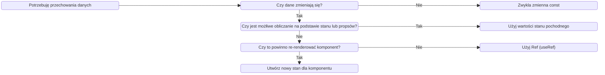
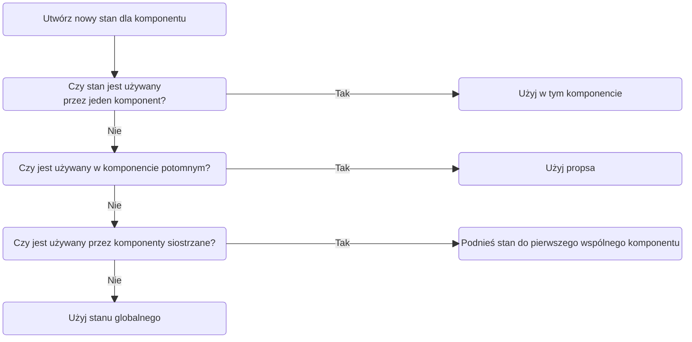
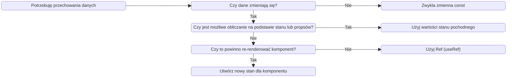

# The Ultimate React Course 2024: React, Redux & More

## 1. Sekcja 1: Welcome, Welcome, Welcome

### 1.1. Wprowadzenie do kursu

### 1.2. Projekt rozpoczęty w codesandbox

Rozpoczęcie projektu po autoryzacji za pomocą konta GH, skrót do utworzenia nowego template w sandboxie pod domeną: react.new
Projekt polegający na utworzeniu prostej apki do pobierania porad z api, wyświetlania ich i zliczania kliknięć. Użyto useState oraz useEffect. Wydzielono komponent z Messages.
Mój kod: https://codesandbox.io/p/sandbox/busy-proskuriakova-mclsv8

### 1.3. Wprowadzenie o czym jest kurs, jak się uczyć i jak działa udemy

### 1.4. Link do repo prowadzącego

https://github.com/jonasschmedtmann/ultimate-react-course

### 1.5. Zapoznanie jak wygląda repo prowadzącego

## 2. Sekcja 2: PART 1: REACT FUNDAMENTALS [4 PROJECTS]

### 2.6. Wstęp

### 2.7. Wylistowanie 4 źródeł pomocnych podczas nauki kursu:

Dokumentacja React - https://react.dev/
Dokumnetacja CRA - Create React App - https://create-react-app.dev/
Dokumentacja buildera Vite - https://vitejs.dev/guide/
Czysty kod HTML z obsługą zagnieżdżenia skryptu z React - https://gist.githubusercontent.com/gaearon/0275b1e1518599bbeafcde4722e79ed1/raw/db72dcbf3384ee1708c4a07d3be79860db04bff0/example.html

## 3. Sekcja 3: A First Look at React

### 3.8. Wstęp

### 3.9. W jakim celu powstały frameworki front-endowe

Omówienie zagadnień SERVER-SIDE RENDERING, CLIENT-SIDE RENDERING (SPA)
Vanilla JS jest imperatywny, trudniejszy do czytania i utrzymania niż deklaratywne frameworki.
Synchronizacja pomiędzy UI i danymi w Vanillii jest bardzo trudna, frameworki zdejmują odpowiedzialnosć z devów.
Frameworki pomagają w narzuceniu struktury kodu i sposobu pisania. Pozwalają devom zachować spójność kodu wewnątrz zespołu.

### 3.10. Prezdstawienie i analiza kodu napisanego w React i Vanilla JS

https://codesandbox.io/p/sandbox/react-first-app-advice-52879f

### 3.11. Czym jest React

React to biblioteka JS, deklaratywna, bazująca na komponentach i stanach.
React nie jest frameworkiem, tylko biblioteką przez to, że reprezentuje tylko warstwę widoku, potrzeba jeszcze innych bibliotek, żeby utworzyć framework (routing, fetching itd.). Frameworki React: Next.Js, Remix.
React renderuje componenty na aplikacji bazując na ich aktualnym stanie. Utrzymuje synchronizację UI dzięki stonom, gdy stan się zmeinia to komponent ponownie renderuje się.

### 3.12 Przygotowanie środowiska developerskiego

Zaleca VSC, NodeJS LTS,
Wtyczki:

- eslint,
- prettier,
- one monokai - zarządzanie kolorami
- material Icon Theme
  Włączenie autosave na onFocusChange co pozwoli na automatyczne zapisanie po zmianie zakładki w VSC, albo po przełączeniu okien. Osobiście widzę sporo problemów i wolę panować na tym kiedy mają pojawiać sie zapisy.
  Ustawienie domyślnego formatera na prettiera i dodanie mu wartości formatOnSave. Fajna opcja, ale nie ma racji bytu podczas pracy nad starszymi projektami lub z projektami które nie mają ustawień dla prettiera, ponieważ przy zapisie zmienia cały plik i później do commita lecą zmiany nie związane z realną zmianą w kodzie.
  Ustawienie Eslint na onSave

### 3.13 Czysty React

Prezentacja w jaki sposób można tworzyć kod w React, React przyjmuje kod w czystym JS. React i babel zaimportowany w pliku html z linków:

```html
    <script src="https://unpkg.com/react@18/umd/react.development.js"></script>
    <script src="https://unpkg.com/react-dom@18/umd/react-dom.development.js"></script>

    <script src="https://unpkg.com/@babel/standalone/babel.min.js"></script>
```

Renderowanie elementów HTML za pomocą funkcji createElement() zamiast składni JSX.
Hooki useState i useEffect przez wywołanie React.useEffect, React.useState zamiast przez wykorzystanie zainstalowanej aplikacji

## 3.14 Prezentacja dokumentacji React

## 3.15 Rozpoczęcie nowego projektu

Przedstawiono dwa buildery używane przy projektach React: CRA i Vite.
CRA jest starterem zawierającym Eslint, Prettier, Jest, webpack itd. Nie zaleca się korzystania z niego na realnych aplikacjach, jedynie do celów edukacyjnych.
Vite jest przedstyawiony jako bardzo szybki builder do budowania "realnych aplikacji". Problemem jest konieczność instalowania dodatkowych paczek jak ESLint, przy którym łatwo o błędy.

## 3.16 Rozpoczęcie projektu przy użyciu CRA

Wstęp do budowy terminala i podstawowych komend:

- ls,
- dir,
- cd

Instalacja projektu za pomocą komendy:

> npx create-react-app@5 pizza-menu

Zapoznanie ze strukturą utworzonego projektu i ruchomienie projektu za pomocą komendy

> npm start

Naniesienie swoich, drobnych zmian

## 4. Sekcja 4: (Optional) Review of Essential JavaScript for React

### 4.17. Wstęp do sekcji

### 4.18. Destrukturyzacja obiektów i tablic

Zainstalowanie dodayku Quokka.js do wywyołania JS w środowisku VSC.
Zaprezentowane sposoby destrukturyzacji obiektów:
Poprzez stworzenie zmiennej obiektu zawierającego elementy do których chcemy sie dostać z obiektu:

> const { title, author, genres } = book;

\*Sposoby destrukturyzacji obiektów niewymienione w kursie:

- Destrukturyzacja w funkcjach
  > function showUser({name, surname}) {
  > console.log(name);
  > console.log(surname);
  > }
  > const user = {
  > name: "Marcin",
  > surname: "Nowak"
  > };
  > showUser(user);

Zaprezentowane sposoby destrukturyzacji tablic:
Poprzez stworzenie zmiennej tablicy zawierającej elementy do których chcemy sie dostać z tablicy (nazwy zostają przypisane do kolejnych elementów):

> const [primaryGenre, secondaryGenre] = genres;

\*Sposoby destrukturyzacji tablic niewymienione w kursie:

- Pominięcie elementów
  > const [name1, name2,, name4] = tab;
- Ustawienie domyślnych wartości
  > const [name1 = "brak", name2 = "brak", name3 = "brak"] = tab;
- Zamiana miejscami wartości
  > [a, b] = [b, a];

### 4.19. Rest/Spread Operator

Rozbicie tablicy na pojedyncze wartości oraz resztę starej tablicy. Wartość reszta starej tablicy musi być wydzielona na końcu:

> const [primaryGenre, secondaryGenre, ...otherGenres] = genres;

Dodanie do tablicy pojedyncze wartości za pomocą operatora spread:

> const newGenres = [...otherGenres, "epic games"];

Dodanie do obiektu pojedyncze wartości za pomocą operatora spread:

> const updatedBook = { ...book, moviePublicationDate: 2000 }

Edycja pojedynczej wartości (price) za pomocą operatora spread:

> const updatedBook = { ...book, moviePublicationDate: 2000, pages: 2000 }

### 4.20. Template Literals

String zapisywany za pomocą ``, w którym można odwołac się do zmiennej przy pomocy ${zmienna}:

```js
> const { moviePublicationDate } = updatedBook;
> const summary = `Data publikacji: ${updatedBook.moviePublicationDate}`;
```

### 4.21 Użycie operatorów warunkowych zamiast if/else

warunek ? true : false

deklaracja zmiennej:

```
> const stop = x > y ? "Stop" : "Move"
```

### 4.22 Funkcje strzałkowe

```js
(parametr) => {blok kodu}
```

Prowadzący zaleca używanie funkcji strzałkowych jako jednolinijkowe:
(parametr) => kod

wyrażenie funkcyjne:

```js
const funkcja = (parametr) => kod
```

deklaracja funkcji:
(parametr) => kod

Wyrażenia można wywoływać wewnątrz template stringów

### 4.23 Skrócone wyrażenia logiczne: &&, ||, ??

&& jeśli pierwsza wartość jest true, to równanie zwraca drugą wartość. Jeśli pierwsza wartość jest falsy to zwraca pierwszą wartość

|| jeśli pierwsza wartość jest true, to równanie zwraca pierwszą wartość. Jeśli pierwsza wartość jest falsy to zwraca drugą wartość.
Jest tu problem, jeśli chcemy pozyskać info o tym, że czegoś jest 0, co nie jest tożsame z odpowiednikiem "undefined" to otrzymamy zwrotkę jakby wartość była false, a nie 0.

?? jeśli pierwsza wartość jest true, to równanie zwraca drugą wartość. Jeśli pierwsza wartość jest falsy to zwraca pierwszą wartość.
Tu problem z wartościami "nullish" został poprawiony

### 4.24 Operator Optional Chaining

?. Dodawany po wartości która może zwracać undefined lub null
Przydatne gdy nie mamy pewności co do sktuktury danych które otrzymamy

### 4.25 Metoda .map()

Metoda zwraca nową tablicę z tą samą długością, ale z wykonanymi operacjami na każdym z elementów.

```js
> const essentialsData = books.map((book) => ({
> title: book.title,
> author: book.author,
> reviewsCount: getTotalReviewCount(book),
> }));
```

### 4.26 Metoda .filter()

Metoda zwraca nową tablicę z wartościami spełniającymi warunek.
Da sie zastosować dwa filtry:

```js
> const longBooksWithMovie = books
> .filter((book) => book.pages > 500)
> .filter((book) => book.hasMovieAdaptation);
```

Ale lepiej użyć jednego z wyrazeniem logicznym:

```js
> const longBooksWithMovie = books
> .filter((book) => book.pages > 500 && book.hasMovieAdaptation)
```

Metody filter można używać z innymi metodami np.

```js
> const adventureBooks = books.filter((books) =>
> books.genres.includes("adventure")
> ).map(book=>book.title)
```

### 4.27 Metoda .reduce()

W kursie przedstawiono metodę .reduce() jako przykład funkcji akumulującej wyniki

```js
> const pagesAllBooks = books.reduce((sum, book) => sum + book.pages, 0);
```

sum - początkowo wynosi 0, następnie akumuluje wyniki dodawania book.pages, w rezultacie dostajemy sumę stron wszystkich książek

Zamiast ", 0" można podstawić obiekt lub tablicę, co w połączeniu z operatorem spread pozwala na filtrowanie, mapowanie, zliczanie elementów itd.

### 4.28 Metoda .sort()

Metoda mutująca tablicę na której działa, służy sortowaniu

```js
> const sorted = arr.sort((a, b) => a - b);
```

Aby zapobiec zmianom oryginalnej tablicy, sortowanie przeprowadza sie na kopii wykonanej za pomocą metody .slice();

```js
> const sorted = arr.slice().sort((a, b) => b - a);

> const sortedByPages = books.slice().sort((a, b) => b.pages - a.pages);
```

### 4.29 Niemutujące tablice

Wykorzystanie operatora spread (dodanie) i metod filter() (usuwanie) oraz map() (aktualizacja) nie mutuje tablic, tylko zwraca nową

### 4.30 JS asynchroniczny - Promises

Promis składa sie z fetcha() i następujących po nim metod .then() zawierających instrukcje

```js
> fetch("https://jsonplaceholder.typicode.com/todos").then(res=>res.json()).then(data=>console.log(data));
```

Asynchroniczność polega na tym, że kod może wykonać jakąś operację, bez oczekiwania na zakończenie poprzedniej operacji.

### 4.31 JS asynchroniczny - Async/await

Blok async/await pozwala na czytelniejsze i prostsze przypisanie danych pobranych asynchronicznie ze źródła

```js
> async function getTodos() {
> const res = await fetch("https://jsonplaceholder.typicode.com/todos");
> const data = await res.json();
> console.log(data);
>
> return data;
> }
> const todos = getTodos();
>
> console.log(todos); //Promise
```

## 5. Sekcja 5: Working With Components, Props, and JSX

### 5.32 Wprowadzenie do sekcji

### 5.33 Renderowanie komponentu Root i strict mode w JS

Strict Mode jest częścią React.
Komponenty renderuje się poprzez odwołanie do elementu html któy jest rootem i wywołanie metody render():

```js
> const root = ReactDOM.createRoot(document.getElementById('root'));
> root.render(
> <React.StrictMode>
> <App />
> </React.StrictMode>
> );
```

### 5.34. Debugging

Główne przyczyny nie działania aplikacji:

- Brak uruchomionej aplikacji (npm start)
- Potrzeba przeładowania przeglądarki

Błędy mogą pojawiaś się w zakładkach VSCode: termional i problemy, dane wyjściowe oraz w konsoli przeglądarki.

Kolejne przykłady błędów:

- Wiele zwracanych elementów JSX nie owrapowanych rodzicem
- Zmienna do któej nic się nie odwołuje (eslint)

### 5.35 Komponenty jako bloki kodu

Komponent to podstawowe założenie react. W React służą do budowania bloków UI. UI składa się z warstw danych, logiki i wyglądu.
Cały UI składa się z wielu połączonych komponentów.

### 5.36 Tworzenie i reużywalność komponentów

Komponenty w React tworzymy jako funkcje, nazwa funkcji jest zapisywana z wielkiej litery, PascalCase.
Komponentów można używać wielokrotnie.

### 5.37 Czym jest JSX

Pozwala pisać kod deklaratywnie, opisuje jak komponent ma działać i wyglądać. Komponenty uruchamiają blok kodu JSX. JSX jest rozszerzeniem JS pozwalającym na osadzenie JS, CSS i komponentów React w składni HTML
JSX jest konwertowany do funkcji React.createElement()

Kod imperatwny: krok po kroku opisujemy jak utworzyć komponent: querySelectory, addEventListener, classList.add() itd.
Kod deklaratywny: JSX

```js
> <p>{question.text}</p>
> <UpvotBtn
> onClick={upvote}
> upvotes={upvotes}
> />
```

### 5.38 Tworzenie dodatkowych komponentów

Utworzenie komponentów Header, Menu, Footer i osadzenie w Menu komponentu Pizza

### 5.39 JS w komponentach

Użycie zmiennych i funkcji do poierania informacji o godzinie wewnątrz komponentu

```js
> const hour = new Date().getHours();
> const hours = {
> open: 12,
> close: 18
> }
> const isOpen = hour >= hours.open & hour <= hours.close;
```

### 5.40 Separation of Concerns (Modulartność kodu)

W react zastosowano nowe podejście w podziale kodu na logikę i UI. Dotychczasowo za html, css i js odpowiadały osobne pliki, teraz wszystkie informacje są przechowywane w obrębie jednego komponentu, zachowując przy tym podział obowiązków konkretnych bloków kodu.

### 5.41 Stylowanie w aplikacji React

Liniowo za pomocą obiektu

```js
> <h1 style={{ display: "flex", fontSize: "32px" }}> Tekst </h1>
```

Przekazanie obiektu ze zmiennej:

```js
> const styles = { display: "flex", fontSize: "32px" }
>
> <h1 markdown="1" style={styles}> Tekst </h1>
```

Za pomocą klasy ostylowanej w osobnym pliku .css:

```js
> <div> className="container"</div>
```

Nie można użyć słowa class, ponieważ jest zarezerwowane w JS (skłądnie to JSX, a nie HTML) dla deklaracji klas

### 5.42 Obsługa propsów

Props to przekazanie wartości poprzez atrybuty do elementu potomnego.

```js
> <Pizza
>   imgSrc={pizza.photoName}
>   name={pizza.name}
>   ingredients={pizza.ingredients}
>   key={i}
> />
```

Wywołanie właściwości propsa poprzez destrukturyzację obiektu props w elemencie dziecka:

> Pizza(props) {
> const { imgSrc, name, ingredients } = props;
> }

### 5.43 Props, Immutability, and One-Way Data Flow

- Propsy służą do przekazywania danych z komponentu rodzica do komponentu dziecka (w dół drzewa komponentów)
- Niezbędne narzędzie do obsługi komponentów, podobne do parametrów funkcji
- Dzięki propsom komponent rodzica kontroluje jak komponent dziecka wygląda i działa
- Cokolwiek może być ptrzekazane jako props:
  - pojedyncza wartość,
  - tablice,
  - obiekty,
  - funkcje,
  - inne komponenty

Propsy są niemutowalne, a przepływ danych jest w dół drzewa komponentu. Jeśli jest potrzeba zmian propsa, to odbywa się przez stan. Zmiany w propsach prowadzą do zmian w komponencie rodzica, a to tworzy efekty uboczne, co nie jest czystym rozwiązaniem. Komponenty mają być czystymi funkcjami, to pozwalia optymalizować aplikacje, unikać błędów i czynią apkę przewidywalną.

Jednokierunkowy przepływ danych czyni aplikacje łatwiejszymi do zrozumienia oraz do kontroli. Prościej je naprawiać i mamy większą kontrolę nad nią oraz zwiększa wydajność.
Dwukierunkowy przepływ danych jest wykorzystywany np. w angularze.

### 5.44 Zadanie #1 Karta profilu

Kod w repo

### 5.45 Zasady JSX

Specyfika:

- JSX działą i wygląda jak HTML, lecz obsługuje tryb "JavaScript", dzięki zastosowaniu {}
- Można zamieszczać wywołania JS wewnątrz {}. Np.: odwołąnia do zmiennych, tworzenie tablic lub obiektów, funkcje tablicowe np. [].map(), operator warunkowy itd.
- If/else, pętle, switche nie są dopuszczone
- JSX działa dzięki wywołaniu JavaScript
  - Można zamieścić JSX wewnątrz JSX za pomocą {}
  - JSX można pisać wszędzie wewnątrz komponentu (if/else, przypisanie do zmiennycg, dodanie do funkcji)
- JSX ma jeden element root

Różnice w porównaniu do HTMLa:

- className zamiast class
- htmlFro zamiast for
- każdy tag musi być zamknięty np. `, <br />`
- obsługa zdarzeń, atrybuty i inne właściwości są pisane camelCasem: onClick, OnMouseOver
  - wyjątkiem są aria-_ i data-_, one są pisane jak HTML
- liniowe style CSS są wprowadzane jako obiekt: ``
- właściwości CSS są wywoływane jako camelCase
- komentarze muszą być wewnątrz {} jak w JS

### 5.46 Wywołanie listy

Za pomocą funkcji .map() wywołanej na tablicy. Chodzi o to, żeby było można podstawić tyle komponentów dziecka ile mamy danych do podziału przekazanuych do rodzica.

```js
> <main className="menu">
>   <h2>Our Menu</h2>
>   {
>     pizzaData.map((pizza, i) => {
>       return (
>         <Pizza
>           imgSrc={pizza.photoName}
>           name={pizza.name}
>           ingredients={pizza.ingredients}
>           key={i}
>           price={pizza.price}
>         />
>       );
>     })
>   }
> </main>

```

### 5.47 Warunkowe renderowanie z &&

Jeśli sprawdza czy jakaś wartość istnieje, to jeśli jej nie ma zwróci 0, a jeśli sprawdzi jakieś porównanie to zwróci false. Jeśli się da, to lepiej użyć operatora warunkowego.

```js
> const pizzas = pizzaData;
> const pizzasNums = pizzaData.length;
> return
>
>   <main className="menu">
>     <h2>Our Menu</h2>
>     pizzasNums > 0 &&
>       <ul className="pizzas">
>         {pizzas.map(pizza, i) =>
>           return
>             <Pizza
>               imgSrc={pizza.photoName}
>               name={pizza.name}
>               ingredients={pizza.ingredients}
>               key={i}
>               price={pizza.price}
>             />
>           ;
>         }
>       </ul>
>   </main>
> ;
```

### 5.48 Warunkowe renderowanie z operatorami

```js
> {pizzasNums > 0 ? (
>
>   <ul className="pizzas">
>     {pizzas.map((pizza, i) => {
>       return (
>         <Pizza
>           imgSrc={pizza.photoName}
>           name={pizza.name}
>           ingredients={pizza.ingredients}
>           key={i}
>           price={pizza.price}
>         />
>       );
>     })}
>   </ul>
> ) : (
>   <p>Pracujemy nad menu, odwiedź nas później</p>
> )}
```

### 5.49 Warunkowe renderowanie z wieloma deklaracjami return

Przydatne np. gdy jakieś dane nie wymagają wyświetlenia w komponencie

```js
> function Pizza(props) {
> const { photoName, name, ingredients, price, soldOut } = props;
> if (soldOut) return null;
> return (
>
> <div className="pizza">
> 
> <div>
> <h3>{name}</h3>
> <p>{ingredients}</p>
> <span>{price}</span>
> </div>
> </div>
> );
> }
```

### 5.50 Wyodrębnianie JSX w nowym komponencie

Utworzenie komponentu Order w stopce

### 5.51 Destrukturyzacja propsów

Podstawowym sposobem jest destrukturyzacja bezpośrednio w deklaracji komponentu:

```js
> function Pizza({ photoName, name, ingredients, price, soldOut }) {
> }
```

Kolejnym sposobem jest zadeklarowanie jako zmienne:

```js
> function Pizza(props) {
> const { photoName, name, ingredients, price, soldOut } = props;
> }
```

### 5.52 React Fragments

Pozwala grupować elementy bez dodawania dodatkowych elementów w drzewie HTML

```js
> <></>
```

Użycie React Fragment gdy potrzebujemy przekazać atrybut key:

```js
> <React.Fragment key={i}></React.Fragment>
```

### 5.53 Warunkowe dodawanie klas i tekstu

Dodanie klasy:

```js
> <div className={`pizza ${soldOut && "sold-out"}`}></div>
```

Wpływanie na tekst:

```
> <span>{soldOut ? "Sold out" : price}</span>
```

### 5.54 Sekcja podsumowująca

Każdy komponent jest samodzielnym elementem UI. Zawiera własne: dane, logikę JS oraz własny wygląd.
Komponenty są napisane za pomocą deklaratywnej składni JSX. Każdy fragment JSX może zawierać znaczniki, zasadniczo w formie HTML.
Do komponentów potomnych przekazuje się konfiguracje za pomocą propsów.
Za pomocą metod tablicowych .map(), renderujemy wiele komponentów.
Renderowanie warunkowe służy do wprowadzania zależności w konfigurowanych komponentach.

### 5.55 Zadanie #2 Karta profilu v2

Kod w repo pod katalogiem 5.44

## Sekcja 6: State, Events, and Forms: Interactive Components

### 6.56 Przegląd sekcji

Sekcja o tym jak stworzyć interaktywne komponenty

### 6.57 Tworzenie komponentu z krokami

Sekcja inicjująca projekt

### 6.58 Obsługa zdarzeń w React

Obsługujemy deklaratywnie, eventy obsługujemy liniowo np. onClick={}, zamiast addEventListener.

### 6.59 Czym jest stan w React

Stan to dane które może przechowywać podczas cyklu życia aplikacji. To coś na kształt pamięci komponentu.
Zmianna stanu to zmienna w komponencie. Aktualizacja stanu powoduje re-renderowanie komponentu.
Stan pozwala programistom na utrzymanie wartości zmiennych pomiędzy renderowaniami.

### 6.60 Tworzenie zmiennej stanu przy pomocy hooka useState

Poprzez destrukturyzację tablicy zawierającej się w useState()

```js
> const [step, setStep] = useState(1)
```

### 6.61 Nie obsługuj stanu ręcznie!

Nie można edytować stanu za pomocą let

```js
> let [zmienna, setZmienna] = useState(1)
> zmienna = zmienna ++ // nie zadziała!
```

**Nie wolno** mutować zmiennych:

```js
> const [test] = useState({name: "John"})
> test.name = "Paul"
```

### 6.62 Mechanika stanu

Każda zmiana stanu wywołuje ponowne wyrenderowanie komponentu z podstawionymi już danymi.

React nosi swoją nazwę ponieważ reaguje na zmiany stanu poprzez re-render UI.

### 6.63 Dodanie kolejnego stanu

Dodano useState z isOpen, żeby przełączać widoczność dzięki operatorowi warunkowemu &&

### 6.64 React developer tools

Zapoznanie z zakładką Components w React dev tools

### 6.65 Aktualizacja stanu na podstawie aktualnego stanu

Najlepiej aktualizować stan na podstawie aktualnego stany z wykorzystaniem callbacka

```js
> function handleAddStep() {
> step > 1 && setStep((s)=>s - 1)
> }
```

### 6.66 Praktyczne wskazówki dotyczące stanów

Każdy komponent ma własny stan. UI to reprezentacja danych zmieniających się w czasie, a nie jawna manipulacja DOMem.
Opisujemy UI danymi zmieniającymi stan, obsługą zdarzeń i JSxem.

**Wskazówki**

- Używaj stanu dla zmiennych które muszą pozostać zapamiętane (w JS to let, [] lub {}).
- Jeżeli coś w komponencie ma być dynamiczne, trzeba utworzyć stan powiązany z tym elementem i trzeba aktualizować stan gdy ten element powinien się zmienić.
- Jeśli chce zmienić wygląd komponentu lub wyświetlane dane to powinienem aktualizować stan. To dzieje sie za pomocą obsługi zdarzeń.
- Komponent jest odbiciem stanu zmieniającego sie nieustannie
- Dla danych nie potrzebujących re-renderowania, nie używaj useState, użyj zwykłej zmiennej.

### 6.67 Użycie Vanilla JS

Przykład wykonanej aplikacji w Vanilla JS oraz zaprezentowanie, że komponenty są osobnymi bytami.

### 6.68 Wyzwanie 1: Licznik daty

Licznik wskazuje datę +/- od dnia zero. W dodatku ma być opcja "step" dzięki której ustalamy jak duży ma być przeskok czasu.

W repo katalog 6.68.

### 6.69 Rozpoczęcie nowego projektu "Far Away" Lista do podróży

W repo katalog 6.69

### 6.70 Tworzenie Layoutu

Utworzenie komponentów:

```js
> <Logo />
> <Form />
> <PackingList />
> <Stats />
```

### 6.71 Renderowanie list elementów

Renderowanie za pomocą metody JS .map()

### 6.72 Tworzenie formularza i obsługa podzadań

Utworzenie opition za pomocą Array.from()

```js
> {Array.from({ length: 20 }, (\_, i) => i + 1).map((num) => (
>
>   <option value={num} key={num}>
>     {num}
>   </option>
> ))}
```

### 6.73 Kontrolowanie elementów

Manipulacja inputem oraz selectem za pomocą stanu i metod onChange

### 6.74 State vs. Props

**Stan**

- Dane wewnątgrzne
- Pamięć komponentu, może być aktualizowany przez komponent
- Aktualizacja stanu powodoje ponowne renderowanie komponentu
- Czyni komponent interaktywnym

**Props**

- Zewnętrzne dane, przetrezymywane przez komponent rodzica
- Podobny do argumentu funkcji
- Tylko do odczytu
- Otrzymanie nowych propsów powoduje ponowne wyrenderowanie komponentu. Często gdy rodzić jest aktualizowany.
- Używane przez rodzica do konfugurowania komponentu dziecka

### 6.75 Zadanie #1: Flashcards

Zrobienie aplikacji do wyświetlania pytania i odpowiedzi. Odpowiedź ma się pojawić po kliknięciu, gdy użytkownik kliknie na inną kartę stara zostaje ponownie zasłonięta. Do użycia powinien być wykorzystany jeden stan.

repo katalog 6.75

### 6.76 Wyzwanie 2: Licznik daty v2

repo katalog 6.76

## 7. Sekcja 7: Thinking In React: State Management

### 7.77 Przegląd sekcji

Poruszone askpekty:

- Myślenie "Reactowe"
- Zarządzanie stanem
- Kiedy i gdzie tworzyć stan
- Kominukacja pomiędzy komponentami podrzędnymi oraz nadrzędnymi

### 7.78 Czym jest myślenie "Reactowe"

- Dobry model mentalny jak tworzyć:
  - komponenty,
  - stan
  - propsy
  - data flow
  - effects
  - etc.
- Myślenie o zmianie stanu, a nie zmianie komponentu
- Proces:
  - Podzielenie kodu na komponenty i tworzenie drzewa komponentów
  - Zbudowanie statycznej wersji kodu, bez stanu
  - Myślenie o stanie:
    - Kiedy użyć stanu
    - Rodzaj stanu: lokalny vs. globalny
    - Gdzie powinien znajdować się stan
  - Ustalenie data flow
    - Jednokeirunkowy przepływ danych
    - komunikacja dziecko-rodzic
    - Dostęp do globalnego stanu

Pytania na które powinienem znać odpowiedź:

- Jak podzielić UI na komponenty?
- Jak sprawić, żeby komponenty były wielokrotnego użytku?
- Jak utworzyć UI z reużywalnych komponentów?
- Jakich składowych stanu potrzebuję do interaktywności?
- Gdzie powinien znajdować się stan? Który komponent powinien zarządzać konkretnym stanem?
- Jakiego rodzaju stanu powinienem lub mogę użyć?
- Jak utworzyć przepływ danych przez aplikację

### 7.79 Podstawy zarządzania stanem w React

Zarządzanie stanem jako decyzja kiedy tworzyć nowe elementy stanu, jakie typy stanu są konieczne, gdzie powinny znajdować się wywołania stanu oraz jak powinny przepływać dane przez aplikację.

**Różnice pomiędzy stanem globalnym i stanem lokalnym**

Stan lokalny:

- stan potrzebny jednemu lub kilku componentom
- stan zdefiniowany w komponencie, dostępny tylko dla tego komponentu i komponentów potomnych
- zawsze powinno się zaczyna od stanu lokalnego

Stan globalny:

- stan potrzebny w wielu komponentach
- udostępniony dla każdego komponentu w aplikacji

**Gdzie i kiedy użyć stanu**

Kiedy: <br/> <br/>


Gdzie: <br/> <br/>


Stan globalny możemy wykorzystać gdy jest potrzbny w wielu komponentach rozsianych w rónych miejscdach aplikacji

### 7.80 Jak myśleć o stanie i wynoszeniu stanu do komponentu nadrzędnego

repo katalog 6.69

### 7.81 Wyjaśnienie "Wyniesienie stanu do komponentu rodzica"

Przepływ od rodzica do dziecka. Aktualizacja stanu za pomocą funkcji zadeklarowanej w rodzicu i przekazanej do dziecka.

### 7.82 Usunięcie elementu: Wieksza komunikacja rodzic-dziecko

repo katalog 6.69

Usuwanie za pomocą funkcji handleDelete() w App.js
```js
> function handleDelete(id) {
>   setItems((prevItems) => prevItems.filter((item) => item.id !== id));
> }
```

### 7.83 Edycja elementu: Złożona operacja na danych ze stanu

Dodanie inputa do zmiany stanu rzeczy z listy potrzebnych do podróży:

```js
> <input
>   type="checkbox"
>   checked={packed !== undefined ? packed : false}
>   onChange={() => changePacked(id)}
> />
```

### 7.84 Stan pochodny

repo katalog 6.69

Stan pochodny jest wyliczany z istniejącego stanu lub propsa
Np.

```js
> const [cart, setCard] = useState([
  { name: "book1", price: "15,99" },
  { name: "book2", price: "12,99" }
])
const numItems = cart.length;
const totalPrice = cart.reduce((acc, cur) => acc + cur.price, 0)
```

### 7.85 Obliczanie statystyk - Stan pochodny

repo katalog 6.69

```js
> const { items } = props;
>   
> if (!items.length) // zabezpiczenie przed wykonywaniem obliczeń, gdy nie ma elementów
>   return (
>     <p className="stats">
>       <em>Dodaj coś do listy pakowania</em>
>     </p>
>   )
> 
> const itemsNumbers = items.length;  
> const intemsPackedNumbers = items.filter((item) => item.packed && item).length;
> const itemsPackedPercentage = Math.round((intemsPackedNumbers / itemsNumbers) * 100);
```

### 7.86 Sortowanie elementów

repo katalog 6.69

Sortowanie z użyciem stanu do ustalenia wartości selecta. Sortowanie przy pomocy zmiennej let bez użycia stanu do przetrzymywania informacji o kolejności elementów w liście:

```js
>  const [sortBy, setSortBy] = useState("default");
>
>  let sortedItems;
>
>  if (sortBy === "description") {
>    sortedItems = newItems
>      .slice()
>      .sort((a, b) => a.description.localeCompare(b.description));
>  } else if (sortBy === "package-status") {
>    sortedItems = newItems
>      .slice()
>      .sort((a, b) => Number(a.packed) - Number(b.packed));
>  } else {
>    sortedItems = newItems
>      .slice()
>      .sort((a, b) => a.id - b.id);
>  }
>
>  function handleSort(value) {
>    setSortBy(value);
>  }
```

### 7.87 Czyszczenie listy

repo katalog 6.69

Przekazanie pustej tablicy do stanu z listą elementów, wywołanie confirm:

```
> const confirmed = window.confirm("Czy jesteś pewny, że chcesz wyczyścić listę?");
> confirmed && setItems([]);
```

### 7.88 Przenoszenie komponentów do osobnych plików

repo katalog 6.69

### 7.89 Zadanie #1: Komponent akordeonu

repo katalog 7.89

### 7.90 Props {children}: reużywalny przycisk

repo katalog 6.56

Props {children} jest czymś w rodzaju dziury, któą można napełnić dowolnym kodem JSX. Podstawowe narzędzie do tworzenia reużywalnych i łatwych w konfiguracji komponentów. Użyteczny podczas tworzenia komponentów które nie muszą znać swojego kontentu przed użyciem, np. modal.

### 7.91 Więcej przykładów reużywalności z propsem {children}

Przekazanie komponentu Button jako children:

repo katalog 6.56

```
> <StepMessage step={step}>
>   {messages[step - 1]}
>   <div className="buttons">
>     <Button
>       onClick={() => alert(`Learn how ${messages[step - 1]}`)}
>       bgColor="#e7e7e7e7"
>       color="#333"
>     >
>       Learn how
>     </Button>
>   </div>
> </StepMessage>
```

### 7.92 Zadanie #2: Komponent akordeonu v2

Zmiana w elementach akordeonu, teraz żaden z komponentów nie będzie zarządzał informacją o stane samodzielnie, a będzie dziedziczył informację czy ma być otwarty od rodzica (na podstawie swojego id). Zmieni się funkcjonalność, od teraz moze być tylko jeden element otwarty.

### 7.93 Wyzwanie #1: Kalkulator napiwków

repo katalog 7.93

## 8 Sekcja 8: [Optional] Practice Project: Eat-'N-Split

### 8.94 Przegląd sekcji

Podsumowanie podstaw z React podczas tworzenia aplikacji "Eat-N-Split"

### 8.95 Wstęp do projektu

Aplikacja do pomocy podczas podziału wydatków. Ma podsumować wydatki, dodać przyjaciela.

repo katalog 8.95

### 8.96 Wersja statyczna aplikacji: Lista przyjaciół

repo katalog 8.95

### 8.97 Wersja statyczna aplikacji: Formularze

repo katalog 8.95

### 8.98 Pojawianie się formularza dodającego przyjaciół

repo katalog 8.95

### 8.99 Dodanie przyjaciela

repo katalog 8.95

### 8.100 Wybranie przyjaciela

repo katalog 8.95

### 8.101 Tworzenie elementu kontrolującego

repo katalog 8.95

### 8.102 Rozdszielenie rachunku

repo katalog 8.95

## 9 Sekcja 9: Średniozaawansowany React: [2 Projekty]

### 9.103 Wstęp do części 2

Prezentacja aplikacji usePopcorn

### 9.104 Przydatne źródła

Pisanie odpornych komponentów
https://overreacted.io/writing-resilient-components

Nie rozpraszaj się wyimaginowanymi problemami:

- Ludzie postrzegają lintera jako nadgorliwego, hałaśliwego strażnika, a nie pomocnego narzędzia
- Ludzie odróżniają prawidłowego i nieprawidłowego użycia określonego wzorca. Na przykład istnieje popularna reguła zabraniająca wywoływania setState wewnątrz komponentu ComponentDidMount, ale jeśli zawsze byłby to bład to React blokowałby ją.
- Ludzie nadgorliwie walczą o semantykę i egzekwowanie zasad, które nie wnoszą znaczącej różnicy. „Użyłeś deklaracji funkcji, ale w naszym projekcie zastosowano funkcje strzałkowe.”

**“Has this rule ever helped us catch a bug?” If not, turn it off.**
**Use the linter to find bugs, not enforcing the a e s t h e t i c s.**

Zasady odpornych komponentów:

- Nie zatrzymuj przepływu danych
- Zawsze bądź gotowy do renderowania
- Żaden komponent nie jest singletonem
- Trzymaj stan lokalny w izolacji

#### Principle 1: Don’t Stop the Data Flow

##### Don’t Stop the Data Flow in Rendering

##### Don’t Stop the Data Flow in Side Effects

##### Don’t Stop the Data Flow in Optimizations

#### Principle 2: Always Be Ready to Render

#### Principle 3: No Component Is a Singleton

#### Principle 4: Keep the Local State Isolated

Filozofia react
https://github.com/mithi/react-philosophies

Przewodnik po renderowaniu w React
https://blog.isquaredsoftware.com/2020/05/blogged-answers-a-mostly-complete-guide-to-react-rendering-behavior/

Wizaualny przewodnik po rendorowaniu w React
https://alexsidorenko.com/blog/react-render-always-rerenders/

React Fiber - konferencja
https://www.youtube.com/watch?v=ZCuYPiUIONs

React Fiber - czym jest
https://www.youtube.com/watch?v=0ympFIwQFJw

React i React Native
https://levelup.gitconnected.com/how-exactly-does-react-handles-events-71e8b5e359f2

React Events Listener
https://gist.github.com/romain-trotard/76313af8170809970daa7ff9d87b0dd5

Przewodnik jak zrobić samodzielnie aplikację React
https://github.com/pomber/didact

useSync­External­Store
https://julesblom.com/writing/usesyncexternalstore

Zagłębienie się jak działają hooki w React
https://the-guild.dev/blog/react-hooks-system


Dlaczego hooki React opierają się na kolejności wywołań?
https://overreacted.io/why-do-hooks-rely-on-call-order

React refs
https://thoughtspile.github.io/2021/05/17/everything-about-react-refs/

react use
https://github.com/streamich/react-use

reacthookz/web
https://github.com/react-hookz/web

## 10 Sekcja 10: Myślenie w React: Komponenty, Kompozycja i Reużywalność

### 10.105 Przegląd sekcji

W sekcji zapowiedziano:

- Jak traktować komponenty
- Czym jest kompozycja
- Czy jest reużywalność
- Jak podzielić komponent
- Jak budować layout

### 10.106 Rozpoczęcie projektu usePopcorn

Wersja do testowania na usepopcorn.netlify.app

repo katalog 10.106

### 10.107 Jak dzielić komponenty w UI

Jeśli komponent przyjmuje 10-15 propsów to powinien zostać podzielony.

4 kryteria podziału komponentu:

- Logiczny podział kontentu/layoutu
- Reużywalność
- Podział odpowiedzialności
- Osobiste preferencje co do wielkości komponentu

Logiczny podział kontentu/layoutu - jeśli komponent zawiera niespójne ze sobą fragmenty to należy go podzielić

Reużywalność - jeśli da się ponownie użyć komponent i zajdzie taka potrzeba lub chęć

Podział odpowiedzialności - Jeśli komponent robi zbyt wiele rzeczy lub zależy od zbyt wielu propsów. Jeśli posiada zbyt wiele stanów lub efektów. Jeśli kod (w tym JSX) są zbyt skomplikowane/mylące

Osobiste preferencje co do wielkości komponentu - Dostosuj wielkość kodu do własnych wymagań/wymagań zespołu

**Wskazówki ogólne**:

- Tworząc nowy komponent **tworzę nową warstwę abstrakcji**. Abstrakcja kosztuje dodatkowy wysiłek umysłowy podczas tworzenia aplikacji. Ważne, żeby nie tworzyć zbyt wielu komponentów zbyt wcześnie.
- Nazywanie komponentów na podstawie tego co robią i co wyświetlają. Można używać długich nazw.
- Nie deklaruje się komponentu wewnątrz innego komponentu
- Zamieszczanie komponentów wewnątrz tego samego pliku. Nie rozbijaj komponentów na osobne pliki zbyt wcześnie
- Normą jest to, że projekty mają różnej wielkości komponenty: małe i ogromne.

### 10.108 Podział komponentów w praktyce

repo katalog 10.106

### 10.109 Kategorie komponentów

- komponenty bezstanowe lub prezentacyjne,
- komponenty stanowe,
- komponenty strukturalne

**Komponenty bezstanowe**

Bez stanu, przyjmują props i prezentują dane, zwykle małe i reużywalne

**Komponenty stanowe**

Posiadają stan, mogą być reużywalne

**Komponenty strukturalne**

Komponenty layoutu jak Pages, Layout, Screen. Skłądają się z mniejszych komponentów, mogą być małe, jednak zwykle są duże i raczej nie reużywalne.

### 10.110 Przekazywanie komponentu w propsie przez wiele warstw

repo katalog 10.106

### 10.111 Kompozycja komponentu

repo katalog 10.106

### 10.112 Poprawienie przekazywania komponentu z kompozycją

repo katalog 10.106

### 10.113 Użycie kompozycji do stwoprzenia reużywalnego boxa

repo katalog 10.106

### 10.114 Wprowadzanie elementu jako propsa, alternatywa dla children

```js
> <Box element={<MovieList movies={movies} />} />
```

Z tego rozwiązania korzysta np. React Router.

### 10.115 Tworzenie reużywalnego komponentu oceny filmu

repo katalog 10.106

### 10.116 Tworzenie gwiazdek oceny filmu

repo katalog 10.106

### 10.117 Obsługa zdarzenia: najechanie kursorem

repo katalog 10.106

Użycie metod onMouseEnter i onMouseLeave jako nasłuchujących na wydarzenia związane z najadem kursora.

### 10.118 Props jako komponent API

repo katalog 10.106

### 10.119 Zwiększenie reużywalności przez API

Przykład rozpisanych właściwości komponentu:

```js
>  const { maxRating = 5, color = "#fcc419", size = 48, className = "", messages = [], defaultRating = 0, onSetRating = () => {return true} } = props;
```

### 10.120 PropTypes

Już się nie używa, jeśli chcemy panować na typami to pisze się kod w TypeScript.

```js
> import PropTypes from 'prop-types' - zainstalowana wraz z CRA

> StarRating.propTypes = {
>   maxRating: PropTypes.number,
>   messages: PropTypes.array,
>   onSetRating: PropTypes.func,
> }
```

### 10.121 Wyzwanie #1: Komponent skracający tekst

repo katalog 10.121

## 11 Sekcja 11: Jak React działa "pod spodem"

### 11.122 Wstęp do sekcji

### 11.123 Wstęp do projektu i prezentacja na czym polega

Projekt ma symulować kod innego programisty, mam się wcielić w osobę dołączającą do nowego zespołu

### 11.124 Komponenty, instancje i elementy

Komponent to funkcja która zwraca element React, szablon z któego React tworzy instancje komponentu.
Instancja komponentu to osobne wywołania szablonu, które przechowują swój stan i props oraz posiadają własny cykl życia.
Element React to wynik wywołania funkcji React.createElement(). Element React jest konwertowany w elemenet DOM.

### 11.125 Instancje i elementy w praktyce

repo katalog 10.121

Zabezpieczenie React przed atakiem xss:

```js
> $$typeof: Symbol(react.element)
```

Wywołanie komponentu jak funkcji przez Komponent(), nie zadziała poprawnie. Element nie zostanie prawidłowo zinterpretowany jako instancja komponentu z type: DifferentContent(), a jako funkcja renderująca element html

### 11.126 Jak działa renderowanie: Przegląd

Renderowanie elementów w React składa się z dwóch faz: renderowanie i commit. Faza renderowania polega na wewnętrznej aktualizacji react, nie ma zmian graficznych na UI użytkownika. Faza commit polega na przekazaniu informacji o zmianie elementów, usunięciu elementów itd.
Za wyświetlenie elementów odpowiada przeglądarka.

Wywołąnie renderowania:

- Początkowe renderowanie (initial render),
- Rerender przez aktualizację stanu w jednym lub wielu instancjach komponentu

Rednderowanie oświeża całą aplikację, ale nie aktualizuje całego dom. Render w react polega na wywołaniu funkcji komponentów i ustalaniu co należy zmienić w DOM później.
Renderowanie nie jest wywołane od razu, a zostaje zaplanowane przez silnik obsługujący JS na "czas wolny". Wiele wywołań aktualizacji stanu jest obsługiwanych grupowo.

### 11.127 Jak działa renderowanie: Faza renderowania

Nie jest prawdą że:

- Render w React polega na odświeżeniu widoku ekranu / DOM
- React kasuje stary widok podczas rerenderowania

Virtual DOM jest drzewem elementów React, stworzonym ze wszystkich instancji w drzewie komponentów. Nie ma nic wspólnego z "shadow DOM" który jest wbudowany w przegloarkę i obsługuje "web components".

Jeśli element rodzica zostanie ponownie wyrenderowany, to wszystkie elementy potomne, aż do samego dołu drzewa również zostaną rerenderowane. Nie ma znaczenia czy na 15 piętrze potomków zmienił się props, czy nie.

Nowy DOM zostanie uzgodniony z tak zwanym **drzewem Fiber**, istniejącym przed aktualizacją. Uzgadnianie jest dokonywane w Reconcilerze - Fiber (uzgadniaczu). Następnie dochodzi do aktualizacji drzewa Fiber.

Dlaczego Reconciler jest potrzebny i zamiast niego nie aktualizować całego DOM?
Zapis DOM jest stosunkowo powolny, nie ma sensu odświeżać gdy zmienia się tylko mała część DOM.
React reużywa z istniejącego DOM, ile tylko może, dzięki reconciliation (uzgadnianiu).

Reconciler odbiera Virtualny DOM i przebudowuje na Fiber Tree.

Fibers nie są odtwarzane przy każdym renderowaniu ale jest mutowana.
Fibers służą do porównywania aktualnego stanu, propsów, effectsów, hooków ze stanem początkowym
Fibers są jednostką pracy. Praca jest wykonywana asynchronicznie: renderowanie jest podzielone na kawałki, zadania są prioretyzowane, a praca jest zastrzymana, reużyta lub odrzucona. Umożliwia użycie współbieżnych funkcji (concurrent features) jak Suspense i transitions. Długie renderowania nie blokują silnika JS.

Diffing - analiza wykonana przez Fiber, wskazujaca na różnice pomiędzy aktualnym drzewem Fiber, a zaktualizowanym drzewem Fiber opartym na nowym wirtualnym DOM.

Na końcu tworzy listę aktualizacji w DOM, jako wynik "listy efektów".

### 11.128 Jak działa renderowanie: Faza commitu

React zapisuje do DOM: wstawia, usuwa i aktualizuje elementu DOM. Zmiany zostają "przelane" z listy DOM do właściwego DOM. Wykonując zmiany jedna po drugiej.
Faza commitu jest synchroniczna, jest to konieczne, żeby DOM nie pokazywał częściowego rezultatu co zapewnia spójny UI. W tym celu podzielono proces renderowania na fazę renderowania i fazę zatwierdzania (commitu).

Po fazie commitu drzewo Fiber workInFrogress zostaje drzewen aktualnym do następnego cyklu renderowania. Za fazę commitu nie odpowiada ani React, ani przeglądarka, tylko biblioteka React DOM.
Na końcu rendorowany jest obraz w przeglądarce.

React używa biblioteki React DOM, ponieważ został tak zaprojektowany, żeby nie korzystać z jednej platformy, a działać zarównow React DOM, ReactNative lub Remotion.
Te biblioteki do fazy commitowania określono jako renderers, co jest błędem, bo nie obsługują rendorowania, tylko zatwierdzanie różnic w Fiber.

BTW. wyniki fazy renderowania nie są listą aktualizacji DOM, a listą aktualizacji dowolnych elementów. Dlatego React woli nazywać wirtualny dom Elementami React.

### 11.129 Jak działa Diffing

Diffing jest oparty o dwa założenia:

- Dwa elementy różnych typów tworzą różne drzewa.
- elementy ze stabilnym kluczem nie zmieniają się podczas renderów

### 11.130 Jak działa Diffing w praktyce

repo katalog 11.123

Przedstawienie zasady mówiącej, ze jeśli nie zmienia się klucz to nie jest zmieniana wartość stanu elementu.

### 11.131 Props key

- Specjalny props który musi być unikalny (ale tylko w obrębie listy)
- pozwala React na rozróżnienie pomiędzy wieloma instancjami tego samego komponentu (np podczas generowania list otrzymujemy warning)
- jeśli key będzie ten sam podczas renderowania, to zostanie przechowany w DOM.
- jeśli key zmieni sie pomiędzy renderowaniami, to zostanie zniszczony i zostanie utworzony nowy element

### 11.132 Resetowanie stanu za pomocą atrybutu key

repo katalog 11.123

### 11.133 Resetowanie stanu za pomocą atrybutu key w aplikacji eat-n-split

repo katalog 8.95

### 11.134 Zasady logiki renderowania: czeste komponenty

Dwa typy logiki w komponentach React:

- Logika renderowania,
- Obsługa wydarzeń (Event Handler Functions)

Logika renderowania - kod w górnej części komponentu (np useState), udział w opisie jak komponent ma wyglądać (JSX). Wykonywany za kazdym razem gdy komponent jest renderowany.

Obsługa wydarzeń - funkcje wykonywane jako obsługa wydarzeń np. handlery. Kod odpowiada za: aktualizację stanu, obsługę zapytań HTTP, odczytywanie inputów, nawigacje do innego linku itd.

**Refresher** - zasady programowania funkcyjnego

Skutki uboczne (side effects) - modyfikacja danych poza zakresem funcji np. zmienianie zewnętrznych zmiennych, zapytania HTTP, zapisywanie do DOM.

```js
> function circleArea(r) {
> const data = Date.now();
> const area = 3.14 * r * r;
> return `${date}: ${area}`
> }
```

Pure functions - funkcje bez skutków ubocznych.

```js
> function circleArea(r) {
>  areas.circle = 3.14 * r * r;
> }
```

Side effects nie są złe, służą do porozumiewania się ze światem zewnętrznym.

Zasady logiki renderowania:

- Komponenty muszą być czyste jeśli chodzi o logikę renderowania. Te same propsy powinny być zwracane w jsx.
- Nie może produkować efektór ubocznych
  - Nie dopuszcza się wykonywać połączeń z siecią (Api calls)
  - Nie dopuszcza się tworzyć liczników (timers)
  - Nie dopuszcza się bezpośrednio pracować z API DOM
  - Nie dopuszcza się mutować obiektór lub zmiennych znajdujących się na zewnątrz zakresu funkcji - **dlatego nei mutuje się propsów**
  - Nie dopuszcza się aktualizować stanu lub referencji: to spowoduje nieskończoną pętlę
- skutki uboczne są dozwolone, lub nawet wskazane w funkcjach obsługujących zdarzenia (np. useEffect).

### 11.135 Grupowanie aktualizacji stanu

Jak aktualizacje stanu są grupowane?

- renderowania nie są wywoływane natychmiastowo, ale trafiają do planu silnika JS. Wiele setState jest grupowanych w obsłudze zdarzeń.

```js
> const reset = function() {
>  setAnswer('');
>  console.log(answer);
>  setBest(false);
>  setSolved(false);
> }
```

Z powyższego kodu, wywołania setState nie są wykonywane jedno po drugim, a złączone w jedno wywołanie. Dzięki temu wywoływany jest jeden render i commit, zamiast trzech osobnych.
Console.log wskaże stary stan dla answer, ponieważ zostaje odczytanyz  drzewa Fiber, a rerenderowanie jeszcze nie nastąpiło. Jest to związane z asynchronicznością (gdyby kod był synchroniczny, zmiana byłaby widoczna, ale rozjechałaby sie mechanika React).

Jeśli potrzebujemy aktualizoweać stan na bazie poprzedniego stanu, to powinniśmy używać setState z callbackiem: (setAnswer(answer => ...))

### 11.136 Grupowanie aktualizacji stanu w praktyce

Obsługa wszystkich rodzajów funkcji przez batchowanie (grupowanie) jest dostępna od React 18, React 17 miał tę funkcję tylko podczas handlerów. Teraz obsługuje wszystkie rodzaje wydarzeń - np. timeouty

### 11.137 Jak działa obsługa zdarzeń w React

Propagacja zdarzeń następuje przez capturing(przesył informacji o evencie w dół drzewa DOM do elementu docelowego).
Po osiągnięciu docelowego elementu przez event, wraca po całym drzewie DOM w górę zgodnie z bubblingiem.
Bubliong i capturing są zasadami JS przemieszczania się eventów po DOM.
Metodą zapobiegającą bubblingowi jest e.stopPropagation().

Delegacja zdarzeń (event delegation) - obsługa zdarzeń dla wielu elementów. Lepsza wydajność i oszczędność pamięci, bo wymaga jednej funkcji obsługującej.
Delegacja polega na:

- dodaniu obsługi do elementu rodzica
- sprawdzeniu który element rodzica odpowiada za wywołanie eventu
- obsługa zdarzenia, jeśli event pochodzi od jednego z dzieci

Sami w React nie mamy często styczności z delegacją zdarzeń, ponieważ React wykorzystuje ten proces automatycznie.
W React wszystkie zdarzenia są obsługinawe w #root. Zdarzenie dociera do przycisku, a później bąbelkuje i zostaje rozwiązane w #root.

Zdarzenia syntetyczne w React:

- Wrapper dla natywnych zdarzeń DOM,
- taki sam interface jak natywne obiekty zdarzeń (stopPropagation(), preventDefault())
- Naprawia pewne niedoskonałości przeglądarek, dzięki czemu zdarzenia działają tak samo we wszystkich przeglądarkach (pewnie chodzi o obsługę silników JS np. mozilli i safari)
- Najważniesze zdarzenia syntetyczne będą bąbelkowały (focus, blur, change), lecz bez scroll
- Nazwy zdarzeń są tworzone za pomocą camelCase (onClick, onChange itd.)
- Domyślne zachowanie zdarzeń są zablokowane przez React np. wysłanie formularza ma e.preventDefault();
- Jeśli potrzebujesz obsługi podczas fazy capture, wystarczy dodać słowo capture (onClickCapture)

### 11.138 Biblioteki vs. Frameworki i ekosystem React

React jest libką, a nie freameworkiem.
Framework to zlepek najpotrzebniejszych bibliotek do osiągnięcia jakiegoś celu podczas tworzenia aplikacji. Libki są po to, żeby uprościć proces wzorca tworzenia kodu.
Vue, Svelte, Angular to frameworki, zawierają całe zesatwy bibliotek.

Framework:

- kompletna struktura projektu, wszystko jest załączone (baterie są w zestawie)
- zamyka w konkretnym stacku technologicznym i cieżko z niego wyjść

Biblioteka:

- React jest biblioteką "widoku". React rysuje komponenty w widoku użytkownika.
- Baterie trzeba dopasować samemu

Biblioteki w ekosystemie React:

- Routing (dla SPA) - React Router,
- Https request - fetch(),
- Zdalne zarządzanie stanem - React Query,
- Globalne zarządzanie stanem - Context API, Redux,
- Sylowanie - CSS Modules, styled components, tailwindcss,
- Zarządzanie formularzem - React Hook Form,
- Animacje/przejścia,
- UI componenty

### 11.139 Podsumowanie sekcji: Praktyczne informacje

- Komponent to szablon dla kawałka UI, React tworzy instancję komponentu. Instancja komponentu gdy jest renderowana zwraca element React.
- Renderowanie oznacza wywołanie funkcji komponentu i obliczanie któe elementu DOM potrzebują zmiany. Nie nadpisuje niczego w DOM. Zaq każdym razem gdy instancja komponentu jest inicjowana i rerendorowana, funkcja jest wywołąna ponownie.
- Jedynie początkowe renderowanie i aktualizacja stanu moga wywołąć render, któe wykonuje się dla całej aplikacji, a nie dla pojedynczego komponentu.
- Podczas rerenderowania instancji komponentu, wszystkie dzieci mogą być rerenderowane. To nie znaczy, ze wszystkie dzieci zostaną aktualizowane w DOM, dzięki uzgadnianiu (reconciliation), które sprawdza czy elementy zmieniają się pomiędzy renderowaniami. Wszystkie rerenderowania mogą wpłynać na wydajność aplikacji.
- Diffing jest sposobem na podjęcie decyzji przez React jaki element DOM ma zostać dodany lub zmodyfikowany. Jeśli element pomiędzy renderami nie zmieni pozycji w drzewie elementów, to odpowedni element DOM i stan komponentu nie ulegną zmianom. Jeśli element zmieni pozycję lub jeśli to inny typ elemenetu, to element i stan elementu zostanią zniszczone i zresetowane.
- Nadając atrybut key elementom, możemy je rozróżnić. Jeśli key nie zmienił się podczas renderowania, to element jest zatrzymany w DOM. Jeśli key zmieni się, to element zostanie przebudowany.
- Nie wolno deklarować komponentu wewnątrz komponentu.
- React nie aktualizuje DOM, dzieje się to przez ReactDOM (odpowiednikiem jest ReactNative).
- Wiele wywołań aktualizacji stanu jest grupowanych i wykonywanych wspólnie. Aktualizacje są wykonywane asynchronicznie. Od React 18 grupowanie działa podczas timeoutów, promisów i natywnych obsług zdarzeń.
- Gdy używamy zdarzeń otrzymujemy dostęp do syntetycznych obiektów zdarzeń, a nie do obiektów natywnych przeglądarki. Większosć zdarzeń bąbelkuje, prócz scrolla.
- React to biblioteka, a nie framework. Potrzebuje innych libek do utworzenia bardziej skomplikowanych aplikacji.

## 12 Sekcja 12: Effects and Data Fetching

### 12.140 Przegląd sekcji

- pobieranie danych to podstawowa czynność
- Efekty tworzy sie z hookiem useEffects
- Efekty muszą być czyszczone
- Będzie realna aplikacja

### 12.141 Cykl życia komponentu

**To instancja komponentu ma swój cykl życia** ale dla uproszczenia mówi się o cyklu życia komponentu.

Cykle:

#### Zamontowanie/inicjalny render

- pierwszy render
- tworzone są świeże stany i propsy

#### Re-reder

wydarza się gdy:

- zmienia się stan
- zmienia się props
- re-renderuje się rodzic
- zmienia się kontekst

#### Odmontowanie komponentu

- instancja komponentu jest zniszczona i usunięta
- stan i props są zniszczone

### 12.142 Jak nie pobierać danych w React

**Nie pobiera się** bezpośrednio w metodzie fetch wraz z zapisaniem do stanu, to wywoła nieskończoną pętlę aktualizacji komponentu i przypisywania do stanu. Podobnie nie powinno się wywoływać przypisania stanu bezpośrednio w komponencie, bo zapętra się render komponentu. Z tego powodu powinno się izolować pobieranie dancyh i aktualizację stanu. Dane zostaną pobrane wraz z renderowaniem komponentu, zamiast po renderowaniu.

### 12.143 useEffect - na ratunek

Dane są pobierane po renderowaniu komponentu.

useEffect składa się z częsci deklaracji funkcji oraz tablicy zależności.

### 12.144 Zapoznanie z useEffect

Czym jest efekt i czym różni sie od obsługi zdarzeń?
Efekt uboczny to interakcjie pomiędzy komponentem i światem poza komponentem np. fetch danych z API. Efekty uboczne nie powinny występować w trakcie renderowania komponentu.

Efekty uboczne mogą być tworzone w:

- obsłudze zdarzeń - uruchamiane za każdym razem gdy wystąpi event na któy nasłuchują (onClick, onSubmit itd.)
- useEffect - występuje za kazdym razem gdy nastąpi renderowanie (zamontowanie, odmontowanie, re-render komponentu)

### 12.145 Użycie async Function

Skutkiem asynchroniczności jest to, że w trakcie trwania funkcji w ogórej jest update stanu na podstawie fetcha, nie widać zmian stanu. Zmiany będą widoczne dopiero po zakończeniu fetcha.

### 12.146 Dodanie stanu ładowania

repo 10.106

### 12.147 obsługa błedów

repo 10.106

Podstawowym sposobem obsłużenia błędów było:

- utworzenie komponentu wyświetlanego podczas błędów
- obsłużenie bloku try-catch i finally
- dodanie w bloku try warunków do wytwołania błędów

### 12.148 Tablica zależności w useEffect

Domyślnie efekty są uruchamiane po kazdym renderze, zapobiega się temu przez dodanie tablicy zależności.
Bez tablicy React nie wie kiedy uruchomić efekt.
Za każdym razem gdy zmieni się któreś z zależności, efekt zostanie ponownie wywołany.
Każda zmienna stanu i props użyte w efekcie muszą być w tablicy zależności.

useEffect działa na zasadzie nasłuchiwania na zdarzenie aktualizacji śledzonej zmiennej.

Efekty są reaktywne, reagują na zmiany stanu i propsów używanych wewnątrz efektu.

Jeśli komponent re-renderuje się, ale nie aktualizuje sie żadna z zależności w tablicy, to useEffect nie wykona się.

Efekty wykonują się po wyświetleniu aplikacji przez przeglądarkę i działają asynchronicznie.

### 12.149 Synchronizacja zapytania z informacjami o filmie

repo 10.106

### 12.150 Wybranie filmu

repo 10.106

### 12.151 Załadowanie szczegółów filmu

repo 10.106

### 12.152 Dodanie/usuwanie do listy obejrzanych filmów

repo 10.106

### 12.153 Dodanie nowego efektu: Zmiana tytułu strony

repo 10.106

### 12.154 Sprzątanie po useEffect

Funkcja sprzątająca (cleanup function) ma za zadanie przywrócenie stanu sprzed użycia efektu. Uruchamia się ją w dwóch momentach:

- przed wykonaniem efektu
- podczas odmontowania komponentu

Czyszczenie efektu może być potrzebne gdy jeden efekt nadpisuje następny np. podczas requestów HTTP. Może dojść do "wyścigu warunków":

- HTTP request
- API subscription
- Start timer
- Add event listener

Każdy efekt powinien pełnić jedną funkcję.

### 12.155 Czyszczenie tytułu

repo 10.106

W JS występuje zjawisko domknięć (closure), polega na tym, że funkcje przechowują w pamięci wartości, które pojawiały się w nich. Widać to w useEffect, gdy podczas czyszczenia efektu za pomocą return, odwołujemy się do ostatniej wartości np. title.

### 12.156 Czyszczenie danych po fetch

repo 10.106

Korzyści z rozwiązania tego problemu:

- zmniejszenie liczby zapytań gdy użytkownik wypełnia samodzielnie input
- brak ryzyka, że wcześniejsze zapytanie dotrze po późniejszym (race condition)
- zmniejszenie liczby pobranych danych

Nie ma potrzeby czyszczenia gdy użytkownik nie wywołuje wielu pobrań w krótkim czasie np. pobirając informacje o jednym obiekcie, lub ładując listę obiektów podczas montowania komponentu.

### 12.157 Jeszcze jeden efekt: nasłuchiwanie na wciśnięcie klawisza

repo 10.106

Użyto tutaj klasycznego nasłuchiwania z JSa przez addEventListener()
add.EventListeren nazwywany jest "włazem ewekuacyjnym"

### 12.158 Wyzwanie #1: Przelicznik walut

repo 12.158

## 13 Sekcja 13: Własne hooki, useRef itd

### 13.159 Przegląd sekcji

- Hooki są proste do nauki, trudne do opanowania
- Zasady hooków
- Pełniejsze poznanie useState
- useRef
- własne hooki

### 13.160 Hooki react i ich zasady

- Hooki to wbudowane w React funkcje (interfejs API):
  - mogą tworzyć stan i mieć do niego dostęp w drzewie Fiber
  - rejestrują efekty uboczne w drzewie Fiber
  - wybór w elementach DOM
  - wiele więcej
- zawsze zaczynają się od use
- pozwalają na proste reużywanie logiki, możemy wiele hooków spiąć w jeden
- komponenty funkcyjne mogą posiadać swój własny stan i uruchamiać efekty uboczne w różnych momentach życia komponentu (przed React 16.8 obsługa była obiektowa)

Hooki React:

- useState
- useEffect
- useReducer
- useContext
- useRef
- useCallback
- useMemo
- useTransition
- useDefferredValue
- useLayoutEffect
- useDebugValue
- useImperativeHandle
- useId
- useSyncExternalStore
- useInsertionEffect

Zasady hooków:

- wywołujemy tylko na najwyższym poziomie komponentu - nie da się wewnątrz pętli, warunków, czy zagnieżdżonych funkcji
- hooki mogą być wywoływane tylko z poziomu komponentu lub własnego hooka
- nie mogą wyć wywołane po zwrócerniu wartości przez return

### 13.161 Zasady hooków w praktyce

Na przykładzie aplikacji usePopcorn repo 10.106

### 13.162 Szczegóły useState

Czasem, gdy komponent jest renderowany nie ma potrzeby używania useState, tylko można użyć stanu pochodnego poprzed przypisanie jakiejś właściwości do zmiennej.

Przypisanie stanu jest asynchroniczne, przez co nie można odczytać zmienionego stanu zaraz po wykonaniu przypisania. Podczas aktualizacji stanu na podstawie poprzedniej wartości trzeba skorzystać z wywołania zwrotnego

> setAvg((avg)=>(avg + newValue)/2)

### 13.163 Tworzenie stanu z Callbackiem (Lazy Initial State)

Zapisywanie danych o wybranych filmach w pamięci lokalnej przeglądarki

Wykorzystano useState i useEffect. Do inicjalizacji useState wprowadzono odczytanie z pamięci lokalnej.

> function getValueFromLocalStorage(key) {
> const storedValue = localStorage.getItem(key);
> return JSON.parse(storedValue);
> }
> function setValueFromLocalStorage(value, key) {
> localStorage.setItem(key, JSON.stringify(value));
> }

repo 10.106

### 13.164 Podsumowanie useState

Stan można utworzyć poprzed nadanie początkowej wartości lub null, oraz przez dodanie callbacka (lazy evaluation). Funkcja musi być czysta i nie może przyjmować argumentów.

Aktualizacja stanu może być poprzed dodanie do settera pojedynczej wartości, lub funcji wykorzystującej jako argument poprzedni stan: (c) => c+1

### 13.165 Jak nie wybierać elementów DOM w React

Nie powinno się używać imperatywnego JS w React, chodzi o to, żeby kod był deklaratywny

### 13.166 Wstęp do innych hooków: useRef

useRef to obiekt z mutowalną właściwości *.current* którego wartość przetrwa pomiędzy renderami
Przypadki w których używa sie useRef:

- tworzenie zmiennej która ma być taka sama pomiędzy renderami
- wybieranie i przechowywanie lementów DOM

Refs są dla danych które nie są renderowane (obsługa eventów lub efekty). W JSX trzeba użyć stanu.
Nie można edytować i odczytywać *.current* wewnątrz logiki renderowania (można tylko w useEffect). Służy do zmierania danych

State vs. Refs

- Oba zapamiętują warości pomiędzy renderami
- Aktualizacja stanu wywołuje ponowny render komponentu, aktualizacja refs nie wywołuje ponownego renderowania
- stan jest mutowalny, refs nie
- stan jest aktualizowany asynchornicznie, refs nie



### 13.167 Użycie useRef do obsługi elementu DOM

repo 10.106

### 13.168 Użycie useRef do zachowania nadych pomiędzy renderami

repo 10.106

### 13.169 Czym są własne hooki i kiedy je tworzyć

- Pozwalają nam re-używać logikę nie UI-ową.
- Jeden hook powinien robić jedną rzecz
- zasady hooków dotyczą również hooków customowych

### 13.170 Pierwszy custom hook: useMovies

repo 10.106

### 13.171 Utworzenie hooka useLocalStorageState

repo 10.106

### 13.172 Utworzenie hooka useKey

repo 10.106

### 13.172 Wyzwanie #1: utworzenie włąsnego hooka useGeolocate

repo 13.173